Ch 2.2: Time Plots
================

- <a href="#autoplot" id="toc-autoplot"><code>autoplot()</code></a>
- <a href="#24-seasonal-plots" id="toc-24-seasonal-plots">2.4 Seasonal
  plots</a>
  - <a href="#multiple-seasonal-periods"
    id="toc-multiple-seasonal-periods">Multiple seasonal periods</a>
- <a href="#25-seasonal-subseries-plots"
  id="toc-25-seasonal-subseries-plots">2.5 Seasonal subseries plots</a>
  - <a href="#example-australian-holiday-tourism"
    id="toc-example-australian-holiday-tourism">Example: Australian holiday
    tourism</a>
  - <a href="#26-scatterplots" id="toc-26-scatterplots">2.6 Scatterplots</a>
  - <a href="#correlation" id="toc-correlation">Correlation</a>
  - <a href="#scatterplot-matrices"
    id="toc-scatterplot-matrices">Scatterplot matrices</a>

``` r
library(fpp3)
```

    ## ── Attaching packages ────────────────────────────────────────────── fpp3 0.5 ──

    ## ✔ tibble      3.1.8     ✔ tsibble     1.1.3
    ## ✔ dplyr       1.1.0     ✔ tsibbledata 0.4.1
    ## ✔ tidyr       1.3.0     ✔ feasts      0.3.0
    ## ✔ lubridate   1.9.2     ✔ fable       0.3.2
    ## ✔ ggplot2     3.4.1     ✔ fabletools  0.3.2

    ## ── Conflicts ───────────────────────────────────────────────── fpp3_conflicts ──
    ## ✖ lubridate::date()    masks base::date()
    ## ✖ dplyr::filter()      masks stats::filter()
    ## ✖ tsibble::intersect() masks base::intersect()
    ## ✖ tsibble::interval()  masks lubridate::interval()
    ## ✖ dplyr::lag()         masks stats::lag()
    ## ✖ tsibble::setdiff()   masks base::setdiff()
    ## ✖ tsibble::union()     masks base::union()

``` r
library(tsibble)
```

# `autoplot()`

``` r
ansett
```

    ## # A tsibble: 7,407 x 4 [1W]
    ## # Key:       Airports, Class [30]
    ##        Week Airports Class    Passengers
    ##      <week> <chr>    <chr>         <dbl>
    ##  1 1989 W28 ADL-PER  Business        193
    ##  2 1989 W29 ADL-PER  Business        254
    ##  3 1989 W30 ADL-PER  Business        185
    ##  4 1989 W31 ADL-PER  Business        254
    ##  5 1989 W32 ADL-PER  Business        191
    ##  6 1989 W33 ADL-PER  Business        136
    ##  7 1989 W34 ADL-PER  Business          0
    ##  8 1989 W35 ADL-PER  Business          0
    ##  9 1989 W36 ADL-PER  Business          0
    ## 10 1989 W37 ADL-PER  Business          0
    ## # … with 7,397 more rows

Let’s look at the weekly economy passenger load on Ansett Airlines
between their two largest cities.

``` r
melsyd_economy <- ansett |>
  filter(Airports == "MEL-SYD", Class == "Economy") |>
  mutate(Passengers = Passengers/1000)
autoplot(melsyd_economy, Passengers) +
  labs(title = "Ansett airlines economy class",
       subtitle = "Melbourne-Sydney",
       y = "Passengers (,000)")
```

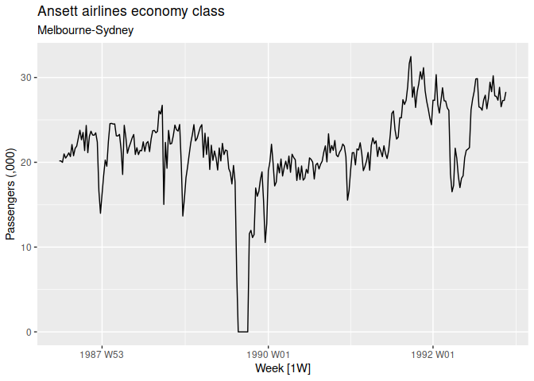<!-- -->

Note:

- The period in 1989 when no passengers were carried - d/t an industrial
  dispute
- Reduced load in 1992 - d/t a trial program which replaced economy
  seats by business class seats
- Large increase in passenger load in second half 1991 - unexplained
- Large dips in load around the start of each year - holiday effects
- Long-term fluctuations with an increase in level in 1987, decrease in
  1989, increase through 1990 and 1991

A model needs to take all these features into account.

Looking at our simpler time series from 2.1:

``` r
PBS |>
  filter(ATC2 == "A10") |>
  select(Month, Concession, Type, Cost) |>
  summarise(TotalC = sum(Cost)) |>
  mutate(Cost = TotalC/1e6) -> a10
autoplot(a10, Cost) +
  labs(y = "$ (millions)",
       title = "Australian antidiabetic drug sales")
```

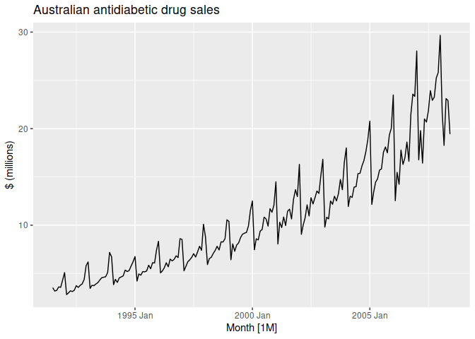<!-- -->

This shows a clear and increasing trend.

# 2.4 Seasonal plots

``` r
a10 |>
  gg_season(Cost, labels = "both") +
  labs(y = "$ (millions)",
       title = "Seasonal plot: Antidiabetic drug sales")
```

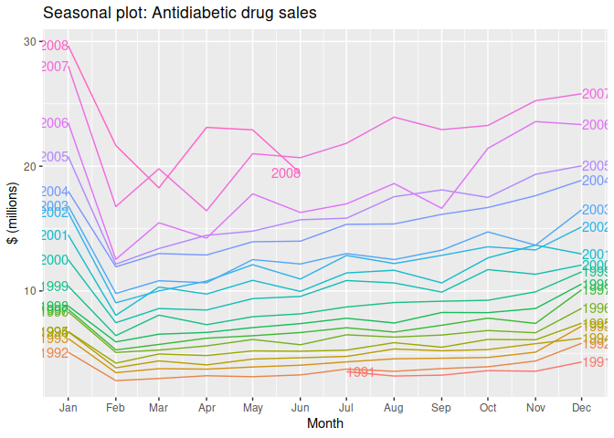<!-- -->

Useful for identifying Years with with unusual patterns. In this case we
see 2008 dipping lower than usual in March 2008. The low figure in June
could be the result of incomplete data.

## Multiple seasonal periods

`period` can be used for data with multiple seasonal patterns by
specifying daily, weekly or yearly patterns

``` r
vic_elec
```

    ## # A tsibble: 52,608 x 5 [30m] <Australia/Melbourne>
    ##    Time                Demand Temperature Date       Holiday
    ##    <dttm>               <dbl>       <dbl> <date>     <lgl>  
    ##  1 2012-01-01 00:00:00  4383.        21.4 2012-01-01 TRUE   
    ##  2 2012-01-01 00:30:00  4263.        21.0 2012-01-01 TRUE   
    ##  3 2012-01-01 01:00:00  4049.        20.7 2012-01-01 TRUE   
    ##  4 2012-01-01 01:30:00  3878.        20.6 2012-01-01 TRUE   
    ##  5 2012-01-01 02:00:00  4036.        20.4 2012-01-01 TRUE   
    ##  6 2012-01-01 02:30:00  3866.        20.2 2012-01-01 TRUE   
    ##  7 2012-01-01 03:00:00  3694.        20.1 2012-01-01 TRUE   
    ##  8 2012-01-01 03:30:00  3562.        19.6 2012-01-01 TRUE   
    ##  9 2012-01-01 04:00:00  3433.        19.1 2012-01-01 TRUE   
    ## 10 2012-01-01 04:30:00  3359.        19.0 2012-01-01 TRUE   
    ## # … with 52,598 more rows

``` r
vic_elec |> gg_season(Demand, period = "day") +
  theme(legend.position = "none") +
  labs(y = "Mwh", title = "Electricity demain in Victoria")
```

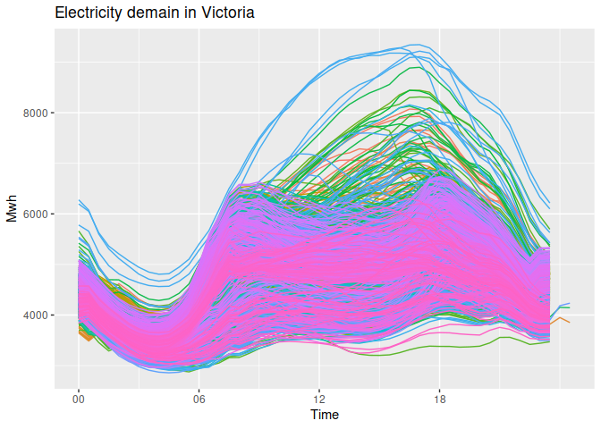<!-- -->

``` r
vic_elec |> gg_season(Demand, period = "week") +
  theme(legend.position = "none") +
  labs(y = "Mwh", title = "Electricity demain in Victoria")
```

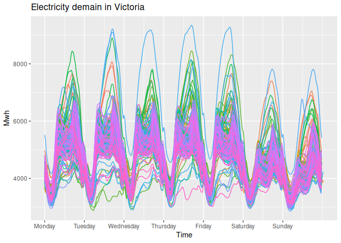<!-- -->

``` r
vic_elec |> gg_season(Demand, period = "year") +
  theme(legend.position = "none") +
  labs(y = "Mwh", title = "Electricity demain in Victoria")
```

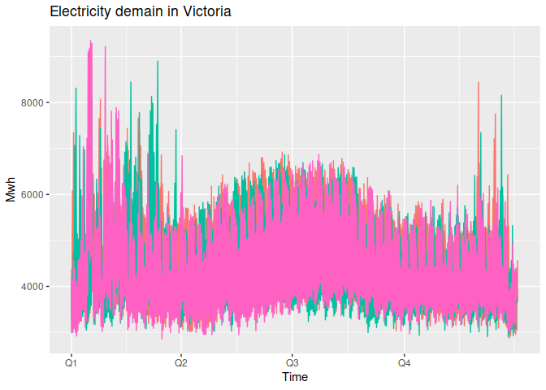<!-- -->

# 2.5 Seasonal subseries plots

``` r
a10 |>
  gg_subseries(Cost) +
  labs(
    y = "$ (million)",
    title = "Australian antidibetic drug sales"
  )
```

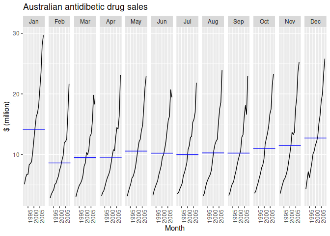<!-- -->

This plot collects each season into seperate mini time plots. The blue
line indicates the mean. This plot is useful to clearly view the
underlying seasonal pattern and shows the changes in seasonality over
time. In this case it is not very interesting.

## Example: Australian holiday tourism

``` r
tourism
```

    ## # A tsibble: 24,320 x 5 [1Q]
    ## # Key:       Region, State, Purpose [304]
    ##    Quarter Region   State           Purpose  Trips
    ##      <qtr> <chr>    <chr>           <chr>    <dbl>
    ##  1 1998 Q1 Adelaide South Australia Business  135.
    ##  2 1998 Q2 Adelaide South Australia Business  110.
    ##  3 1998 Q3 Adelaide South Australia Business  166.
    ##  4 1998 Q4 Adelaide South Australia Business  127.
    ##  5 1999 Q1 Adelaide South Australia Business  137.
    ##  6 1999 Q2 Adelaide South Australia Business  200.
    ##  7 1999 Q3 Adelaide South Australia Business  169.
    ##  8 1999 Q4 Adelaide South Australia Business  134.
    ##  9 2000 Q1 Adelaide South Australia Business  154.
    ## 10 2000 Q2 Adelaide South Australia Business  169.
    ## # … with 24,310 more rows

Lets consider the total visitor nights on holiday for each quarter.

``` r
holidays <- tourism |>
  filter(Purpose == "Holiday") |>
  group_by(State) |>
  summarise(Trips = sum(Trips))
holidays
```

    ## # A tsibble: 640 x 3 [1Q]
    ## # Key:       State [8]
    ##    State Quarter Trips
    ##    <chr>   <qtr> <dbl>
    ##  1 ACT   1998 Q1  196.
    ##  2 ACT   1998 Q2  127.
    ##  3 ACT   1998 Q3  111.
    ##  4 ACT   1998 Q4  170.
    ##  5 ACT   1999 Q1  108.
    ##  6 ACT   1999 Q2  125.
    ##  7 ACT   1999 Q3  178.
    ##  8 ACT   1999 Q4  218.
    ##  9 ACT   2000 Q1  158.
    ## 10 ACT   2000 Q2  155.
    ## # … with 630 more rows

``` r
autoplot(holidays, Trips) +
  labs(y = "Overnight trips",
       title = "Australian domestic holidays")
```

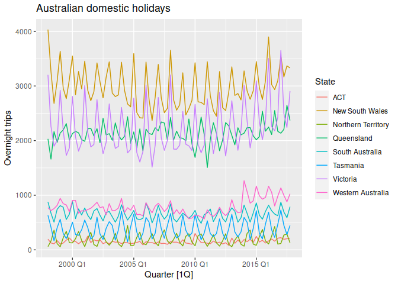<!-- -->

The plot shows strong seasonality for most states but the peaks do not
necessarily coincide.To see the timing of those seasonal peaks use a
`gg_season()` plot.

``` r
gg_season(holidays, Trips) +
  labs(y = "Overnight trips ('000)",
       title = "Austrlian domestic holidays")
```

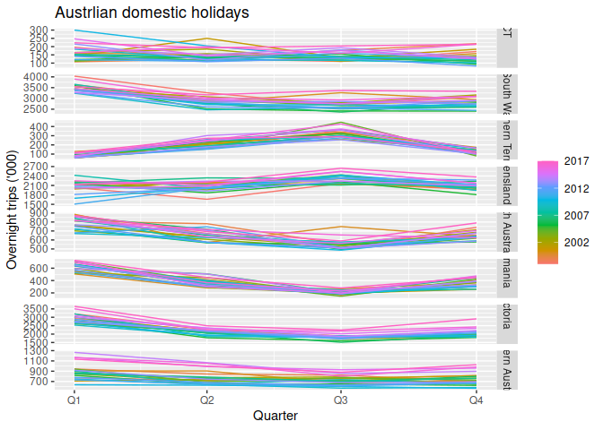<!-- -->

And a `gg_subseries()` plot

``` r
gg_subseries(holidays, Trips) +
  labs(y = "Overnight trips ('000)",
       title = "Austrlian domestic holidays")
```

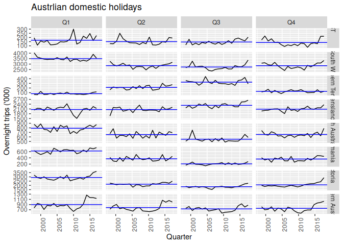<!-- -->

Here we see the increase in Western Australia in recent years. Also
Victoria’s strong increas in Q1 and Q4 but not in the other quarters.

## 2.6 Scatterplots

The above plots are used to explore individual time series. Scatterplots
can explore the relationship between two time series.

The following shows half-hourly electricity demand and temperature for
2014 in Victoria Australia.

``` r
vic_elec |>
  filter(year(Time) == 2014) |>
  autoplot(Demand) +
  labs(y = "GW",
       title = "Half-hourly electricity demand: Victoria")
```

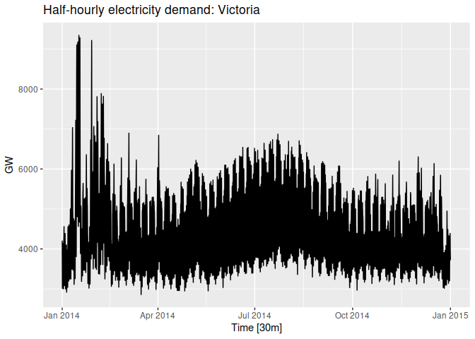<!-- -->

``` r
vic_elec |>
  filter(year(Time) == 2014) |>
  autoplot(Temperature) +
  labs(
    y = "Degrees Celsius",
    title = "Half-hourly temperatures: Melbourne, Australia"
  )
```

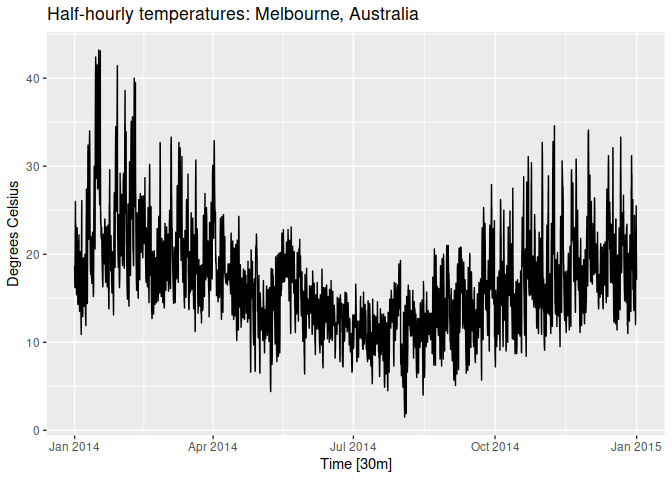<!-- -->

``` r
vic_elec |>
  filter(year(Time) == 2014) |>
  ggplot(aes(x = Temperature, y = Demand)) +
  geom_point() +
  labs(x = "Temperature (degrees Celsius)",
       y = "Electricity demand")
```

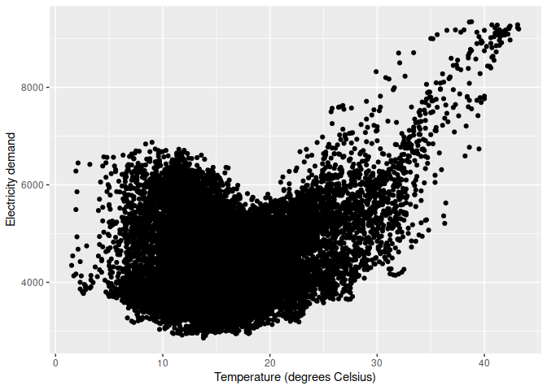<!-- -->

This shows a high demand when temperatures are high as well as when they
are low.

## Correlation

The **correlation coefficients** measure the strength of the linear
relationship between two variables.

$$
r = \frac{\sum (x_{t} - \bar{x})(y_{t}-\bar{y})}{\sqrt{\sum(x_{t}-\bar{x})^2}\sqrt{\sum(y_{t}-\bar{y})^2}}
$$

for $r$ between -1 and 1.


The correlation coefficient only measures the strenght of the **linear**
relationship.


These plots all have correlation coefficients of 0.82 but have very
different relationships. Plots are important. Do not rely on correlation
values alone.

## Scatterplot matrices

A useful starting point is to plot each variable agains each other
variable.

``` r
visitors <- tourism |>
  group_by(State) |>
  summarise(Trips = sum(Trips))
visitors |>
  ggplot(aes(x = Quarter, y = Trips)) +
  geom_line() +
  facet_grid(vars(State), scales = "free_y") +
  labs(title = "Australian domestic tourism",
       y= "Overnight trips ('000)")
```

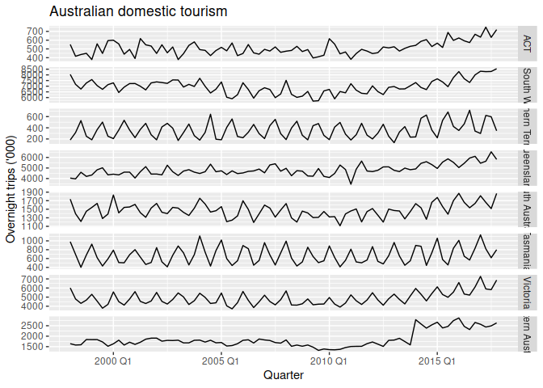<!-- -->

``` r
visitors |>
  pivot_wider(values_from=Trips, names_from=State) |>
  GGally::ggpairs(columns = 2:9)
```

    ## Registered S3 method overwritten by 'GGally':
    ##   method from   
    ##   +.gg   ggplot2

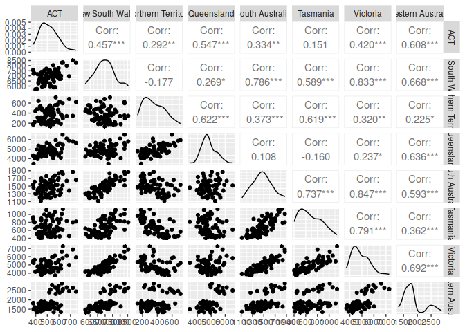<!-- -->
