Chapter 3 Time series decomposition
================

- <a href="#31-transformations-and-adjustments"
  id="toc-31-transformations-and-adjustments">3.1 Transformations and
  Adjustments</a>
  - <a href="#calendar-adjustments" id="toc-calendar-adjustments">Calendar
    adjustments</a>
  - <a href="#population-adjustments"
    id="toc-population-adjustments">Population adjustments</a>
  - <a href="#inflation-adjustments"
    id="toc-inflation-adjustments">Inflation adjustments</a>
  - <a href="#mathematical-transformations"
    id="toc-mathematical-transformations">Mathematical transformations</a>
- <a href="#32-time-series-components"
  id="toc-32-time-series-components">3.2 Time series components</a>
  - <a href="#example-employment-in-the-us-retail-sector"
    id="toc-example-employment-in-the-us-retail-sector">Example: Employment
    in the US retail sector</a>
  - <a href="#seasonally-adjusted-data"
    id="toc-seasonally-adjusted-data">Seasonally adjusted data</a>
- <a href="#33-moving-averages" id="toc-33-moving-averages">3.3 Moving
  Averages</a>
  - <a href="#moving-average-smoothing"
    id="toc-moving-average-smoothing">Moving average smoothing</a>
  - <a href="#moving-averages-of-moving-averages"
    id="toc-moving-averages-of-moving-averages">Moving averages of moving
    averages</a>
  - <a href="#estimating-the-trend-cycle-with-seasonal-data"
    id="toc-estimating-the-trend-cycle-with-seasonal-data">Estimating the
    trend-cycle with seasonal data</a>
  - <a href="#example-employment-in-the-us-retail-sector-1"
    id="toc-example-employment-in-the-us-retail-sector-1">Example:
    Employment in the US retail sector</a>
  - <a href="#weighted-moving-averages"
    id="toc-weighted-moving-averages">Weighted moving averages</a>
- <a href="#classical-decomposition"
  id="toc-classical-decomposition">Classical decomposition</a>
  - <a href="#additive-decomposition"
    id="toc-additive-decomposition">Additive decomposition</a>
  - <a href="#multiplicative-decomposition"
    id="toc-multiplicative-decomposition">Multiplicative decomposition</a>
  - <a href="#comments-on-classical-decomposition"
    id="toc-comments-on-classical-decomposition">Comments on classical
    decomposition</a>
- <a href="#35-methods-used-by-official-statistics-agencies"
  id="toc-35-methods-used-by-official-statistics-agencies">3.5 Methods
  used by official statistics agencies</a>
  - <a href="#x-11-method" id="toc-x-11-method">X-11 method</a>
  - <a href="#seats-method" id="toc-seats-method">SEATS method</a>
- <a href="#36-stl-decomposition" id="toc-36-stl-decomposition">3.6 STL
  decomposition</a>

``` r
library(fpp3)
```

    ## ── Attaching packages ────────────────────────────────────────────── fpp3 0.5 ──

    ## ✔ tibble      3.1.8     ✔ tsibble     1.1.3
    ## ✔ dplyr       1.1.0     ✔ tsibbledata 0.4.1
    ## ✔ tidyr       1.3.0     ✔ feasts      0.3.0
    ## ✔ lubridate   1.9.2     ✔ fable       0.3.2
    ## ✔ ggplot2     3.4.1     ✔ fabletools  0.3.2

    ## ── Conflicts ───────────────────────────────────────────────── fpp3_conflicts ──
    ## ✖ lubridate::date()    masks base::date()
    ## ✖ dplyr::filter()      masks stats::filter()
    ## ✖ tsibble::intersect() masks base::intersect()
    ## ✖ tsibble::interval()  masks lubridate::interval()
    ## ✖ dplyr::lag()         masks stats::lag()
    ## ✖ tsibble::setdiff()   masks base::setdiff()
    ## ✖ tsibble::union()     masks base::union()

We generally consider three types of patterns in time series:

- trend
- seasonality
- cycles

trend and cycle are usually combined into a single trend-cycle component
often just called trend.

A time series can then be decomposed into:

- trend component
- seasonality component of which there may be multiple
- remainder component

# 3.1 Transformations and Adjustments

When decomposing a time series, it is sometimes helpful to first
transform or adjust the series in order to make the decomposition (and
later analysis) as simple as possible. So we will begin by discussing
transformations and adjustments.

## Calendar adjustments

Use average/month rather than raw totals

## Population adjustments

Convert to per capita data where appropriate.

``` r
global_economy |>
  filter(Country == "Australia") |>
  autoplot(GDP/Population) +
  labs(title = "GDP per capita", y = "$US")
```

<!-- -->

## Inflation adjustments

The Consumer Price Index (CPI) can be used to adjust current values for
inflation based on a prior time. The price index $z_t$ and the original
hose price in year $t$ as $y_t$ can be used to calculated the adjusted
value by $x_t=t_t/z_t*z_{2000}$ which would give the adjusted price
based on year 2000 dollar values.

As an example, we can look at the annual newspaper and book sales in
`aus_retail` and adjust the data for inflation using CPI from
`global_economy`

``` r
print_retail <- aus_retail |>
  filter(Industry == "Newspaper and book retailing") |>
  group_by(Industry) |>
  index_by(Year = year(Month)) |>
  summarise(Turnover = sum(Turnover))
aus_economy <- global_economy |>
  filter(Code == "AUS")
```

``` r
print_retail |>
  left_join(aus_economy, by = "Year") |>
  mutate(Adjusted_turnover = Turnover / CPI * 100) |>
  pivot_longer(c(Turnover, Adjusted_turnover),
               values_to = "Turnover") |>
  mutate(name = factor(name,
         levels=c("Turnover","Adjusted_turnover"))) |>
  ggplot(aes(x = Year, y = Turnover)) +
  geom_line() +
  facet_grid(name ~ ., scales = "free_y") +
  labs(title = "Turnover: Australian print media industry",
       y = "$AU")
```

    ## Warning: Removed 1 row containing missing values (`geom_line()`).

<!-- -->

By adjusting for inflation we see that the industry is in steeper
decline than the raw data suggests.

## Mathematical transformations

**Logarithmic transformations** $w_t=\log({y_t})$, are useful when
variation increases and decreases with the level of the series.

**Power transformations** $w_t=y_t^p$ are also used but are more
difficult to interpret.

**Box-Cox transformations**

$$
\begin{equation}
  w_t  =
    \begin{cases}
      \log(y_t) & \text{if $\lambda=0$};  \\
      (\text{sign}(y_t)|y_t|^\lambda-1)/\lambda & \text{otherwise}.
    \end{cases}
\end{equation}
$$

In the modified Box-Cox used here negative values of $y_t$ are allowed
as long as $\lambda>0$

The logarithm used is $ln$.

$\lambda$ should be chosen to make the seasonal variation relatively
constant accross the series.

`gerrero` can be used to determine $\lambda$.

``` r
lambda <- aus_production |>
  features(Gas, features = guerrero) |>
  pull(lambda_guerrero)
lambda
```

    ## [1] 0.1095171

``` r
# install.packages("latex2exp")
aus_production |>
  autoplot(box_cox(Gas, lambda)) +
  labs(y = "",
       title = latex2exp::TeX(paste0(
         "Transformed gas production with $\\lambda$ = ",
         round(lambda,2)
       )))
```

<!-- -->

# 3.2 Time series components

- Additive decomposition

Most appropriate if the magnitude of the seasonal fluctuations, or the
variation around the trend-cycle, does not vary with the level of the
time series.

$$
y_{t} = S_{t} + T_{t} + R_t
$$

where $y_t$ is the data, $S_t$ is the seasonal component, $T_t$ is the
trend-cycle component and $R_t$ is the remainder component all at period
$t$.

- Multiplicative decomposition

Appropriate whenthe variation in the seasonal pattern, or the variation
around the trend-cycle, appears to be proportional to the level of the
time series. This is common with economic time series.

$$
y_{t} = S_{t} \times T_{t} \times R_t
$$

Alternatively `log()` can first be used to stabilize the variation over
time and then the additive decomposition can be used to calculate the
multiplicative decomposition since

$$
y_{t} = S_{t} \times T_{t} \times R_t \quad\text{is equivalent to}\quad
  \log y_{t} = \log S_{t} + \log T_{t} + \log R_t
$$

## Example: Employment in the US retail sector

``` r
us_retail_employment <- us_employment |>
  filter(year(Month) >= 1990, Title == "Retail Trade") |>
  select(-Series_ID)
us_retail_employment
```

    ## # A tsibble: 357 x 3 [1M]
    ##       Month Title        Employed
    ##       <mth> <chr>           <dbl>
    ##  1 1990 Jan Retail Trade   13256.
    ##  2 1990 Feb Retail Trade   12966.
    ##  3 1990 Mar Retail Trade   12938.
    ##  4 1990 Apr Retail Trade   13012.
    ##  5 1990 May Retail Trade   13108.
    ##  6 1990 Jun Retail Trade   13183.
    ##  7 1990 Jul Retail Trade   13170.
    ##  8 1990 Aug Retail Trade   13160.
    ##  9 1990 Sep Retail Trade   13113.
    ## 10 1990 Oct Retail Trade   13185.
    ## # … with 347 more rows

``` r
autoplot(us_retail_employment, Employed) +
  labs(y = "Persons (thousands)",
       title = "Total employment in US retail")
```

<!-- -->

We can decompose this with the **STL** method discussed later.

``` r
dcmp <- us_retail_employment |>
  model(stl = STL(Employed))
components(dcmp)
```

    ## # A dable: 357 x 7 [1M]
    ## # Key:     .model [1]
    ## # :        Employed = trend + season_year + remainder
    ##    .model    Month Employed  trend season_year remainder season_adjust
    ##    <chr>     <mth>    <dbl>  <dbl>       <dbl>     <dbl>         <dbl>
    ##  1 stl    1990 Jan   13256. 13288.      -33.0      0.836        13289.
    ##  2 stl    1990 Feb   12966. 13269.     -258.     -44.6          13224.
    ##  3 stl    1990 Mar   12938. 13250.     -290.     -22.1          13228.
    ##  4 stl    1990 Apr   13012. 13231.     -220.       1.05         13232.
    ##  5 stl    1990 May   13108. 13211.     -114.      11.3          13223.
    ##  6 stl    1990 Jun   13183. 13192.      -24.3     15.5          13207.
    ##  7 stl    1990 Jul   13170. 13172.      -23.2     21.6          13193.
    ##  8 stl    1990 Aug   13160. 13151.       -9.52    17.8          13169.
    ##  9 stl    1990 Sep   13113. 13131.      -39.5     22.0          13153.
    ## 10 stl    1990 Oct   13185. 13110.       61.6     13.2          13124.
    ## # … with 347 more rows

This output forms a “dabble” or decomposition table.

``` r
components(dcmp) |>
  as_tsibble() |>
  autoplot(Employed, colour = "gray") +
  geom_line(aes(y = trend), colour = "#D55E00") +
  labs(
    y = "Persons (thousands)",
    title = "Total employment in US retail"
  )
```

<!-- -->

``` r
components(dcmp) |> autoplot()
```

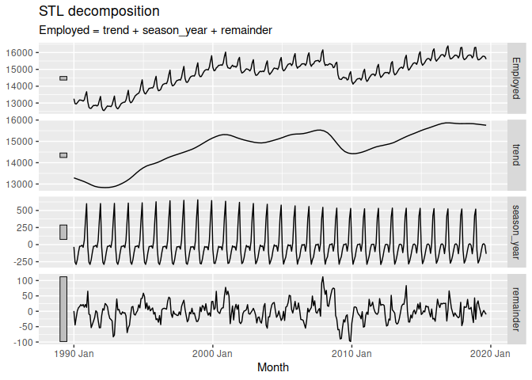<!-- -->

The gray bars on the left indicate the relative scale of each graph.

## Seasonally adjusted data

Seasonally adjusted data is what’s left after removing the seasonal
component from the data, either by subraction or division.

``` r
components(dcmp) |>
  as_tsibble() |>
  autoplot(Employed, colour = "gray") +
  geom_line(aes(y=season_adjust), colour = "#0072B2") +
  labs(y = "Persons (thousands)",
       title = "Total employment in US retail")
```

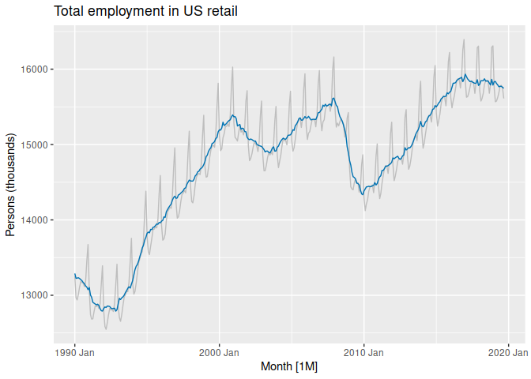<!-- -->

Seasonally adjusted data is useful for unemployment data, for example,
because it’s the non-seasonal aspects which are usually more
interesting.

Remember that seasonally adjusted components still contain the trend and
remainder.

# 3.3 Moving Averages

Classical decomposition method originating in the 1920s and widely used
until the 1950s. It remains the basis of many time series decomposition
methods.

The first step is to use a moving average method to estimate the
trend-cycle.

## Moving average smoothing

A moving average of order $m$ can be written:

$$
\begin{equation}
  \hat{T}_{t} = \frac{1}{m} \sum_{j=-k}^k y_{t+j}
\end{equation}
$$

where $m=2k+1$. This eliminates some of the randomness and smooths the
trend-cycle component. This is called an $m$**-MA**, meaning a moving
average of order $m$.

``` r
global_economy |>
  filter(Country == "Australia") |>
  autoplot(Exports) +
  labs(y = "% of GDP", title = "Total Australian Exports")
```

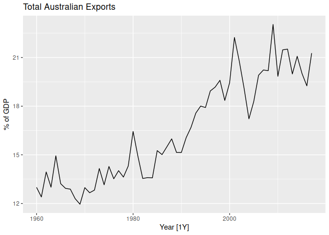<!-- -->

``` r
aus_exports <- global_economy |>
  filter(Country == "Australia") |>
  mutate(
    `5-MA` = slider::slide_dbl(Exports, mean,
                .before = 2, .after = 2, .complete = TRUE)
  )
aus_exports
```

    ## # A tsibble: 58 x 10 [1Y]
    ## # Key:       Country [1]
    ##    Country   Code   Year         GDP Growth   CPI Imports Exports Popul…¹ `5-MA`
    ##    <fct>     <fct> <dbl>       <dbl>  <dbl> <dbl>   <dbl>   <dbl>   <dbl>  <dbl>
    ##  1 Australia AUS    1960     1.86e10  NA     7.96    14.1    13.0  1.03e7   NA  
    ##  2 Australia AUS    1961     1.96e10   2.49  8.14    15.0    12.4  1.05e7   NA  
    ##  3 Australia AUS    1962     1.99e10   1.30  8.12    12.6    13.9  1.07e7   13.5
    ##  4 Australia AUS    1963     2.15e10   6.21  8.17    13.8    13.0  1.10e7   13.5
    ##  5 Australia AUS    1964     2.38e10   6.98  8.40    13.8    14.9  1.12e7   13.6
    ##  6 Australia AUS    1965     2.59e10   5.98  8.69    15.3    13.2  1.14e7   13.4
    ##  7 Australia AUS    1966     2.73e10   2.38  8.98    15.1    12.9  1.17e7   13.3
    ##  8 Australia AUS    1967     3.04e10   6.30  9.29    13.9    12.9  1.18e7   12.7
    ##  9 Australia AUS    1968     3.27e10   5.10  9.52    14.5    12.3  1.20e7   12.6
    ## 10 Australia AUS    1969     3.66e10   7.04  9.83    13.3    12.0  1.23e7   12.6
    ## # … with 48 more rows, and abbreviated variable name ¹​Population

``` r
aus_exports |>
  autoplot(Exports) +
  geom_line(aes(y = `5-MA`), colour = "#D55E00") +
  labs(y = "% of GDP",
       title = "Total Australian exports") +
  guides(colour = guide_legend(title = "series"))
```

    ## Warning: Removed 4 rows containing missing values (`geom_line()`).

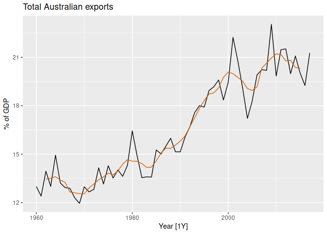<!-- -->

The moving average is smoother than the original data. The larger the
order the smoother the line.


Note that the order is usually odd so that the moving objects averages
are symmetric.

## Moving averages of moving averages

For even-ordered moving average we can take a moving average of the
moving averages to make them symmetrical.

``` r
beer <- aus_production |>
  filter(year(Quarter) >= 1992) |>
  select(Quarter, Beer)
beer_ma <- beer |>
  mutate(
    `4-MA` = slider::slide_dbl(Beer, mean,
                .before = 1, .after = 2, .complete = TRUE),
    `2x4-MA` = slider::slide_dbl(`4-MA`, mean,
                .before = 1, .after = 0, .complete = TRUE)
  )
beer_ma
```

    ## # A tsibble: 74 x 4 [1Q]
    ##    Quarter  Beer `4-MA` `2x4-MA`
    ##      <qtr> <dbl>  <dbl>    <dbl>
    ##  1 1992 Q1   443    NA       NA 
    ##  2 1992 Q2   410   451.      NA 
    ##  3 1992 Q3   420   449.     450 
    ##  4 1992 Q4   532   452.     450.
    ##  5 1993 Q1   433   449      450.
    ##  6 1993 Q2   421   444      446.
    ##  7 1993 Q3   410   448      446 
    ##  8 1993 Q4   512   438      443 
    ##  9 1994 Q1   449   441.     440.
    ## 10 1994 Q2   381   446      444.
    ## # … with 64 more rows

When a 2-MA follows a moving average of an even order (such as 4), it is
called a “centred moving average of order 4”. This is because the
results are now symmetric. To see that this is the case, we can write
the $2 \times 4$-MA as follows:

$$
\begin{align*}
  \hat{T}_{t} &= \frac{1}{2}\Big[
    \frac{1}{4} (y_{t-2}+y_{t-1}+y_{t}+y_{t+1}) +
    \frac{1}{4} (y_{t-1}+y_{t}+y_{t+1}+y_{t+2})\Big] \\
             &= \frac{1}{8}y_{t-2}+\frac14y_{t-1} +
             \frac14y_{t}+\frac14y_{t+1}+\frac18y_{t+2}.
\end{align*}
$$ Other combinations are commonly used such as $3 \times 3$-MA.

## Estimating the trend-cycle with seasonal data

Centered moving averages are most commonly used for extracting the
trend-cycle from seaonal data. For the $2 \times 4$-MA:

$$
\hat{T}_{t} = \frac{1}{8}y_{t-2} + \frac14y_{t-1} +
    \frac14y_{t} + \frac14y_{t+1} + \frac18y_{t+2}
$$

In general a $2 \times m$-MA is equvalent to a weighted moving average
of order $m+1$ where all observations take the weight $1/m$ except the
first and last which take weights of $1/2m$. For example, a
$2 \times 12$-MA can be used to estimate the trend-cycle of monthly data
with annual seasonality and a $7$-MA can estimate the trend-cycle of
daily data with weekly seasonality.

## Example: Employment in the US retail sector

``` r
us_retail_employment_ma <- us_retail_employment |>
  mutate(
    `12-MA` = slider::slide_dbl(Employed, mean,
                .before = 5, .after = 6, .complete = TRUE),
    `2x12-MA` = slider::slide_dbl(`12-MA`, mean,
                .before = 1, .after = 0, .complete = TRUE)
  )
us_retail_employment_ma |>
  autoplot(Employed, colour = "gray") +
  geom_line(aes(y = `2x12-MA`), colour = "#D55E00") +
  labs(y = "Persons (thousands)",
       title = "Total employment in US retail")
```

    ## Warning: Removed 12 rows containing missing values (`geom_line()`).

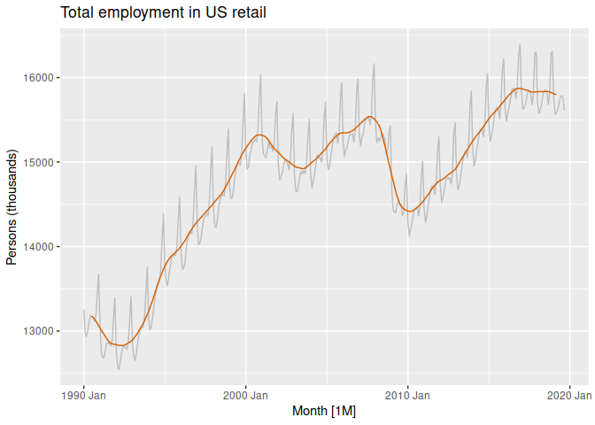<!-- -->

This is much like the trend-cycle obtained earlier with more
sophisticated methods.

## Weighted moving averages

$$
\hat{T}_t = \sum_{j=-k}^k a_j y_{t+j}
$$

where $k=(m-1)/2$ and the weights are given by $[a_{-k},\dots,a_k]$ and
the **weights must sum to one** and that they are symmetric.

# Classical decomposition

## Additive decomposition

1.  Compute the trend-cycle component $\hat{T}_t$ using a $2\times m$-MA
    if $m$ is even and $m$-MA if $m$ is odd.

2.  Calculate the De-trended Series: $y_t-T_t$

3.  Estimate seasonal component $\hat{S}_t$. To estimate the seasonal
    component for each season, simply average the detrended values for
    that season. For example, with monthly data, the seasonal component
    for March is the average of all the detrended March values in the
    data. These seasonal component values are then adjusted to ensure
    that they add to zero. The seasonal component is obtained by
    stringing together these monthly values, and then replicating the
    sequence for each year of data.

4.  Remainder: $\hat{R}_t=y_t-\hat{T}_t-\hat{S}_t$

``` r
us_retail_employment |>
  model(
    classical_decomposition(Employed, type = "additive")
  ) |>
  components() |>
  autoplot() +
  labs(title = "Classical additive decomposition of total US retail employment")
```

    ## Warning: Removed 6 rows containing missing values (`geom_line()`).

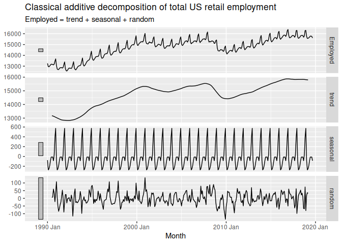<!-- -->

## Multiplicative decomposition

Similar to additive.

1.  Estimate Trend: $\hat{T}_t$

2.  Calculate the De-trended Series: $y_t/\hat{T}_t$

3.  Estimate Seasonal Components: $\hat{S}_t$

4.  Remainder $\hat{R}_t=y_t/(\hat{T}_t\hat{S}_t)$

``` r
us_retail_employment |>
  model(
    classical_decomposition(Employed, type = "multiplicative")
  ) |>
  components() |>
  autoplot() +
  labs(title = "Classical multiplicative decomposition of total US retail employment")
```

    ## Warning: Removed 6 rows containing missing values (`geom_line()`).

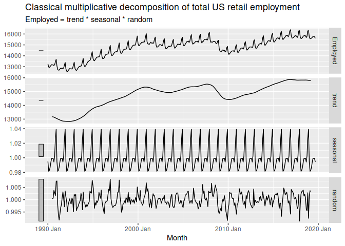<!-- -->

## Comments on classical decomposition

While classical decomposition is still widely used, it is not
recommended, as there are now several much better methods. Some of the
problems with classical decomposition are summarized below.

- The estimate of the trend-cycle is unavailable for the first few and
  last few observations. For example, if $m=12$, there is no trend-cycle
  estimate for the first six or the last six observations. Consequently,
  there is also no estimate of the remainder component for the same time
  periods.

- The trend-cycle estimate tends to over-smooth rapid rises and falls in
  the data.

- Classical decomposition methods assume that the seasonal component
  repeats from year to year. For many series, this is a reasonable
  assumption, but for some longer series it is not. For example,
  electricity demand patterns have changed over time as air conditioning
  has become more widespread. In many locations, the seasonal usage
  pattern from several decades ago had its maximum demand in winter (due
  to heating), while the current seasonal pattern has its maximum demand
  in summer (due to air conditioning). Classical decomposition methods
  are unable to capture these seasonal changes over time.

- Occasionally, the values of the time series in a small number of
  periods may be particularly unusual. For example, the monthly air
  passenger traffic may be affected by an industrial dispute, making the
  traffic during the dispute different from usual. The classical method
  is not robust to these kinds of unusual values.

# 3.5 Methods used by official statistics agencies

Most use variants of the X-11 method, the SEATS method or a combination
of the two. They are specifically designed for **quarterly and monthly**
data. They will not handle other types of seasonality such as weekly,
daily or hourly. The latest implementation is **X-13ARIMA-SEATS**
availbel in the `seasonal` package.

``` r
library(seasonal)
```

    ## 
    ## Attaching package: 'seasonal'

    ## The following object is masked from 'package:tibble':
    ## 
    ##     view

## X-11 method

``` r
x11_dcmp <- us_retail_employment |>
  model(x11 = X_13ARIMA_SEATS(Employed ~ x11())) |>
  components()
autoplot(x11_dcmp) +
  labs(title = "Decomposition of total US retail employment using X-11")
```

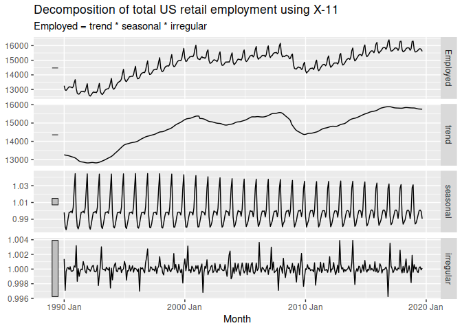<!-- -->

Compare this decomposition with the STL decomposition and the classical
decomposition shown above. The default approach for X_13ARIMA_SEATS
shown here is a multiplicative decomposition, whereas the STL and
classical decompositions shown earlier were additive; but it doesn’t
make much difference in this case. The X-11 trend-cycle has captured the
sudden fall in the data due to the 2007–2008 global financial crisis
better than either of the other two methods (where the effect of the
crisis has leaked into the remainder component). Also, the unusual
observation in 1996 is now more clearly seen in the X-11 remainder
component.

``` r
x11_dcmp |>
  ggplot(aes(x = Month)) +
  geom_line(aes(y = Employed, colour = "Data")) +
  geom_line(aes(y = season_adjust,
                colour = "Seasonally Adjusted")) +
  geom_line(aes(y = trend, colour = "Trend")) +
  labs(y = "Persons (thousands)",
       title = "Total employment in US retail") +
  scale_colour_manual(
    values = c("gray", "#0072B2", "#D55E00"),
    breaks = c("Data", "Seasonally Adjusted", "Trend")
  )
```

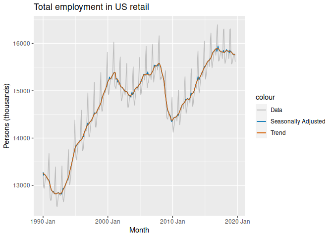<!-- -->

A seasonal sub-series plot of the seasonal component can help visualize
the variation over time.

``` r
x11_dcmp |>
  gg_subseries(seasonal)
```

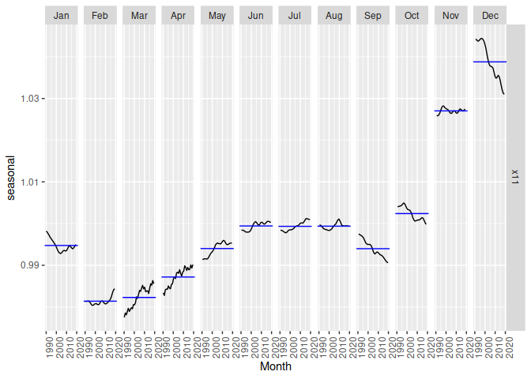<!-- -->

## SEATS method

“Seasonal Extraction in ARIMA Time Series” is a method developed by the
Bank of Spain and is now used in government agencies world-wide.

``` r
seats_dump <- us_retail_employment |>
  model(seats = X_13ARIMA_SEATS(Employed ~ seats())) |>
  components()
autoplot(seats_dump) +
  labs(title = "Decomposition of total US retail employment using SEATS")
```

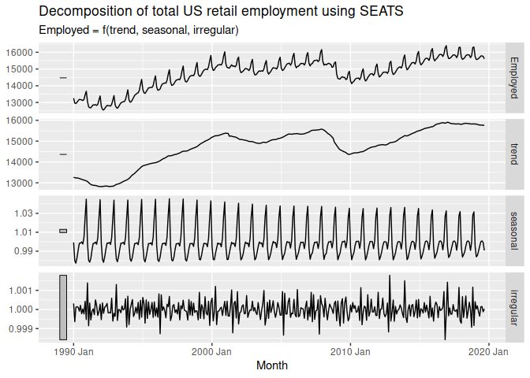<!-- -->

This gives similar results to the X-11 method.

# 3.6 STL decomposition

- Handles any type of seasonality, not just monthly and quarterly
- The seasonal component can vary over time with a rate of change
  controlled by the user
- The smoothness of the trend cycle can be controlled by the user
- It can be robust to outliers, although they will affect the remainder
- Does not handle calendar variation automatically
- Only provides facilities for additive decompositions

A multiplicative decomposition can be obtained by first taking logs of
the data, then back-transforming the components. Decompositions that are
between additive and multiplicative can be obtained using a Box-Cox
transformation of the data with $0<\lambda<1$. A value of $\lambda=0$
gives a multiplicative decomposition while $\lambda=1$ gives an additive
decomposition.

``` r
us_retail_employment |>
  model(
    STL(Employed ~ trend(window = 7) +
          season(window = "periodic"),
        robust = TRUE)) |>
  components() |>
  autoplot()
```

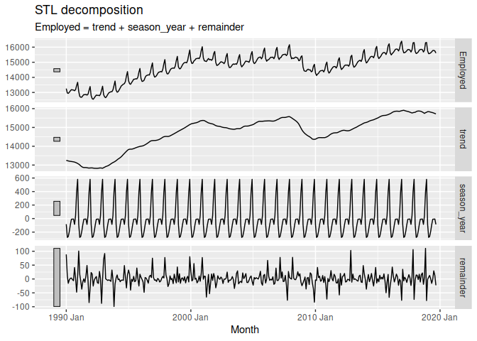<!-- -->

The two main parameters to be chosen when using STL are the trend-cycle
window `trend(window = ?)` and the seasonal window `season(window = ?)`.
These control how rapidly the trend-cycle and seasonal components can
change. Smaller values allow for more rapid changes. Both trend and
seasonal windows should be odd numbers; trend window is the number of
consecutive observations to be used when estimating the trend-cycle;
season window is the number of consecutive years to be used in
estimating each value in the seasonal component. Setting the seasonal
window to be infinite is equivalent to forcing the seasonal component to
be periodic season(window=‘periodic’) (i.e., identical across years).

By default, `STL()` provides a convenient automated STL decomposition
using a seasonal window of `season(window=13)`, and the trend window
chosen automatically from the seasonal period. The default setting for
monthly data is `trend(window=21)`. This usually gives a good balance
between over-fitting the seasonality and allowing it to slowly change
over time. But, as with any automated procedure, the default settings
will need adjusting for some time series. In this case the default trend
window setting produces a trend-cycle component that is too rigid. As a
result, signal from the 2008 global financial crisis has leaked into the
remainder component, as can be seen in the bottom panel of Figure 3.7.
Selecting a shorter trend window as in Figure 3.18 improves this
