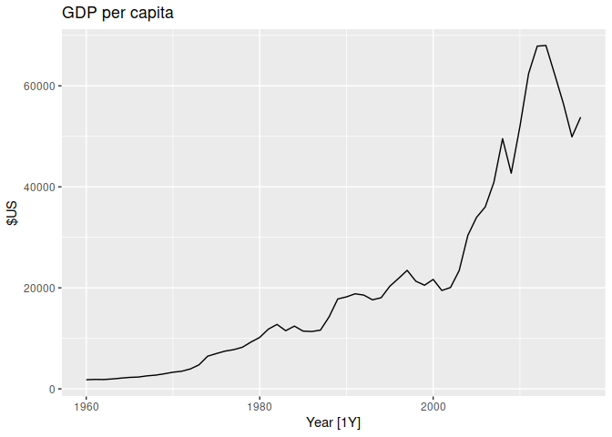
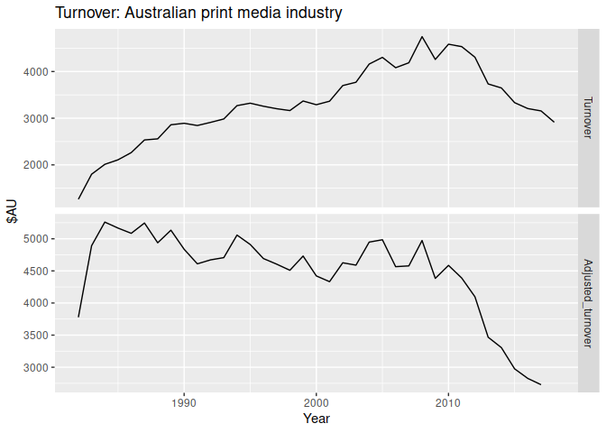
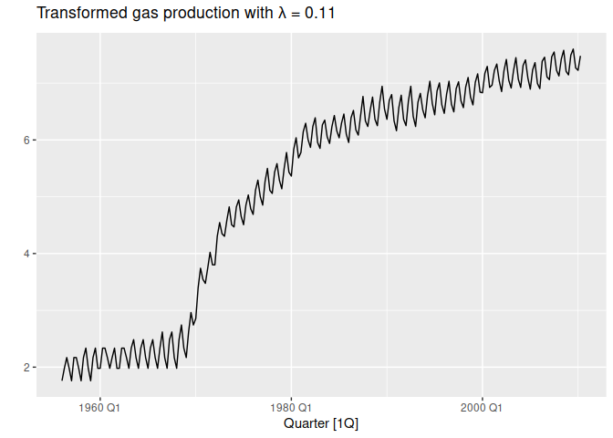

Chapter 3 Time series decomposition
================

- <a href="#31-transformations-and-adjustments"
  id="toc-31-transformations-and-adjustments">3.1 Transformations and
  Adjustments</a>
  - <a href="#calendar-adjustments" id="toc-calendar-adjustments">Calendar
    adjustments</a>
  - <a href="#population-adjustments"
    id="toc-population-adjustments">Population adjustments</a>
  - <a href="#inflation-adjustments"
    id="toc-inflation-adjustments">Inflation adjustments</a>
  - <a href="#mathematical-transformations"
    id="toc-mathematical-transformations">Mathematical transformations</a>
- <a href="#32-time-series-components"
  id="toc-32-time-series-components">3.2 Time series components</a>

``` r
library(fpp3)
```

    ## ── Attaching packages ────────────────────────────────────────────── fpp3 0.5 ──

    ## ✔ tibble      3.1.8     ✔ tsibble     1.1.3
    ## ✔ dplyr       1.1.0     ✔ tsibbledata 0.4.1
    ## ✔ tidyr       1.3.0     ✔ feasts      0.3.0
    ## ✔ lubridate   1.9.2     ✔ fable       0.3.2
    ## ✔ ggplot2     3.4.1     ✔ fabletools  0.3.2

    ## ── Conflicts ───────────────────────────────────────────────── fpp3_conflicts ──
    ## ✖ lubridate::date()    masks base::date()
    ## ✖ dplyr::filter()      masks stats::filter()
    ## ✖ tsibble::intersect() masks base::intersect()
    ## ✖ tsibble::interval()  masks lubridate::interval()
    ## ✖ dplyr::lag()         masks stats::lag()
    ## ✖ tsibble::setdiff()   masks base::setdiff()
    ## ✖ tsibble::union()     masks base::union()

We generally consider three types of patterns in time series:

- trend
- seasonality
- cycles

trend and cycle are usually combined into a single trend-cycle component
often just called trend.

A time series can then be decomposed into:

- trend component
- seasonality component of which there may be multiple
- remainder component

# 3.1 Transformations and Adjustments

When decomposing a time series, it is sometimes helpful to first
transform or adjust the series in order to make the decomposition (and
later analysis) as simple as possible. So we will begin by discussing
transformations and adjustments.

## Calendar adjustments

Use average/month rather than raw totals

## Population adjustments

Convert to per capita data where appropriate.

``` r
global_economy |>
  filter(Country == "Australia") |>
  autoplot(GDP/Population) +
  labs(title = "GDP per capita", y = "$US")
```

<!-- -->

## Inflation adjustments

The Consumer Price Index (CPI) can be used to adjust current values for
inflation based on a prior time. The price index $z_t$ and the original
hose price in year $t$ as $y_t$ can be used to calculated the adjusted
value by $x_t=t_t/z_t*z_{2000}$ which would give the adjusted price
based on year 2000 dollar values.

As an example, we can look at the annual newspaper and book sales in
`aus_retail` and adjust the data for inflation using CPI from
`global_economy`

``` r
print_retail <- aus_retail |>
  filter(Industry == "Newspaper and book retailing") |>
  group_by(Industry) |>
  index_by(Year = year(Month)) |>
  summarise(Turnover = sum(Turnover))
aus_economy <- global_economy |>
  filter(Code == "AUS")
```

``` r
print_retail |>
  left_join(aus_economy, by = "Year") |>
  mutate(Adjusted_turnover = Turnover / CPI * 100) |>
  pivot_longer(c(Turnover, Adjusted_turnover),
               values_to = "Turnover") |>
  mutate(name = factor(name,
         levels=c("Turnover","Adjusted_turnover"))) |>
  ggplot(aes(x = Year, y = Turnover)) +
  geom_line() +
  facet_grid(name ~ ., scales = "free_y") +
  labs(title = "Turnover: Australian print media industry",
       y = "$AU")
```

    ## Warning: Removed 1 row containing missing values (`geom_line()`).

<!-- -->

By adjusting for inflation we see that the industry is in steeper
decline than the raw data suggests.

## Mathematical transformations

**Logarithmic transformations** $w_t=\log({y_t})$, are useful when
variation increases and decreases with the level of the series.

**Power transformations** $w_t=y_t^p$ are also used but are more
difficult to interpret.

**Box-Cox transformations**

$$
\begin{equation}
  w_t  =
    \begin{cases}
      \log(y_t) & \text{if $\lambda=0$};  \\
      (\text{sign}(y_t)|y_t|^\lambda-1)/\lambda & \text{otherwise}.
    \end{cases}
\end{equation}
$$

In the modified Box-Cox used here negative values of $y_t$ are allowed
as long as $\lambda>0$

The logarithm used is $ln$.

$\lambda$ should be chosen to make the seasonal variation relatively
constant accross the series.

`gerrero` can be used to determine $\lambda$.

``` r
lambda <- aus_production |>
  features(Gas, features = guerrero) |>
  pull(lambda_guerrero)
lambda
```

    ## [1] 0.1095171

``` r
# install.packages("latex2exp")
aus_production |>
  autoplot(box_cox(Gas, lambda)) +
  labs(y = "",
       title = latex2exp::TeX(paste0(
         "Transformed gas production with $\\lambda$ = ",
         round(lambda,2)
       )))
```

<!-- -->

# 3.2 Time series components
