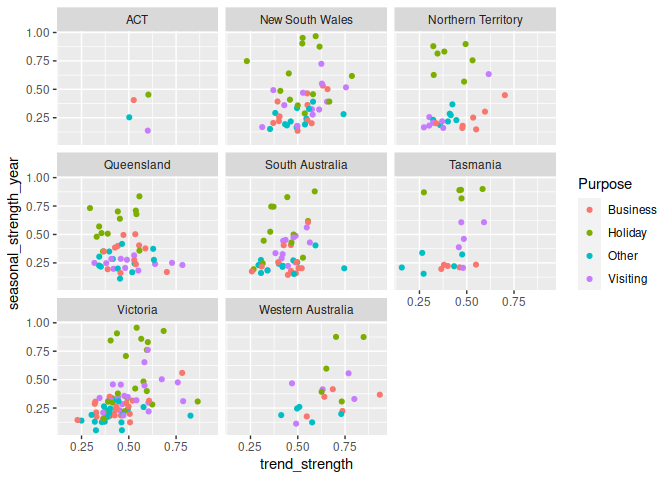
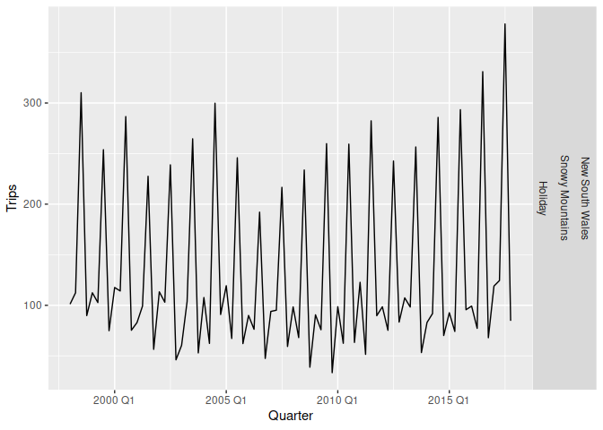

Chapter 4 Time series features
================

- <a href="#41-some-simple-statistics"
  id="toc-41-some-simple-statistics">4.1 Some simple statistics</a>
- <a href="#42-acf-features" id="toc-42-acf-features">4.2 ACF features</a>
- <a href="#43-stl-features" id="toc-43-stl-features">4.3 STL features</a>
- <a href="#44-other-features-of-the-feasts-package"
  id="toc-44-other-features-of-the-feasts-package">4.4 Other features of
  the <code>feasts</code> package</a>
- <a href="#45-exploring-australian-tourism-data"
  id="toc-45-exploring-australian-tourism-data">4.5 Exploring Australian
  tourism data</a>

The feasts package includes functions for computing FEatures And
Statistics from Time Series.

``` r
library(fpp3)
```

    ## ── Attaching packages ────────────────────────────────────────────── fpp3 0.5 ──

    ## ✔ tibble      3.1.8     ✔ tsibble     1.1.3
    ## ✔ dplyr       1.1.0     ✔ tsibbledata 0.4.1
    ## ✔ tidyr       1.3.0     ✔ feasts      0.3.0
    ## ✔ lubridate   1.9.2     ✔ fable       0.3.2
    ## ✔ ggplot2     3.4.1     ✔ fabletools  0.3.2

    ## ── Conflicts ───────────────────────────────────────────────── fpp3_conflicts ──
    ## ✖ lubridate::date()    masks base::date()
    ## ✖ dplyr::filter()      masks stats::filter()
    ## ✖ tsibble::intersect() masks base::intersect()
    ## ✖ tsibble::interval()  masks lubridate::interval()
    ## ✖ dplyr::lag()         masks stats::lag()
    ## ✖ tsibble::setdiff()   masks base::setdiff()
    ## ✖ tsibble::union()     masks base::union()

``` r
library(feasts)
```

# 4.1 Some simple statistics

**Features** are numerical summmaries computed from a time
series.`features()` is used in R for this purpose.

``` r
tourism |>
  features(Trips, list(mean = mean, sd = sd)) |>
  arrange(mean)
```

    ## # A tibble: 304 × 5
    ##    Region          State              Purpose   mean    sd
    ##    <chr>           <chr>              <chr>    <dbl> <dbl>
    ##  1 Kangaroo Island South Australia    Other    0.340 0.847
    ##  2 MacDonnell      Northern Territory Other    0.449 1.00 
    ##  3 Wilderness West Tasmania           Other    0.478 1.35 
    ##  4 Barkly          Northern Territory Other    0.632 1.37 
    ##  5 Clare Valley    South Australia    Other    0.898 1.53 
    ##  6 Barossa         South Australia    Other    1.02  1.75 
    ##  7 Kakadu Arnhem   Northern Territory Other    1.04  1.66 
    ##  8 Lasseter        Northern Territory Other    1.14  1.69 
    ##  9 Wimmera         Victoria           Other    1.15  2.19 
    ## 10 MacDonnell      Northern Territory Visiting 1.18  1.61 
    ## # … with 294 more rows

This shows that Kangaroo Island/Other had the least average number of
visits.

Using `quantile` in the `features` argument of `features()` provides the
basic statistical information.

``` r
tourism |> features(Trips, quantile)
```

    ## # A tibble: 304 × 8
    ##    Region         State             Purpose    `0%`  `25%`   `50%`  `75%` `100%`
    ##    <chr>          <chr>             <chr>     <dbl>  <dbl>   <dbl>  <dbl>  <dbl>
    ##  1 Adelaide       South Australia   Busine…  68.7   134.   153.    177.   242.  
    ##  2 Adelaide       South Australia   Holiday 108.    135.   154.    172.   224.  
    ##  3 Adelaide       South Australia   Other    25.9    43.9   53.8    62.5  107.  
    ##  4 Adelaide       South Australia   Visiti… 137.    179.   206.    229.   270.  
    ##  5 Adelaide Hills South Australia   Busine…   0       0      1.26    3.92  28.6 
    ##  6 Adelaide Hills South Australia   Holiday   0       5.77   8.52   14.1   35.8 
    ##  7 Adelaide Hills South Australia   Other     0       0      0.908   2.09   8.95
    ##  8 Adelaide Hills South Australia   Visiti…   0.778   8.91  12.2    16.8   81.1 
    ##  9 Alice Springs  Northern Territo… Busine…   1.01    9.13  13.3    18.5   34.1 
    ## 10 Alice Springs  Northern Territo… Holiday   2.81   16.9   31.5    44.8   76.5 
    ## # … with 294 more rows

# 4.2 ACF features

Autocorrelations were discussed in Section 2.8. All the autocorrelations
of a series can be considered features of that series. We can also
summarise the autocorrelations to produce new features; for example, the
sum of the first ten squared autocorrelation coefficients is a useful
summary of how much autocorrelation there is in a series, regardless of
lag.

We can also compute autocorrelations of the changes in the series
between periods. That is, we “difference” the data and create a new time
series consisting of the differences between consecutive observations.
Then we can compute the autocorrelations of this new differenced series.
Occasionally reiteration of differencing may provide more useful
information.

For example we may compute seasonal differences for monthly data, eg.
Feb to Feb. This enables us to look at how the series is changing
between years, rather than between months. Again, the autocorrelations
of the seasonally differenced series may provide useful information.

The `feat_acf()` function computes a selection of the autocorrelations
discussed here. It will return six or seven features:

- the first autocorrelation coefficient from the original data;
- the sum of squares of the first ten autocorrelation coefficients from
  the original data;
- the first autocorrelation coefficient from the differenced data;
- the sum of squares of the first ten autocorrelation coefficients from
  the differenced data;
- the first autocorrelation coefficient from the twice differenced data;
- the sum of squares of the first ten autocorrelation coefficients from
  the twice differenced data;
- For seasonal data, the autocorrelation coefficient at the first
  seasonal lag is also returned.

``` r
tourism |> features(Trips, feat_acf)
```

    ## # A tibble: 304 × 10
    ##    Region   State Purpose     acf1 acf10 diff1…¹ diff1…² diff2…³ diff2…⁴ seaso…⁵
    ##    <chr>    <chr> <chr>      <dbl> <dbl>   <dbl>   <dbl>   <dbl>   <dbl>   <dbl>
    ##  1 Adelaide Sout… Busine…  0.0333  0.131  -0.520   0.463  -0.676   0.741  0.201 
    ##  2 Adelaide Sout… Holiday  0.0456  0.372  -0.343   0.614  -0.487   0.558  0.351 
    ##  3 Adelaide Sout… Other    0.517   1.15   -0.409   0.383  -0.675   0.792  0.342 
    ##  4 Adelaide Sout… Visiti…  0.0684  0.294  -0.394   0.452  -0.518   0.447  0.345 
    ##  5 Adelaid… Sout… Busine…  0.0709  0.134  -0.580   0.415  -0.750   0.746 -0.0628
    ##  6 Adelaid… Sout… Holiday  0.131   0.313  -0.536   0.500  -0.716   0.906  0.208 
    ##  7 Adelaid… Sout… Other    0.261   0.330  -0.253   0.317  -0.457   0.392  0.0745
    ##  8 Adelaid… Sout… Visiti…  0.139   0.117  -0.472   0.239  -0.626   0.408  0.170 
    ##  9 Alice S… Nort… Busine…  0.217   0.367  -0.500   0.381  -0.658   0.587  0.315 
    ## 10 Alice S… Nort… Holiday -0.00660 2.11   -0.153   2.11   -0.274   1.55   0.729 
    ## # … with 294 more rows, and abbreviated variable names ¹​diff1_acf1,
    ## #   ²​diff1_acf10, ³​diff2_acf1, ⁴​diff2_acf10, ⁵​season_acf1

# 4.3 STL features

The STL decomposition provides several more features. These can help
identify the series with the most trend or seasonality among a large
collection of time series.

For strongly trended data, the seasonally adjusted data should have much
more variation than the remainder component. Therefore
$Var(R_t)/Var(T_t+R_t)$ should be relatively small. But for data with
little or no trend, the two variances should be approximately the same.
So we define the **strength of trend** as:

$$
F_T = \max\left(0, 1 - \frac{\text{Var}(R_t)}{\text{Var}(T_t+R_t)}\right)
$$ $F_T$ has a range of \[0,1\].

Similarly the **strength of seasonality** is

$$
F_S = \max\left(0, 1 - \frac{\text{Var}(R_t)}{\text{Var}(S_{t}+R_t)}\right)
$$

``` r
tourism |> features(Trips, feat_stl)
```

    ## # A tibble: 304 × 12
    ##    Region  State Purpose trend…¹ seaso…² seaso…³ seaso…⁴ spiki…⁵ linea…⁶ curva…⁷
    ##    <chr>   <chr> <chr>     <dbl>   <dbl>   <dbl>   <dbl>   <dbl>   <dbl>   <dbl>
    ##  1 Adelai… Sout… Busine…   0.464   0.407       3       1 1.58e+2  -5.31   71.6  
    ##  2 Adelai… Sout… Holiday   0.554   0.619       1       2 9.17e+0  49.0    78.7  
    ##  3 Adelai… Sout… Other     0.746   0.202       2       1 2.10e+0  95.1    43.4  
    ##  4 Adelai… Sout… Visiti…   0.435   0.452       1       3 5.61e+1  34.6    71.4  
    ##  5 Adelai… Sout… Busine…   0.464   0.179       3       0 1.03e-1   0.968  -3.22 
    ##  6 Adelai… Sout… Holiday   0.528   0.296       2       1 1.77e-1  10.5    24.0  
    ##  7 Adelai… Sout… Other     0.593   0.404       2       2 4.44e-4   4.28    3.19 
    ##  8 Adelai… Sout… Visiti…   0.488   0.254       0       3 6.50e+0  34.2    -0.529
    ##  9 Alice … Nort… Busine…   0.534   0.251       0       1 1.69e-1  23.8    19.5  
    ## 10 Alice … Nort… Holiday   0.381   0.832       3       1 7.39e-1 -19.6    10.5  
    ## # … with 294 more rows, 2 more variables: stl_e_acf1 <dbl>, stl_e_acf10 <dbl>,
    ## #   and abbreviated variable names ¹​trend_strength, ²​seasonal_strength_year,
    ## #   ³​seasonal_peak_year, ⁴​seasonal_trough_year, ⁵​spikiness, ⁶​linearity,
    ## #   ⁷​curvature

``` r
tourism |> 
  features(Trips, feat_stl) |>
  ggplot(aes(x = trend_strength,
             y = seasonal_strength_year,
             col = Purpose)) +
  geom_point() +
  facet_wrap(vars(State))
```

<!-- -->

This shows strong seasonal strength for “Holiday” and strong trend
strength for Victoria and Western Australia.

The most seasonal series can be easily identified and plotted.

``` r
tourism |>
  features(Trips, feat_stl) |>
  filter(
    seasonal_strength_year == max(seasonal_strength_year)
  ) |>
  left_join(tourism, 
            by = c("State", "Region", "Purpose"), 
            multiple = "all") |>
  ggplot(aes(x = Quarter, y = Trips)) +
  geom_line() +
  facet_grid(vars(State, Region, Purpose))
```

<!-- -->

This is apparently the most popular ski region of Australia.

The `feat_stl()` function returns several more features other than those
discussed above.

- `seasonal_peak_year` indicates the timing of the peaks — which month
  or quarter contains the largest seasonal component. This tells us
  something about the nature of the seasonality. In the Australian
  tourism data, if Quarter 3 is the peak seasonal period, then people
  are travelling to the region in winter, whereas a peak in Quarter 1
  suggests that the region is more popular in summer.
- `seasonal_trough_year` indicates the timing of the troughs — which
  month or quarter contains the smallest seasonal component.
- `spikiness` measures the prevalence of spikes in the remainder
  component $R_t$ of the STL decomposition. It is the variance of the
  leave-one-out variances of $R_t$.
- `linearity` measures the linearity of the trend component of the STL
  decomposition. It is based on the coefficient of a linear regression
  applied to the trend component.
- `curvature` measures the curvature of the trend component of the STL
  decomposition. It is based on the coefficient from an orthogonal
  quadratic regression applied to the trend component.
- `stl_e_acf1` is the first autocorrelation coefficient of the remainder
  series.
- `stl_e_acf10` is the sum of squares of the first ten autocorrelation
  coefficients of the remainder series.

# 4.4 Other features of the `feasts` package

The remaining features in the feasts package, not previously discussed,
are listed here for reference. The details of some of them are discussed
later in the book.

- `coef_hurst` will calculate the Hurst coefficient of a time series
  which is a measure of **“long memory”**. A series with long memory
  will have significant autocorrelations for many lags.
- `feat_spectral` will compute the (Shannon) spectral entropy of a time
  series, which is a measure of **how easy the series is to forecast**.
  A series which has strong trend and seasonality (and so is easy to
  forecast) will have entropy close to 0. A series that is very noisy
  (and so is difficult to forecast) will have entropy close to 1.
- `box_pierce` gives the Box-Pierce statistic for testing if a time
  series is **white noise**, and the corresponding p-value. This test is
  discussed in Section 5.4.
- ljung_box gives the Ljung-Box statistic for testing if a time series
  is **white noise**, and the corresponding p-value. This test is
  discussed in Section 5.4.
- The $k$th partial autocorrelation measures the relationship between
  observations $k$ periods apart after removing the effects of
  observations between them. So the first partial autocorrelation
  ($k=1$) is identical to the first autocorrelation, because there is
  nothing between consecutive observations to remove. Partial
  autocorrelations are discussed in Section 9.5.
- The `feat_pacf` function contains several features involving partial
  autocorrelations including the sum of squares of the first five
  partial autocorrelations for the original series, the
  first-differenced series and the second-differenced series. For
  seasonal data, it also includes the partial autocorrelation at the
  first seasonal lag.
- `unitroot_kpss` gives the Kwiatkowski-Phillips-Schmidt-Shin (KPSS)
  statistic for testing if a series is stationary, and the corresponding
  p-value. This test is discussed in Section 9.1.
- unitroot_pp gives the Phillips-Perron statistic for testing if a
  **series is non-stationary**, and the corresponding p-value.
- `unitroot_ndiffs` gives the **number of differences required to lead
  to a stationary series** based on the KPSS test. This is discussed in
  Section 9.1
- `unitroot_nsdiffs` gives the **number of seasonal differences required
  to make a series stationary**. This is discussed in Section 9.1.
- `var_tiled_mean` gives the variances of the “tiled means” (i.e., the
  means of consecutive non-overlapping blocks of observations). The
  default tile length is either 10 (for non-seasonal data) or the length
  of the seasonal period. This is sometimes called the **“stability”**
  feature.
- `var_tiled_var` gives the variances of the “tiled variances” (i.e.,
  the variances of consecutive non-overlapping blocks of observations).
  This is sometimes called the **“lumpiness”** feature.
- `shift_level_max` finds the largest mean shift between two consecutive
  sliding windows of the time series. This is useful for finding
  **sudden jumps or drops** in a time series.
- `shift_level_index` gives the index at which the largest mean shift
  occurs. shift_var_max finds the largest variance shift between two
  consecutive sliding windows of the time series. This is useful for
  finding **sudden changes in the volatility** of a time series.
- `shift_var_index` gives the index at which the largest variance shift
  occurs.
- `shift_kl_max` finds the largest distributional shift (based on the
  Kulback-Leibler divergence) between two consecutive sliding windows of
  the time series. This is useful for finding **sudden changes in the
  distribution** of a time series.
- `shift_kl_index` gives the index at which the largest KL shift occurs.
- `n_crossing_points` computes the number of times a time series crosses
  the median.
- `longest_flat_spot` computes the number of sections of the data where
  the series is relatively unchanging.
- `stat_arch_lm` returns the statistic based on the Lagrange Multiplier
  (LM) test of Engle (1982) for autoregressive conditional
  heteroscedasticity (ARCH).
- `guerrero` computes the optimal $\lambda$ value for a Box-Cox
  transformation using the Guerrero method (discussed in Section 3.1).

# 4.5 Exploring Australian tourism data
