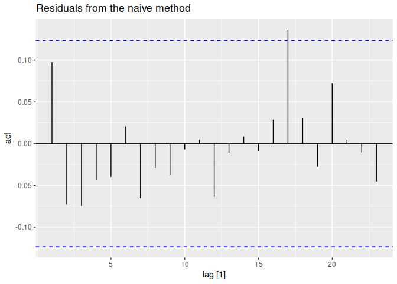

Chapter 5 The forecaster’s toolbox Part 1
================

- <a href="#51-a-tidy-forecasting-workflow"
  id="toc-51-a-tidy-forecasting-workflow">5.1 A tidy forecasting
  workflow</a>
  - <a href="#data-preparation-tidy" id="toc-data-preparation-tidy">Data
    preparation (tidy)</a>
  - <a href="#visualize-the-data" id="toc-visualize-the-data">Visualize the
    data</a>
  - <a href="#specify-a-model" id="toc-specify-a-model">Specify a model</a>
  - <a href="#train-the-model-estimate"
    id="toc-train-the-model-estimate">Train the model (estimate)</a>
  - <a href="#evaluate-model-performance"
    id="toc-evaluate-model-performance">Evaluate model performance</a>
  - <a href="#produce-forecasts" id="toc-produce-forecasts">Produce
    forecasts</a>
- <a href="#52-some-simple-forecasting-methods"
  id="toc-52-some-simple-forecasting-methods">5.2 Some simple forecasting
  methods</a>
  - <a href="#mean-method" id="toc-mean-method">Mean method</a>
  - <a href="#naive-method" id="toc-naive-method">Naive method</a>
  - <a href="#seasonal-naive-method" id="toc-seasonal-naive-method">Seasonal
    naive method</a>
  - <a href="#drift-method" id="toc-drift-method">Drift method</a>
  - <a href="#example-australian-quarterly-beer-production"
    id="toc-example-australian-quarterly-beer-production">Example:
    Australian quarterly beer production</a>
  - <a href="#example-googles-daily-closing-stock-price"
    id="toc-example-googles-daily-closing-stock-price">Example: Google’s
    daily closing stock price</a>
    - <a href="#re-index-based-on-trading-days"
      id="toc-re-index-based-on-trading-days">Re-index based on trading
      days</a>
    - <a href="#filter-the-year-of-interest"
      id="toc-filter-the-year-of-interest">Filter the year of interest</a>
    - <a href="#fit-the-models" id="toc-fit-the-models">Fit the models</a>
    - <a href="#produce-forecasts-for-the-trading-days-in-january-2016"
      id="toc-produce-forecasts-for-the-trading-days-in-january-2016">Produce
      forecasts for the trading days in January 2016</a>
    - <a href="#plot-the-forecasts" id="toc-plot-the-forecasts">Plot the
      forecasts</a>
- <a href="#53-fitted-values-and-residuals"
  id="toc-53-fitted-values-and-residuals">5.3 Fitted values and
  residuals</a>
  - <a href="#fitted-values" id="toc-fitted-values">Fitted values</a>
  - <a href="#residuals" id="toc-residuals">Residuals</a>
- <a href="#54-residual-diagnostics" id="toc-54-residual-diagnostics">5.4
  Residual diagnostics</a>
  - <a href="#example-forecasting-google-daily-closing-stock-prices"
    id="toc-example-forecasting-google-daily-closing-stock-prices">Example:
    Forecasting Google daily closing stock prices</a>
  - <a href="#portmanteau-tests-for-autocorrelation"
    id="toc-portmanteau-tests-for-autocorrelation">Portmanteau tests for
    autocorrelation</a>
- <a href="#55-distributional-forecasts-and-predictions"
  id="toc-55-distributional-forecasts-and-predictions">5.5 Distributional
  forecasts and predictions</a>
  - <a href="#forecast-distributions"
    id="toc-forecast-distributions">Forecast distributions</a>
  - <a href="#prediction-intervals" id="toc-prediction-intervals">Prediction
    intervals</a>
    - <a href="#multipliers-to-be-used-for-predictions"
      id="toc-multipliers-to-be-used-for-predictions">Multipliers to be used
      for predictions</a>
  - <a href="#one-step-prediction-intervals"
    id="toc-one-step-prediction-intervals">One-step prediction intervals</a>
  - <a href="#benchmark-methods" id="toc-benchmark-methods">Benchmark
    methods</a>
  - <a href="#prediction-intervals-from-bootstrapped-residuals"
    id="toc-prediction-intervals-from-bootstrapped-residuals">Prediction
    intervals from bootstrapped residuals</a>

The feasts package includes functions for computing FEatures And
Statistics from Time Series.

``` r
library(fpp3)
```

    ## ── Attaching packages ────────────────────────────────────────────── fpp3 0.5 ──

    ## ✔ tibble      3.1.8     ✔ tsibble     1.1.3
    ## ✔ dplyr       1.1.0     ✔ tsibbledata 0.4.1
    ## ✔ tidyr       1.3.0     ✔ feasts      0.3.0
    ## ✔ lubridate   1.9.2     ✔ fable       0.3.2
    ## ✔ ggplot2     3.4.1     ✔ fabletools  0.3.2

    ## ── Conflicts ───────────────────────────────────────────────── fpp3_conflicts ──
    ## ✖ lubridate::date()    masks base::date()
    ## ✖ dplyr::filter()      masks stats::filter()
    ## ✖ tsibble::intersect() masks base::intersect()
    ## ✖ tsibble::interval()  masks lubridate::interval()
    ## ✖ dplyr::lag()         masks stats::lag()
    ## ✖ tsibble::setdiff()   masks base::setdiff()
    ## ✖ tsibble::union()     masks base::union()

``` r
library(feasts)
```

# 5.1 A tidy forecasting workflow

To illustrate the process, we will fit linear trend models to national
GDP data stored in `global_economy`.

## Data preparation (tidy)

The first step in forecasting is to prepare data in the correct format.
This process may involve loading in data, identifying missing values,
filtering the time series, and other pre-processing tasks. The
functionality provided by `tsibble` and other packages in the
`tidyverse` substantially simplifies this step.

If we want to model GDP per capita over time we must first compute the
variable

``` r
gdppc <- global_economy |>
  mutate(GDP_per_capita = GDP / Population)
gdppc
```

    ## # A tsibble: 15,150 x 10 [1Y]
    ## # Key:       Country [263]
    ##    Country     Code   Year      GDP Growth   CPI Imports Exports Popul…¹ GDP_p…²
    ##    <fct>       <fct> <dbl>    <dbl>  <dbl> <dbl>   <dbl>   <dbl>   <dbl>   <dbl>
    ##  1 Afghanistan AFG    1960   5.38e8     NA    NA    7.02    4.13  9.00e6    59.8
    ##  2 Afghanistan AFG    1961   5.49e8     NA    NA    8.10    4.45  9.17e6    59.9
    ##  3 Afghanistan AFG    1962   5.47e8     NA    NA    9.35    4.88  9.35e6    58.5
    ##  4 Afghanistan AFG    1963   7.51e8     NA    NA   16.9     9.17  9.53e6    78.8
    ##  5 Afghanistan AFG    1964   8.00e8     NA    NA   18.1     8.89  9.73e6    82.2
    ##  6 Afghanistan AFG    1965   1.01e9     NA    NA   21.4    11.3   9.94e6   101. 
    ##  7 Afghanistan AFG    1966   1.40e9     NA    NA   18.6     8.57  1.02e7   138. 
    ##  8 Afghanistan AFG    1967   1.67e9     NA    NA   14.2     6.77  1.04e7   161. 
    ##  9 Afghanistan AFG    1968   1.37e9     NA    NA   15.2     8.90  1.06e7   130. 
    ## 10 Afghanistan AFG    1969   1.41e9     NA    NA   15.0    10.1   1.09e7   130. 
    ## # … with 15,140 more rows, and abbreviated variable names ¹​Population,
    ## #   ²​GDP_per_capita

## Visualize the data

Let’s look at the data for one country

``` r
gdppc |>
  filter(Country == "Sweden") |>
  autoplot(GDP_per_capita) +
  labs(y = "$US", title = "GDP per capita for Sweden")
```

<!-- -->

## Specify a model

There are many different time series models that can be used for
forecasting, and much of this book is dedicated to describing various
models. Specifying an appropriate model for the data is essential for
producing appropriate forecasts.

Models in fable are specified using model functions, which each use a
formula (y \~ x) interface. The response variable(s) are specified on
the left of the formula, and the structure of the model is written on
the right.

For example, a linear trend model (to be discussed in Chapter 7) for GDP
per capita can be specified with

``` r
TSLM(GDP_per_capita ~ trend())
```

    ## <TSLM model definition>

In this case the model function is `TSLM()` (time series linear model),
the response variable is `GDP_per_capita` and it is being modelled using
`trend()` (a “special” function specifying a linear trend when it is
used within `TSLM()`). We will be taking a closer look at how each model
can be specified in their respective sections.

The special functions used to define the model’s structure vary between
models (as each model can support different structures). The “Specials”
section of the documentation for each model function lists these special
functions and how they can be used.

The left side of the formula also supports the transformations discussed
in Section 3.1, which can be useful in simplifying the time series
patterns or constraining the forecasts to be between specific values
(see Section 13.3).

## Train the model (estimate)

Once an appropriate model is specified, we next train the model on some
data. One or more model specifications can be estimated using the
model() function.

``` r
fit <- gdppc |>
  model(trend_model = TSLM(GDP_per_capita ~ trend()))
```

    ## Warning: 7 errors (1 unique) encountered for trend_model
    ## [7] 0 (non-NA) cases

``` r
fit
```

    ## # A mable: 263 x 2
    ## # Key:     Country [263]
    ##    Country             trend_model
    ##    <fct>                   <model>
    ##  1 Afghanistan              <TSLM>
    ##  2 Albania                  <TSLM>
    ##  3 Algeria                  <TSLM>
    ##  4 American Samoa           <TSLM>
    ##  5 Andorra                  <TSLM>
    ##  6 Angola                   <TSLM>
    ##  7 Antigua and Barbuda      <TSLM>
    ##  8 Arab World               <TSLM>
    ##  9 Argentina                <TSLM>
    ## 10 Armenia                  <TSLM>
    ## # … with 253 more rows

This fits a linear trend model to the GDP per capita data for each
combination of key variables in the `tsibble`. In this example, it will
fit a model to each of the 263 countries in the dataset. The resulting
object is a model table or a “**mable**”.

## Evaluate model performance

Once a model has been fitted, it is important to check how well it has
performed on the data. There are several diagnostic tools available to
check model behaviour, and also accuracy measures that allow one model
to be compared against another. Sections 5.8 and 5.9 go into further
details.

## Produce forecasts

With an appropriate model specified, estimated and checked, it is time
to produce the forecasts using forecast(). The easiest way to use this
function is by specifying the number of future observations to forecast.
For example, forecasts for the next 10 observations can be generated
using h = 10. We can also use natural language; e.g., h = “2 years” can
be used to predict two years into the future.

In other situations, it may be more convenient to provide a dataset of
future time periods to forecast. This is commonly required when your
model uses additional information from the data, such as exogenous
regressors. Additional data required by the model can be included in the
dataset of observations to forecast.

``` r
fit |> forecast(h = "3 years")
```

    ## # A fable: 789 x 5 [1Y]
    ## # Key:     Country, .model [263]
    ##    Country        .model       Year   GDP_per_capita  .mean
    ##    <fct>          <chr>       <dbl>           <dist>  <dbl>
    ##  1 Afghanistan    trend_model  2018     N(526, 9653)   526.
    ##  2 Afghanistan    trend_model  2019     N(534, 9689)   534.
    ##  3 Afghanistan    trend_model  2020     N(542, 9727)   542.
    ##  4 Albania        trend_model  2018  N(4716, 476419)  4716.
    ##  5 Albania        trend_model  2019  N(4867, 481086)  4867.
    ##  6 Albania        trend_model  2020  N(5018, 486012)  5018.
    ##  7 Algeria        trend_model  2018  N(4410, 643094)  4410.
    ##  8 Algeria        trend_model  2019  N(4489, 645311)  4489.
    ##  9 Algeria        trend_model  2020  N(4568, 647602)  4568.
    ## 10 American Samoa trend_model  2018 N(12491, 652926) 12491.
    ## # … with 779 more rows

This is a forecast table, or “**fable**”. Each row corresponds to one
forecast period for each country. The `GDP_per_capita` column contains
the **forecast distribution**, while the `.mean` column contains the
**point forecast**. The point forecast is the mean (or average) of the
forecast distribution.

The forecasts can be plotted along with the historical data using
autoplot() as follows.

``` r
fit |>
  forecast(h = "3 years") |>
  filter(Country == "Sweden") |>
  autoplot(gdppc) +
  labs(y = "$US", title = "GDP per capita for Sweden")
```

<!-- -->

# 5.2 Some simple forecasting methods

Some forecasting methods are extremely simple and surprisingly
effective. We will use four simple forecasting methods as benchmarks
throughout this book.

To illustrate them, we will use quarterly Australian clay brick
production between 1970 and 2004.

The `filter_index()` function is a convenient shorthand for extracting a
section of a time series.

``` r
bricks <- aus_production |>
  filter_index("1970 Q1" ~ "2004 Q4") |>
  select(Bricks)
bricks
```

    ## # A tsibble: 140 x 2 [1Q]
    ##    Bricks Quarter
    ##     <dbl>   <qtr>
    ##  1    386 1970 Q1
    ##  2    428 1970 Q2
    ##  3    434 1970 Q3
    ##  4    417 1970 Q4
    ##  5    385 1971 Q1
    ##  6    433 1971 Q2
    ##  7    453 1971 Q3
    ##  8    436 1971 Q4
    ##  9    399 1972 Q1
    ## 10    461 1972 Q2
    ## # … with 130 more rows

## Mean method

Here, the forecasts of all future values are equal to the average (or
“mean”) of the historical data. If we let the historical data be denoted
by $y_1,\dots,y_T$, then we can write the forecasts as

$$\hat{y}_{T+h|T}=\bar{y}=(y_1+\dots+y_T)/T$$

The notation $\hat{y}_{T+h|T}$ is a short-hand for the estimate of
$y_{T+h}$ based on the data $y_1,\dots,y_T$

``` r
bricks |> model(MEAN(Bricks))
```

    ## # A mable: 1 x 1
    ##   `MEAN(Bricks)`
    ##          <model>
    ## 1         <MEAN>

## Naive method

All forecasts set to the value of the last observation.

$$\hat{y}_{T+h|T} = y_{T}$$

This method works well for many economic/financial forecasts.

``` r
bricks |> model(NAIVE(Bricks))
```

    ## # A mable: 1 x 1
    ##   `NAIVE(Bricks)`
    ##           <model>
    ## 1         <NAIVE>

## Seasonal naive method

A similar method is useful for highly seasonal data. In this case, we
set each forecast to be equal to the last observed value from the same
season (e.g., the same month of the previous year). Formally, the
forecast for time $T+h$ is written as

$$\hat{y}_{T+h|T} = y_{T+h-m(k+1)}$$

where $m=$ the seasonal period, and $k$ is the integer part of $(h−1)/m$
(i.e., the number of complete years in the forecast period prior to time
$T+h$). This looks more complicated than it really is. For example, with
monthly data, the forecast for all future February values is equal to
the last observed February value. With quarterly data, the forecast of
all future Q2 values is equal to the last observed Q2 value (where Q2
means the second quarter). Similar rules apply for other months and
quarters, and for other seasonal periods.

``` r
bricks |> model(SNAIVE(Bricks ~ lag("year")))
```

    ## # A mable: 1 x 1
    ##   `SNAIVE(Bricks ~ lag("year"))`
    ##                          <model>
    ## 1                       <SNAIVE>

The `lag()` function is optional here as bricks is quarterly data and so
a seasonal naïve method will need a one-year lag. However, for some time
series there is more than one seasonal period, and then the required lag
must be specified.

## Drift method

A variation on the naïve method is to allow the forecasts to increase or
decrease over time, where the amount of change over time (called the
**drift**) is set to be the average change seen in the historical data.
Thus the forecast for time $T+h$ is given by

$$\hat{y}_{T+h|T} = y_{T} + \frac{h}{T-1}\sum_{t=2}^T (y_{t}-y_{t-1}) = y_{T} + h \left( \frac{y_{T} -y_{1}}{T-1}\right)$$

This is equivalent to drawing a line between the first and last
observations, and extrapolating it into the future.

``` r
bricks |> model(RW(Bricks ~ drift()))
```

    ## # A mable: 1 x 1
    ##   `RW(Bricks ~ drift())`
    ##                  <model>
    ## 1          <RW w/ drift>

## Example: Australian quarterly beer production

The first three methods applied to Australian quarterly beer production
from 1992 to 2006, with the forecasts compared against actual values in
the next 3.5 years.

``` r
# Set training data from 1992 to 2006
train <- aus_production |>
  filter_index("1992 Q1" ~ "2006 Q4")
# Fit the models
beer_fit <- train |>
  model(
    Mean = MEAN(Beer),
    `Naïve` = NAIVE(Beer),
    `Seasonal naïve` = SNAIVE(Beer)
  )
# Generate forecasts for 14 quarters
beer_fc <- beer_fit |> forecast(h = 14)
# Plot forecasts against actual values
beer_fc |>
  autoplot(train, level = NULL) +
  autolayer(
    filter_index(aus_production, "2007 Q1" ~ .),
    colour = "black"
  ) +
  labs(
    y = "Megalitres",
    title = "Forecasts for quarterly beer production"
  ) +
  guides(colour = guide_legend(title = "Forecast"))
```

    ## Plot variable not specified, automatically selected `.vars = Beer`

<!-- -->

In this case, only the seasonal naïve forecasts are close to the
observed values from 2007 onwards

## Example: Google’s daily closing stock price

The non-seasonal methods are applied to Google’s daily closing stock
price in 2015, and used to forecast one month ahead. Because stock
prices are not observed every day, we first set up a **new time index
based on the trading days rather than calendar days**.

### Re-index based on trading days

``` r
google_stock <- gafa_stock |>
  filter(Symbol == "GOOG", year(Date) >= 2015) |>
  mutate(day = row_number()) |>
  update_tsibble(index = day, regular = TRUE)
google_stock
```

    ## # A tsibble: 1,006 x 9 [1]
    ## # Key:       Symbol [1]
    ##    Symbol Date        Open  High   Low Close Adj_Close  Volume   day
    ##    <chr>  <date>     <dbl> <dbl> <dbl> <dbl>     <dbl>   <dbl> <int>
    ##  1 GOOG   2015-01-02  526.  528.  521.  522.      522. 1447600     1
    ##  2 GOOG   2015-01-05  520.  521.  510.  511.      511. 2059800     2
    ##  3 GOOG   2015-01-06  512.  513.  498.  499.      499. 2899900     3
    ##  4 GOOG   2015-01-07  504.  504.  497.  498.      498. 2065100     4
    ##  5 GOOG   2015-01-08  495.  501.  488.  500.      500. 3353600     5
    ##  6 GOOG   2015-01-09  502.  502.  492.  493.      493. 2069400     6
    ##  7 GOOG   2015-01-12  492.  493.  485.  490.      490. 2322400     7
    ##  8 GOOG   2015-01-13  496.  500.  490.  493.      493. 2370500     8
    ##  9 GOOG   2015-01-14  492.  500.  490.  498.      498. 2235700     9
    ## 10 GOOG   2015-01-15  503.  503.  495.  499.      499. 2715800    10
    ## # … with 996 more rows

### Filter the year of interest

``` r
google_2015 <- google_stock |> filter(year(Date) == 2015)
google_2015
```

    ## # A tsibble: 252 x 9 [1]
    ## # Key:       Symbol [1]
    ##    Symbol Date        Open  High   Low Close Adj_Close  Volume   day
    ##    <chr>  <date>     <dbl> <dbl> <dbl> <dbl>     <dbl>   <dbl> <int>
    ##  1 GOOG   2015-01-02  526.  528.  521.  522.      522. 1447600     1
    ##  2 GOOG   2015-01-05  520.  521.  510.  511.      511. 2059800     2
    ##  3 GOOG   2015-01-06  512.  513.  498.  499.      499. 2899900     3
    ##  4 GOOG   2015-01-07  504.  504.  497.  498.      498. 2065100     4
    ##  5 GOOG   2015-01-08  495.  501.  488.  500.      500. 3353600     5
    ##  6 GOOG   2015-01-09  502.  502.  492.  493.      493. 2069400     6
    ##  7 GOOG   2015-01-12  492.  493.  485.  490.      490. 2322400     7
    ##  8 GOOG   2015-01-13  496.  500.  490.  493.      493. 2370500     8
    ##  9 GOOG   2015-01-14  492.  500.  490.  498.      498. 2235700     9
    ## 10 GOOG   2015-01-15  503.  503.  495.  499.      499. 2715800    10
    ## # … with 242 more rows

### Fit the models

``` r
google_fit <- google_2015 |>
  model(
    Mean = MEAN(Close),
    `Naïve` = NAIVE(Close),
    Drift = NAIVE(Close ~ drift())
  )
google_fit
```

    ## # A mable: 1 x 4
    ## # Key:     Symbol [1]
    ##   Symbol    Mean   Naïve         Drift
    ##   <chr>  <model> <model>       <model>
    ## 1 GOOG    <MEAN> <NAIVE> <RW w/ drift>

### Produce forecasts for the trading days in January 2016

``` r
google_jan_2016 <- google_stock |>
  filter(yearmonth(Date) == yearmonth("2016 Jan"))
google_fc <- google_fit |>
  forecast(new_data = google_jan_2016)
```

### Plot the forecasts

``` r
google_fc |>
  autoplot(google_2015, level = NULL) +
  autolayer(google_jan_2016, Close, colour = "black") +
  labs(y = "$US",
       title = "Google daily closing stock prices",
       subtitle = "(Jan 2015 - Jan 2016") +
  guides(colour = guide_legend(title = "Forecast"))
```

<!-- -->

Sometimes one of these simple methods will be the best forecasting
method available; but in many cases, these methods will serve as
**benchmarks** rather than the method of choice. That is, any
forecasting methods we develop will be compared to these simple methods
to ensure that the new method is better than these simple alternatives.
If not, the new method is not worth considering.

# 5.3 Fitted values and residuals

## Fitted values

Each observation in a time series can be forecast using all previous
observations. We call these **fitted values** and they are denoted by
$\hat{y}_{t|t−1}$, meaning the forecast of $y_t$ based on observations
$y_1,\dots,y_{t−1}$. We use these so often, we sometimes drop part of
the subscript and just write $\hat{y}_t$ instead of $\hat{y}_{t|t−1}$.
**Fitted values almost always involve one-step forecasts** (but see
Section 13.8).

Actually, **fitted values are often not true forecasts** because any
parameters involved in the forecasting method are estimated using all
available observations in the time series, including future
observations. For example, if we use the mean method, the fitted values
are given by

$$\hat{y}_t = \hat{c}$$

where $\hat{c}$ is the average computed over all available observations,
**including those at times after $t$**. Similarly, for the drift method,
the drift parameter is estimated using all available observations. In
this case, the fitted values are given by

$$\hat{y}_t = y_{t-1} + \hat{c}$$

where $\hat{c} = (y_T-y_1)/(T-1)$. In both cases, there is a parameter
to be estimated from the data. The “hat” above the $c$ reminds us that
this is an estimate. When the estimate of $c$ involves observations
after time $t$, the fitted values are not true forecasts. On the other
hand, naïve or seasonal naïve forecasts do not involve any parameters,
and so fitted values are true forecasts in such cases.

## Residuals

The “residuals” in a time series model are what is left over after
fitting a model. The residuals are equal to the difference between the
observations and the corresponding fitted values:

$$e_{t} = y_{t}-\hat{y}_{t}.$$

If a transformation has been used in the model, then it is often useful
to look at residuals on the transformed scale. We call these
“**innovation residuals**”. For example, suppose we modelled the
logarithms of the data, $w_t=log(y_t)$. Then the innovation residuals
are given by $w_t−\hat{w}_t$ whereas the regular residuals are given by
$y_t−\hat{y}_t$. (See Section 5.6 for how to use transformations when
forecasting.) If no transformation has been used then the innovation
residuals are identical to the regular residuals, and in such cases we
will simply call them “residuals”.

The fitted values and residuals from a model can be obtained using the
**`augment()`** function. In the beer production example in Section 5.2,
we saved the fitted models as beer_fit. So we can simply apply augment()
to this object to compute the fitted values and residuals for all
models.

``` r
augment(beer_fit)
```

    ## # A tsibble: 180 x 6 [1Q]
    ## # Key:       .model [3]
    ##    .model Quarter  Beer .fitted .resid .innov
    ##    <chr>    <qtr> <dbl>   <dbl>  <dbl>  <dbl>
    ##  1 Mean   1992 Q1   443    436.   6.55   6.55
    ##  2 Mean   1992 Q2   410    436. -26.4  -26.4 
    ##  3 Mean   1992 Q3   420    436. -16.4  -16.4 
    ##  4 Mean   1992 Q4   532    436.  95.6   95.6 
    ##  5 Mean   1993 Q1   433    436.  -3.45  -3.45
    ##  6 Mean   1993 Q2   421    436. -15.4  -15.4 
    ##  7 Mean   1993 Q3   410    436. -26.4  -26.4 
    ##  8 Mean   1993 Q4   512    436.  75.6   75.6 
    ##  9 Mean   1994 Q1   449    436.  12.6   12.6 
    ## 10 Mean   1994 Q2   381    436. -55.4  -55.4 
    ## # … with 170 more rows

There are three new columns added to the original data:

- .fitted contains the fitted values;
- .resid contains the residuals;
- .innov contains the “innovation residuals” which, in this case, are
  identical to the regular residuals.

Residuals are useful in checking whether a model has adequately captured
the information in the data. For this purpose, we use innovation
residuals.

**If patterns are observable in the innovation residuals, the model can
probably be improved**. We will look at some tools for exploring
patterns in residuals in the next section.

# 5.4 Residual diagnostics

A good forecasting method will yield innovation residuals with the
following **essential properties**:

1.  **The innovation residuals are uncorrelated**. If there are
    correlations between innovation residuals, then there is information
    left in the residuals which should be used in computing forecasts.
2.  **The innovation residuals have zero mean**. If they have a mean
    other than zero, then the forecasts are biased.

Any forecasting method that does not satisfy these properties can be
improved. However, that does not mean that forecasting methods that
satisfy these properties cannot be improved. It is possible to have
several different forecasting methods for the same data set, all of
which satisfy these properties. **Checking these properties is important
in order to see whether a method is using all of the available
information, but it is not a good way to select a forecasting method**.

If either of these properties is not satisfied, then the forecasting
method can be modified to give better forecasts. Adjusting for bias is
easy: if the residuals have mean $m$, then simply subtract $m$ from all
forecasts and the bias problem is solved. Fixing the correlation problem
is harder, and we will not address it until Chapter 10.

In addition to these essential properties, it is useful (but not
necessary) for the residuals to also have the following two properties.

1.  The innovation residuals have constant variance. This is known as
    “homoscedasticity”.
2.  The innovation residuals are normally distributed.

These two properties make the calculation of prediction intervals easier
(see Section 5.5 for an example). However, a forecasting method that
does not satisfy these properties cannot necessarily be improved.
Sometimes applying a Box-Cox transformation may assist with these
properties, but otherwise there is usually little that you can do to
ensure that your innovation residuals have constant variance and a
normal distribution. Instead, an alternative approach to obtaining
prediction intervals is necessary. We will show how to deal with
non-normal innovation residuals in Section 5.5.

## Example: Forecasting Google daily closing stock prices

We will continue with the Google daily closing stock price example from
Section 5.2. **For stock market prices and indexes, the best forecasting
method is often the naïve method**. That is, each forecast is simply
equal to the last observed value, or $\hat{y}_t=y_{t−1}$. Hence, the
residuals are simply equal to the difference between consecutive
observations:

$$e_{t} = y_{t} - \hat{y}_{t} = y_{t} - y_{t-1}.$$

The following graph shows the Google daily closing stock price for
trading days during 2015. The large jump corresponds to 17 July 2015
when the price jumped 16% due to unexpectedly strong second quarter
results.

``` r
autoplot(google_2015, Close) +
  labs(y = "$US", title = "Google daily closing stock prices in 2015")
```

<!-- -->

These are the residuals obtained from forecasting this series using the
naïve method. The large positive residual is a result of the unexpected
price jump in July.

``` r
aug <- google_2015 |>
  model(NAIVE(Close)) |>
  augment()
autoplot(aug, .innov) +
  labs(y = "$US",
       title = "Residuals from the naive method")
```

    ## Warning: Removed 1 row containing missing values (`geom_line()`).

<!-- -->

``` r
aug |>
  ggplot(aes(x = .innov)) +
  geom_histogram() +
  labs(title = "Histogram of residuals")
```

    ## `stat_bin()` using `bins = 30`. Pick better value with `binwidth`.

    ## Warning: Removed 1 rows containing non-finite values (`stat_bin()`).

<!-- -->

``` r
aug |>
  ACF(.innov) |>
  autoplot() +
  labs(title = "Residuals from the naive method")
```

<!-- -->

These graphs show that the naïve method produces forecasts that appear
to account for all available information. The mean of the residuals is
close to zero and there is no significant correlation in the residuals
series. The time plot of the residuals shows that the variation of the
residuals stays much the same across the historical data, apart from the
one outlier, and therefore the residual variance can be treated as
constant. This can also be seen on the histogram of the residuals. The
histogram suggests that the residuals may not be normal — the right tail
seems a little too long, even when we ignore the outlier. Consequently,
forecasts from this method will probably be quite good, but prediction
intervals that are computed assuming a normal distribution may be
inaccurate.

A **convenient shortcut** for producing these residual diagnostic graphs
is the `gg_tsresiduals()` function, which will produce a time plot, ACF
plot and histogram of the residuals.

``` r
google_2015 |>
  model(NAIVE(Close)) |>
  gg_tsresiduals()
```

    ## Warning: Removed 1 row containing missing values (`geom_line()`).

    ## Warning: Removed 1 rows containing missing values (`geom_point()`).

    ## Warning: Removed 1 rows containing non-finite values (`stat_bin()`).

<!-- -->

## Portmanteau tests for autocorrelation

In addition to looking at the ACF plot, we can also do a more formal
test for autocorrelation by considering a whole set of $r_k$ values as a
group, rather than treating each one separately.

Recall that $r_k$ is the autocorrelation for lag $k$. When we look at
the ACF plot to see whether each spike is within the required limits, we
are implicitly carrying out multiple hypothesis tests, each one with a
small probability of giving a false positive. When enough of these tests
are done, it is likely that at least one will give a false positive, and
so we may conclude that the residuals have some remaining
autocorrelation, when in fact they do not.

In order to overcome this problem, we test whether the first $l$
autocorrelations are significantly different from what would be expected
from a white noise process. A test for a group of autocorrelations is
called a **portmanteau test**, from a French word describing a suitcase
or coat rack carrying several items of clothing.

One such test is the **Box-Pierce test**, based on the following
statistic

$$Q = T \sum_{k=1}^\ell r_k^2,$$

where $l$ is the maximum lag being considered and $T$ is the number of
observations. If each $r_k$ is close to zero, then $Q$ will be small. If
some $r_k$ values are large (positive or negative), then $Q$ will be
large. **We suggest using $l=10$ for non-seasonal data and $l=2m$ for
seasonal data, where $m$ is the period of seasonality**. However, the
test is not good when $l$ is large, so if these values are larger than
$T/5$, then use $l=T/5$.

A related (and more accurate) test is the **Ljung-Box test**, based on

$$Q^* = T(T+2) \sum_{k=1}^\ell (T-k)^{-1}r_k^2.$$

Again, large values of $Q^*$ suggest that the autocorrelations do not
come from a white noise series.

How large is too large? If the autocorrelations did come from a white
noise series, then both $Q$ and $Q^*$ would have a $\chi^2$ distribution
with $\ell$ degrees of freedom.

In the following code, `lag` = $\ell$

``` r
aug |> features(.innov, box_pierce, lag = 10)
```

    ## # A tibble: 1 × 4
    ##   Symbol .model       bp_stat bp_pvalue
    ##   <chr>  <chr>          <dbl>     <dbl>
    ## 1 GOOG   NAIVE(Close)    7.74     0.654

``` r
aug |> features(.innov, ljung_box, lag = 10)
```

    ## # A tibble: 1 × 4
    ##   Symbol .model       lb_stat lb_pvalue
    ##   <chr>  <chr>          <dbl>     <dbl>
    ## 1 GOOG   NAIVE(Close)    7.91     0.637

For both $Q$ and $Q^*$ the results are not significant (i.e., the
$p$-values are relatively large). Thus, we can conclude that the
residuals are not distinguishable from a white noise series.

An alternative simple approach that may be appropriate for forecasting
the Google daily closing stock price is the `drift` method. The `tidy()`
function shows the one estimated parameter, the **drift coefficient**,
measuring the average daily change observed in the historical data.

``` r
fit <- google_2015 |> model(RW(Close ~ drift()))
tidy(fit)
```

    ## # A tibble: 1 × 7
    ##   Symbol .model              term  estimate std.error statistic p.value
    ##   <chr>  <chr>               <chr>    <dbl>     <dbl>     <dbl>   <dbl>
    ## 1 GOOG   RW(Close ~ drift()) b        0.944     0.705      1.34   0.182

Applying the Ljung-Box test, we obtain the following result.

``` r
augment(fit) |> features(.innov, ljung_box, lag = 10)
```

    ## # A tibble: 1 × 4
    ##   Symbol .model              lb_stat lb_pvalue
    ##   <chr>  <chr>                 <dbl>     <dbl>
    ## 1 GOOG   RW(Close ~ drift())    7.91     0.637

As with the naïve method, the residuals from the drift method are
indistinguishable from a white noise series.

# 5.5 Distributional forecasts and predictions

## Forecast distributions

As discussed in Section 1.7, **we express the uncertainty in our
forecasts using a probability distribution**. It describes the
probability of observing possible future values using the fitted model.
The point forecast is the mean of this distribution. **Most time series
models produce normally distributed forecasts** — that is, we assume
that the distribution of possible future values follows a normal
distribution. We will look at a couple of alternatives to normal
distributions later in this section.

## Prediction intervals

A prediction interval gives an interval within which we expect $y_t$ to
lie with a specified probability. For example, assuming that
distribution of future observations is normal, a 95% prediction interval
for the $h$-step forecast is

$$\hat{y}_{T+h|T} \pm 1.96 \hat\sigma_h$$

where $\hat\sigma_h$ is an estimate of the standard deviation of the
$h$-step forecast distribution.

More generally, a prediction interval can be written as:

$$\hat{y}_{T+h|T} \pm c\hat\sigma_h$$

where the multiplier $c$ depends on the coverage probability. In this
book we usually calculate 80% intervals and 95% intervals, although any
percentage may be used. Table 5.1 gives the value of $c$ for a range of
coverage probabilities assuming a normal forecast distribution.

### Multipliers to be used for predictions

| Percentage | Multiplier |
|------------|------------|
| 50         | 0.67       |
| 55         | 0.76       |
| 60         | 0.84       |
| 65         | 0.93       |
| 70         | 1.04       |
| 75         | 1.15       |
| 80         | 1.28       |
| 85         | 1.44       |
| 90         | 1.64       |
| 95         | 1.96       |
| 96         | 2.05       |
| 97         | 2.17       |
| 98         | 2.33       |
| 99         | 2.58       |

The value of prediction intervals is that they express the uncertainty
in the forecasts. If we only produce point forecasts, there is no way of
telling how accurate the forecasts are. However, if we also produce
prediction intervals, then it is clear how much uncertainty is
associated with each forecast. For this reason, point forecasts can be
of almost no value without the accompanying prediction intervals.

## One-step prediction intervals

When forecasting one step ahead, the standard deviation of the forecast
distribution can be estimated using the standard deviation of the
residuals given by

$$
\begin{equation}
  \hat{\sigma} = \sqrt{\frac{1}{T-K-M}\sum_{t=1}^T e_t^2}, \tag{5.1}
\end{equation}
$$

where $K$ is the number of parameters estimated in the forecasting
method, and $M$ is the number of missing values in the residuals. (For
example, $M=1$ fora naive forecast, because we can’t forecast the first
observation.)

For example, consider a naïve forecast for the Google stock price data
`google_2015`. The last value of the observed series is 758.88, so the
forecast of the next value of the price is 758.88. The standard
deviation of the residuals from the naïve method, as given by Equation
(5.1), is 11.19. Hence, a 95% prediction interval for the next value of
the GSP is

$$758.88 \pm 1.96(11.19) = [736.9, 780.8].$$

Similarly, an 80% prediction interval is given by

$$758.88 \pm 1.28(11.19) = [744.5, 773.2].$$ \## Multi-step prediction
intervals

A common feature of prediction intervals is that they usually increase
in length as the forecast horizon increases. The further ahead we
forecast, the more uncertainty is associated with the forecast, and thus
the wider the prediction intervals. That is, $\sigma_h$ usually
increases with $h$ (although there are some non-linear forecasting
methods which do not have this property).

To produce a prediction interval, it is necessary to have an estimate of
$\sigma_h$. As already noted, for one-step forecasts ($h=1$), Equation
(5.1) provides a good estimate of the forecast standard deviation
$\sigma_1$. For multi-step forecasts, a more complicated method of
calculation is required. These calculations assume that the residuals
are uncorrelated.

## Benchmark methods

For the four benchmark methods, it is possible to mathematically derive
the forecast standard deviation under the assumption of uncorrelated
residuals. If $\hat\sigma$ denotes the standard deviation of the
$h$-step forecast distribution, and $\hat\sigma$ is the residual
standard deviation given by (5.1), then we can use the expressions shown
in Table 5.2. Note that when $h=1$ and $T$ is large, these all give the
same approximate value $\hat\sigma$.

| !Benchmark method !$h$-step forecast standard deviation |                                                |
|---------------------------------------------------------|------------------------------------------------|
| Mean                                                    | $\hat\sigma_h = \hat\sigma\sqrt{1 + 1/T}$      |
| Naive                                                   | $\hat\sigma_h = \hat\sigma\sqrt{h}$            |
| Seasonal naive                                          | $\hat\sigma_h = \hat\sigma\sqrt{k+1}$          |
| Drift                                                   | $\hat\sigma_h = \hat\sigma\sqrt{h(1+h/(T-1))}$ |

Prediction intervals can easily be computed for you when using the
1fable1 package. For example, here is the output when using the naïve
method for the Google stock price.

``` r
google_2015 |>
  model(NAIVE(Close)) |>
  forecast(h = 10) |>
  hilo()
```

    ## # A tsibble: 10 x 7 [1]
    ## # Key:       Symbol, .model [1]
    ##    Symbol .model         day        Close .mean                  `80%`
    ##    <chr>  <chr>        <dbl>       <dist> <dbl>                 <hilo>
    ##  1 GOOG   NAIVE(Close)   253  N(759, 125)  759. [744.5400, 773.2200]80
    ##  2 GOOG   NAIVE(Close)   254  N(759, 250)  759. [738.6001, 779.1599]80
    ##  3 GOOG   NAIVE(Close)   255  N(759, 376)  759. [734.0423, 783.7177]80
    ##  4 GOOG   NAIVE(Close)   256  N(759, 501)  759. [730.1999, 787.5601]80
    ##  5 GOOG   NAIVE(Close)   257  N(759, 626)  759. [726.8147, 790.9453]80
    ##  6 GOOG   NAIVE(Close)   258  N(759, 751)  759. [723.7543, 794.0058]80
    ##  7 GOOG   NAIVE(Close)   259  N(759, 876)  759. [720.9399, 796.8202]80
    ##  8 GOOG   NAIVE(Close)   260 N(759, 1002)  759. [718.3203, 799.4397]80
    ##  9 GOOG   NAIVE(Close)   261 N(759, 1127)  759. [715.8599, 801.9001]80
    ## 10 GOOG   NAIVE(Close)   262 N(759, 1252)  759. [713.5329, 804.2272]80
    ## # … with 1 more variable: `95%` <hilo>

The `hilo()` function converts the forecast distributions into
intervals. By default, 80% and 95% prediction intervals are returned,
although other options are possible via the level argument.

When plotted, the prediction intervals are shown as shaded regions, with
the strength of colour indicating the probability associated with the
interval. Again, 80% and 95% intervals are shown by default, with other
options available via the `level` argument.

``` r
google_2015 |>
  model(NAIVE(Close)) |>
  forecast(h = 10) |>
  autoplot(google_2015) +
  labs(y ="$US",
       title = "Google daily closing stock price")
```

<!-- -->

## Prediction intervals from bootstrapped residuals

When a normal distribution for the residuals is an unreasonable
assumption, one alternative is to use bootstrapping, which only assumes
that the residuals are uncorrelated with constant variance.

A one-step forecast error is defined as $e_t=y_t-\hat{y}_{t|t-1}$. We
can re-write this as

$$y_t = \hat{y}_{t|t-1} + e_t.$$

So we can simulate the next observation of a time series using

$$y_{T+1} = \hat{y}_{T+1|T} + e_{T+1}$$

Where $\hat{y}_{t|t-1}$ is the one-step forecast and $e_{T+1}$ is an
unknown future error. Assuming future errors will be similar to past
errors, we can replace $e_{T+1}$ by sampling from the collection of
errors we have seen in the past (i.e., the residuals). Adding the new
simulated observation to our data set, we can repeat the process to
obtain

$$y_{T+2} = \hat{y}_{T+2|T+1} + e_{T+2}$$

Doing this repeatedly, we obtain many possible futures. To see some of
them, we can use the `generate()` function.

``` r
fit <- google_2015 |>
  model(NAIVE(Close))
sim <- fit |> generate(h = 30,
                       times = 5,
                       bootstrap = TRUE)
sim
```

    ## # A tsibble: 150 x 5 [1]
    ## # Key:       Symbol, .model, .rep [5]
    ##    Symbol .model         day .rep   .sim
    ##    <chr>  <chr>        <dbl> <chr> <dbl>
    ##  1 GOOG   NAIVE(Close)   253 1      765.
    ##  2 GOOG   NAIVE(Close)   254 1      757.
    ##  3 GOOG   NAIVE(Close)   255 1      760.
    ##  4 GOOG   NAIVE(Close)   256 1      756.
    ##  5 GOOG   NAIVE(Close)   257 1      750.
    ##  6 GOOG   NAIVE(Close)   258 1      747.
    ##  7 GOOG   NAIVE(Close)   259 1      758.
    ##  8 GOOG   NAIVE(Close)   260 1      768.
    ##  9 GOOG   NAIVE(Close)   261 1      776.
    ## 10 GOOG   NAIVE(Close)   262 1      774.
    ## # … with 140 more rows

Here we have generated five possible sample paths for the next 30
trading days. The .rep variable provides a new key for the tsibble. The
plot below shows the five sample paths along with the historical data.

``` r
google_2015 |>
  ggplot(aes(x = day)) +
  geom_line(aes(y = Close)) +
  geom_line(aes(y = .sim, 
                colour = as.factor(.rep)),
            data = sim) +
  labs(title = "Google daily closing stock price",
       y = "$US") +
  guides(colour = "none")
```

<!-- -->

Then we can compute prediction intervals by calculating percentiles of
the future sample paths for each forecast horizon. The result is called
a bootstrapped prediction interval. The name “bootstrap” is a reference
to pulling ourselves up by our bootstraps, because the process allows us
to measure future uncertainty by only using the historical data.

This is all built into the `forecast()` function so you do not need to
call `generate()` directly.

``` r
fc <- fit |> forecast(h = 30, bootstrap = TRUE)
fc
```

    ## # A fable: 30 x 5 [1]
    ## # Key:     Symbol, .model [1]
    ##    Symbol .model         day        Close .mean
    ##    <chr>  <chr>        <dbl>       <dist> <dbl>
    ##  1 GOOG   NAIVE(Close)   253 sample[5000]  759.
    ##  2 GOOG   NAIVE(Close)   254 sample[5000]  759.
    ##  3 GOOG   NAIVE(Close)   255 sample[5000]  759.
    ##  4 GOOG   NAIVE(Close)   256 sample[5000]  759.
    ##  5 GOOG   NAIVE(Close)   257 sample[5000]  759.
    ##  6 GOOG   NAIVE(Close)   258 sample[5000]  759.
    ##  7 GOOG   NAIVE(Close)   259 sample[5000]  759.
    ##  8 GOOG   NAIVE(Close)   260 sample[5000]  758.
    ##  9 GOOG   NAIVE(Close)   261 sample[5000]  759.
    ## 10 GOOG   NAIVE(Close)   262 sample[5000]  759.
    ## # … with 20 more rows

Notice that the forecast distribution is now represented as a simulation
with 5000 sample paths. Because there is no normality assumption, the
prediction intervals are not symmetric. The `.mean` column is the mean
of the bootstrap samples, so it may be slightly different from the
results obtained without a bootstrap.

``` r
autoplot(fc, google_2015) +
  labs(title = "Google daily closing stock price",
       y = "$US")
```

<!-- -->

The number of samples can be controlled using the `times` argument for
`forecast()`. For example, intervals based on 1000 bootstrap samples can
be sampled with:

``` r
google_2015 |>
  model(NAIVE(Close)) |>
  forecast(h = 10, bootstrap = TRUE, times = 1000) |>
  hilo()
```

    ## # A tsibble: 10 x 7 [1]
    ## # Key:       Symbol, .model [1]
    ##    Symbol .model         day        Close .mean                  `80%`
    ##    <chr>  <chr>        <dbl>       <dist> <dbl>                 <hilo>
    ##  1 GOOG   NAIVE(Close)   253 sample[1000]  759. [748.2250, 769.8960]80
    ##  2 GOOG   NAIVE(Close)   254 sample[1000]  759. [742.6012, 775.6541]80
    ##  3 GOOG   NAIVE(Close)   255 sample[1000]  759. [737.9975, 779.3517]80
    ##  4 GOOG   NAIVE(Close)   256 sample[1000]  759. [734.9836, 781.8157]80
    ##  5 GOOG   NAIVE(Close)   257 sample[1000]  759. [730.3147, 787.0578]80
    ##  6 GOOG   NAIVE(Close)   258 sample[1000]  759. [727.5542, 789.9223]80
    ##  7 GOOG   NAIVE(Close)   259 sample[1000]  759. [725.1467, 795.5457]80
    ##  8 GOOG   NAIVE(Close)   260 sample[1000]  759. [722.2653, 797.9332]80
    ##  9 GOOG   NAIVE(Close)   261 sample[1000]  759. [720.8862, 801.1836]80
    ## 10 GOOG   NAIVE(Close)   262 sample[1000]  759. [718.9891, 804.2832]80
    ## # … with 1 more variable: `95%` <hilo>

In this case, they are similar (but not identical) to the prediction
intervals based on the normal distribution.
