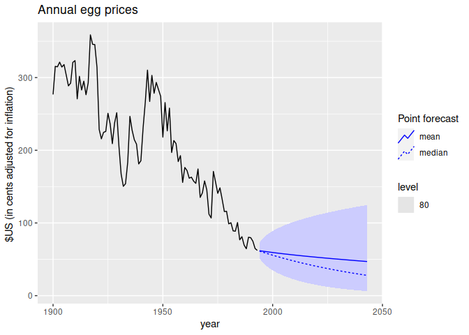
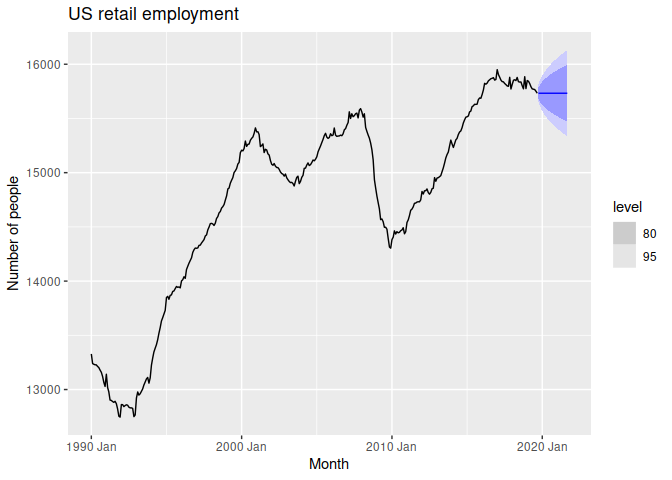
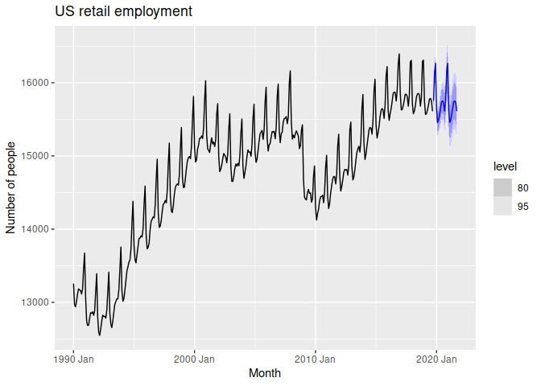
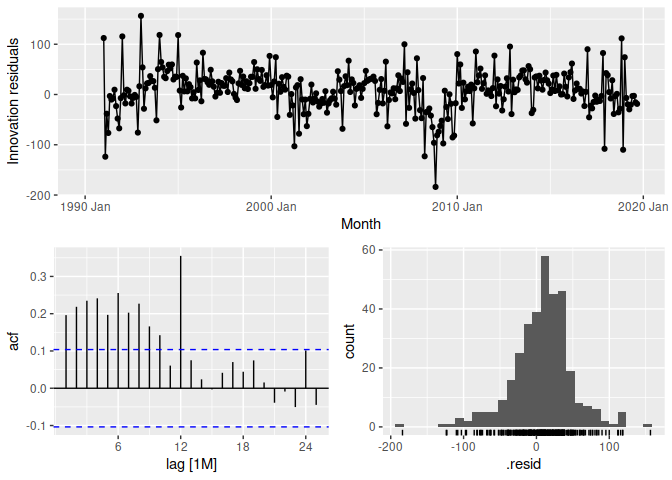

Chapter 5 The forecaster’s toolbox Part 2
================

- <a href="#56-forecasting-using-transformations"
  id="toc-56-forecasting-using-transformations">5.6 Forecasting using
  transformations</a>
  - <a href="#prediction-intervals-with-transformations"
    id="toc-prediction-intervals-with-transformations">Prediction intervals
    with transformations</a>
  - <a href="#bias-adjustments" id="toc-bias-adjustments">Bias
    adjustments</a>
- <a href="#57-forecasting-with-decomposition"
  id="toc-57-forecasting-with-decomposition">5.7 Forecasting with
  decomposition</a>
  - <a href="#example-employment-in-the-us-retail-sector"
    id="toc-example-employment-in-the-us-retail-sector">Example: Employment
    in the US retail sector</a>

``` r
library(fpp3)
```

    ## ── Attaching packages ────────────────────────────────────────────── fpp3 0.5 ──

    ## ✔ tibble      3.1.8     ✔ tsibble     1.1.3
    ## ✔ dplyr       1.1.0     ✔ tsibbledata 0.4.1
    ## ✔ tidyr       1.3.0     ✔ feasts      0.3.0
    ## ✔ lubridate   1.9.2     ✔ fable       0.3.2
    ## ✔ ggplot2     3.4.1     ✔ fabletools  0.3.2

    ## ── Conflicts ───────────────────────────────────────────────── fpp3_conflicts ──
    ## ✖ lubridate::date()    masks base::date()
    ## ✖ dplyr::filter()      masks stats::filter()
    ## ✖ tsibble::intersect() masks base::intersect()
    ## ✖ tsibble::interval()  masks lubridate::interval()
    ## ✖ dplyr::lag()         masks stats::lag()
    ## ✖ tsibble::setdiff()   masks base::setdiff()
    ## ✖ tsibble::union()     masks base::union()

``` r
library(feasts)
```

# 5.6 Forecasting using transformations

Some common transformations which can be used when modelling were
discussed in Section 3.1. When forecasting from a model with
transformations, we first produce forecasts of the transformed data.
Then, we need to reverse the transformation (or **back-transform**) to
obtain forecasts on the original scale. For Box-Cox transformations
given by (3.1), the reverse transformation is given by

$$
\begin{equation}
\tag{5.2}
y_{t} =
\begin{cases}
\exp(w_t) & \text{if } \lambda = 0; \\
      \text{sign}(\lambda w_t+1)|\lambda w_t+1|^{1/\lambda} & \text{otherwise}
\end{cases}
\end{equation}
$$

The `fable` package will automatically back-transform the forecasts
whenever a transformation has been used in the model definition. The
back-transformed forecast distribution is then a “transformed Normal”
distribution.

## Prediction intervals with transformations

If a transformation has been used, then the prediction interval is first
computed on the transformed scale, and the end points are
back-transformed to give a prediction interval on the original scale.
This approach preserves the probability coverage of the prediction
interval, although it will no longer be symmetric around the point
forecast.

The back-transformation of prediction intervals is done automatically
when using the `fable` package, provided you have used a transformation
in the model formula.

Transformations sometimes make little difference to the point forecasts
but have a large effect on prediction intervals.

## Bias adjustments

One issue with using mathematical transformations such as Box-Cox
transformations is that the back-transformed point forecast will not be
the mean of the forecast distribution. In fact, it will usually be the
median of the forecast distribution (assuming that the distribution on
the transformed space is symmetric). For many purposes, this is
acceptable, although the mean is usually preferable. For example, you
may wish to add up sales forecasts from various regions to form a
forecast for the whole country. But medians do not add up, whereas means
do.

For a Box-Cox transformation, the back-transformed mean is given
(approximately) by

$$
\begin{equation}
\tag{5.3}
\hat{y}_{T+h|T} =
  \begin{cases}
       \exp(\hat{w}_{T+h|T})\left[1 +   \frac{\sigma_h^2}{2}\right] & \text{if } \lambda=0;\\
(\lambda \hat{w}_{T+h|T}+1)^{1/\lambda}\left[1 + \frac{\sigma_h^2(1-\lambda)}{2(\lambda \hat{w}_{T+h|T}+1)^{2}}\right] & \text{otherwise;}
  \end{cases}
\end{equation}
$$

where $\hat{w}_{T+h|T}$ is the $h$-step forecast mean and $\sigma_h^2$
is the $h$-step forecast variance on the transformed scale. The larger
the forecast variance, the bigger the difference between the mean and
the median.

The difference between the simple back-transformed forecast given by
(5.2) and the mean given by (5.3) is called the **bias**. When we use
the mean, rather than the median, we say the point forecasts have been
**bias-adjusted**.

To see how much difference this bias-adjustment makes, consider the
following example, where we forecast the average annual price of eggs
using the drift method with a log transformation $(\lambda = 0)$. The
log transformation is useful in this case to ensure the forecasts and
the prediction intervals stay positive.

``` r
prices |>
  filter(!is.na(eggs)) |>
  model(RW(log(eggs) ~ drift())) |>
  forecast(h = 50) |>
  autoplot(prices |> filter(!is.na(eggs)),
    level = 80, 
    point_forecast = lst(mean, median)) +
  labs(title = "Annual egg prices",
       y = "$US (in cents adjusted for inflation) ")
```

    ## Warning in ggplot2::geom_point(mapping = mapping, data =
    ## dplyr::semi_join(object, : Ignoring unknown aesthetics: linetype

<!-- -->

The dashed line in Figure 5.17 shows the forecast medians while the
solid line shows the forecast means. Notice how the skewed forecast
distribution pulls up the forecast distribution’s mean; this is a result
of the added term from the bias adjustment.

Bias-adjusted forecast means are automatically computed in the `fable`
package. The forecast median (the point forecast prior to bias
adjustment) can be obtained using the `median()` function on the
distribution column.

# 5.7 Forecasting with decomposition

- Additive decomposition:

$$y_t = \hat{S}_t + \hat{A}_t,$$

where $\hat{A}_t=\hat{T}_t+\hat{R}_t$ is the seasonally adjusted
component.

- Multiplicative decomposition:

$$y_t = \hat{S}_t\hat{A}_t,$$

where $\hat{A}_t = \hat{T}_t\hat{R}_{t}$.

To forecast a decomposed time series, we **forecast the seasonal
component, $\hat{S}_t$, and the seasonally adjusted component
$\hat{A}_t$, separately**. It is usually assumed that the seasonal
component is unchanging, or changing extremely slowly, so it is forecast
by simply taking the last year of the estimated component. In other
words, **a seasonal naïve method is used for the seasonal component**.

To forecast the seasonally adjusted component, any non-seasonal
forecasting method may be used. For example, the drift method, or Holt’s
method (discussed in Chapter 8), or a non-seasonal ARIMA model
(discussed in Chapter 9), may be used.

## Example: Employment in the US retail sector

``` r
us_retail_employment <- us_employment |>
  filter(year(Month) >= 1990, Title == "Retail Trade")
dcmp <- us_retail_employment |>
  model(STL(Employed ~ trend(window = 7), robust = TRUE)) |>
  components() |>
  select(-.model)
dcmp |>
  model(NAIVE(season_adjust)) |>
  forecast() |>
  autoplot(dcmp) +
  labs(y = "Number of people",
       title = "US retail employment")
```

<!-- -->
<p class="caption">
Figure 5.18: Naïve forecasts of the seasonally adjusted data obtained
from an STL decomposition of the total US retail employment.
</p>

Figure 5.18 shows naïve forecasts of the seasonally adjusted US retail
employment data. These are then “reseasonalised” by adding in the
seasonal naïve forecasts of the seasonal component.

This is made easy with the **`decomposition_model()` function**, which
allows you to compute forecasts via any additive decomposition, using
other model functions to forecast each of the decomposition’s
components. Seasonal components of the model will be forecast
automatically using `SNAIVE()` if a different model isn’t specified. The
function will also do the reseasonalising for you, ensuring that the
resulting forecasts of the original data are obtained. These are shown
in Figure 5.19.

``` r
fit_dcmp <- us_retail_employment |>
  model(stlf = decomposition_model(
    STL(Employed ~ trend(window = 7), robust = TRUE),
    NAIVE(season_adjust)
  ))
fit_dcmp |>
  forecast() |>
  autoplot(us_retail_employment)+
  labs(y = "Number of people",
       title = "US retail employment")
```

<!-- -->

<p class="caption">
Figure 5.19: Forecasts of the total US retail employment data based on a
naïve forecast of the seasonally adjusted data and a seasonal naïve
forecast of the seasonal component, after an STL decomposition of the
data.
</p>

The prediction intervals shown in this graph are constructed in the same
way as the point forecasts. That is, the upper and lower limits of the
prediction intervals on the seasonally adjusted data are
“reseasonalised” by adding in the forecasts of the seasonal component.

The ACF of the residuals, shown in Figure 5.20, displays significant
autocorrelations. These are due to the naïve method not capturing the
changing trend in the seasonally adjusted series.

``` r
fit_dcmp |> gg_tsresiduals()
```

    ## Warning: Removed 12 rows containing missing values (`geom_line()`).

    ## Warning: Removed 12 rows containing missing values (`geom_point()`).

    ## Warning: Removed 12 rows containing non-finite values (`stat_bin()`).

<!-- -->
