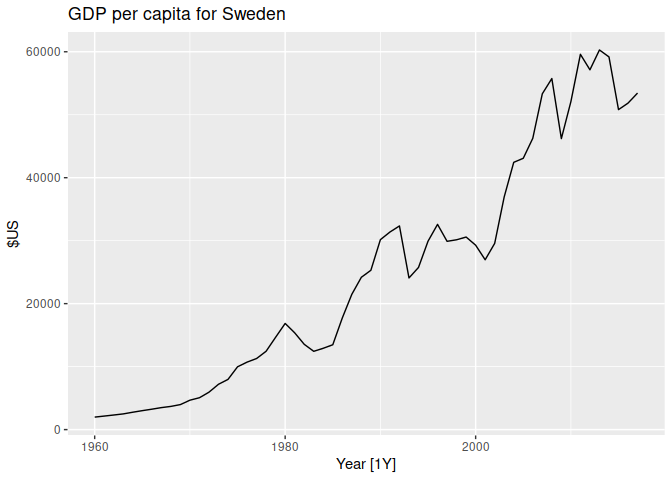
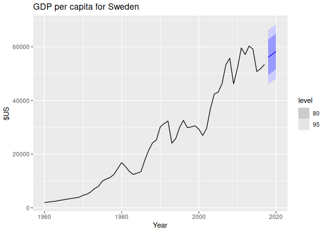

Chapter 5 The forecaster’s toolbox
================

- <a href="#51-a-tidy-forecasting-workflow"
  id="toc-51-a-tidy-forecasting-workflow">5.1 A tidy forecasting
  workflow</a>
  - <a href="#data-preparation-tidy" id="toc-data-preparation-tidy">Data
    preparation (tidy)</a>
  - <a href="#visualize-the-data" id="toc-visualize-the-data">Visualize the
    data</a>
  - <a href="#specify-a-model" id="toc-specify-a-model">Specify a model</a>
  - <a href="#train-the-model-estimate"
    id="toc-train-the-model-estimate">Train the model (estimate)</a>
  - <a href="#evaluate-model-performance"
    id="toc-evaluate-model-performance">Evaluate model performance</a>
  - <a href="#produce-forecasts" id="toc-produce-forecasts">Produce
    forecasts</a>
- <a href="#52-some-simple-forecasting-methods"
  id="toc-52-some-simple-forecasting-methods">5.2 Some simple forecasting
  methods</a>
- <a href="#53-fitted-values-and-residuals"
  id="toc-53-fitted-values-and-residuals">5.3 Fitted values and
  residuals</a>
- <a href="#54-residual-diagnostics" id="toc-54-residual-diagnostics">5.4
  Residual diagnostics</a>
- <a href="#55-distributional-forecasts-and-predictions"
  id="toc-55-distributional-forecasts-and-predictions">5.5 Distributional
  forecasts and predictions</a>
- <a href="#56-forecasting-using-transformations"
  id="toc-56-forecasting-using-transformations">5.6 Forecasting using
  transformations</a>
- <a href="#57-forecasting-with-decomosition"
  id="toc-57-forecasting-with-decomosition">5.7 Forecasting with
  decomosition</a>
- <a href="#58-evaluating-point-forecast-accuracy"
  id="toc-58-evaluating-point-forecast-accuracy">5.8 Evaluating point
  forecast accuracy</a>
- <a href="#59-evaluating-distributional-forecast-accuracy"
  id="toc-59-evaluating-distributional-forecast-accuracy">5.9 Evaluating
  distributional forecast accuracy</a>
- <a href="#510-time-series-cross-validation"
  id="toc-510-time-series-cross-validation">5.10 Time series
  cross-validation</a>

The feasts package includes functions for computing FEatures And
Statistics from Time Series.

``` r
library(fpp3)
```

    ## ── Attaching packages ────────────────────────────────────────────── fpp3 0.5 ──

    ## ✔ tibble      3.1.8     ✔ tsibble     1.1.3
    ## ✔ dplyr       1.1.0     ✔ tsibbledata 0.4.1
    ## ✔ tidyr       1.3.0     ✔ feasts      0.3.0
    ## ✔ lubridate   1.9.2     ✔ fable       0.3.2
    ## ✔ ggplot2     3.4.1     ✔ fabletools  0.3.2

    ## ── Conflicts ───────────────────────────────────────────────── fpp3_conflicts ──
    ## ✖ lubridate::date()    masks base::date()
    ## ✖ dplyr::filter()      masks stats::filter()
    ## ✖ tsibble::intersect() masks base::intersect()
    ## ✖ tsibble::interval()  masks lubridate::interval()
    ## ✖ dplyr::lag()         masks stats::lag()
    ## ✖ tsibble::setdiff()   masks base::setdiff()
    ## ✖ tsibble::union()     masks base::union()

``` r
library(feasts)
```

# 5.1 A tidy forecasting workflow

To illustrate the process, we will fit linear trend models to national
GDP data stored in `global_economy`.

## Data preparation (tidy)

The first step in forecasting is to prepare data in the correct format.
This process may involve loading in data, identifying missing values,
filtering the time series, and other pre-processing tasks. The
functionality provided by `tsibble` and other packages in the
`tidyverse` substantially simplifies this step.

If we want to model GDP per capita over time we must first compute the
variable

``` r
gdppc <- global_economy |>
  mutate(GDP_per_capita = GDP / Population)
gdppc
```

    ## # A tsibble: 15,150 x 10 [1Y]
    ## # Key:       Country [263]
    ##    Country     Code   Year      GDP Growth   CPI Imports Exports Popul…¹ GDP_p…²
    ##    <fct>       <fct> <dbl>    <dbl>  <dbl> <dbl>   <dbl>   <dbl>   <dbl>   <dbl>
    ##  1 Afghanistan AFG    1960   5.38e8     NA    NA    7.02    4.13  9.00e6    59.8
    ##  2 Afghanistan AFG    1961   5.49e8     NA    NA    8.10    4.45  9.17e6    59.9
    ##  3 Afghanistan AFG    1962   5.47e8     NA    NA    9.35    4.88  9.35e6    58.5
    ##  4 Afghanistan AFG    1963   7.51e8     NA    NA   16.9     9.17  9.53e6    78.8
    ##  5 Afghanistan AFG    1964   8.00e8     NA    NA   18.1     8.89  9.73e6    82.2
    ##  6 Afghanistan AFG    1965   1.01e9     NA    NA   21.4    11.3   9.94e6   101. 
    ##  7 Afghanistan AFG    1966   1.40e9     NA    NA   18.6     8.57  1.02e7   138. 
    ##  8 Afghanistan AFG    1967   1.67e9     NA    NA   14.2     6.77  1.04e7   161. 
    ##  9 Afghanistan AFG    1968   1.37e9     NA    NA   15.2     8.90  1.06e7   130. 
    ## 10 Afghanistan AFG    1969   1.41e9     NA    NA   15.0    10.1   1.09e7   130. 
    ## # … with 15,140 more rows, and abbreviated variable names ¹​Population,
    ## #   ²​GDP_per_capita

## Visualize the data

Let’s look at the data for one country

``` r
gdppc |>
  filter(Country == "Sweden") |>
  autoplot(GDP_per_capita) +
  labs(y = "$US", title = "GDP per capita for Sweden")
```

<!-- -->

## Specify a model

There are many different time series models that can be used for
forecasting, and much of this book is dedicated to describing various
models. Specifying an appropriate model for the data is essential for
producing appropriate forecasts.

Models in fable are specified using model functions, which each use a
formula (y \~ x) interface. The response variable(s) are specified on
the left of the formula, and the structure of the model is written on
the right.

For example, a linear trend model (to be discussed in Chapter 7) for GDP
per capita can be specified with

``` r
TSLM(GDP_per_capita ~ trend())
```

    ## <TSLM model definition>

In this case the model function is `TSLM()` (time series linear model),
the response variable is `GDP_per_capita` and it is being modelled using
`trend()` (a “special” function specifying a linear trend when it is
used within `TSLM()`). We will be taking a closer look at how each model
can be specified in their respective sections.

The special functions used to define the model’s structure vary between
models (as each model can support different structures). The “Specials”
section of the documentation for each model function lists these special
functions and how they can be used.

The left side of the formula also supports the transformations discussed
in Section 3.1, which can be useful in simplifying the time series
patterns or constraining the forecasts to be between specific values
(see Section 13.3).

## Train the model (estimate)

Once an appropriate model is specified, we next train the model on some
data. One or more model specifications can be estimated using the
model() function.

``` r
fit <- gdppc |>
  model(trend_model = TSLM(GDP_per_capita ~ trend()))
```

    ## Warning: 7 errors (1 unique) encountered for trend_model
    ## [7] 0 (non-NA) cases

``` r
fit
```

    ## # A mable: 263 x 2
    ## # Key:     Country [263]
    ##    Country             trend_model
    ##    <fct>                   <model>
    ##  1 Afghanistan              <TSLM>
    ##  2 Albania                  <TSLM>
    ##  3 Algeria                  <TSLM>
    ##  4 American Samoa           <TSLM>
    ##  5 Andorra                  <TSLM>
    ##  6 Angola                   <TSLM>
    ##  7 Antigua and Barbuda      <TSLM>
    ##  8 Arab World               <TSLM>
    ##  9 Argentina                <TSLM>
    ## 10 Armenia                  <TSLM>
    ## # … with 253 more rows

This fits a linear trend model to the GDP per capita data for each
combination of key variables in the `tsibble`. In this example, it will
fit a model to each of the 263 countries in the dataset. The resulting
object is a model table or a “**mable**”.

## Evaluate model performance

Once a model has been fitted, it is important to check how well it has
performed on the data. There are several diagnostic tools available to
check model behaviour, and also accuracy measures that allow one model
to be compared against another. Sections 5.8 and 5.9 go into further
details.

## Produce forecasts

With an appropriate model specified, estimated and checked, it is time
to produce the forecasts using forecast(). The easiest way to use this
function is by specifying the number of future observations to forecast.
For example, forecasts for the next 10 observations can be generated
using h = 10. We can also use natural language; e.g., h = “2 years” can
be used to predict two years into the future.

In other situations, it may be more convenient to provide a dataset of
future time periods to forecast. This is commonly required when your
model uses additional information from the data, such as exogenous
regressors. Additional data required by the model can be included in the
dataset of observations to forecast.

``` r
fit |> forecast(h = "3 years")
```

    ## # A fable: 789 x 5 [1Y]
    ## # Key:     Country, .model [263]
    ##    Country        .model       Year   GDP_per_capita  .mean
    ##    <fct>          <chr>       <dbl>           <dist>  <dbl>
    ##  1 Afghanistan    trend_model  2018     N(526, 9653)   526.
    ##  2 Afghanistan    trend_model  2019     N(534, 9689)   534.
    ##  3 Afghanistan    trend_model  2020     N(542, 9727)   542.
    ##  4 Albania        trend_model  2018  N(4716, 476419)  4716.
    ##  5 Albania        trend_model  2019  N(4867, 481086)  4867.
    ##  6 Albania        trend_model  2020  N(5018, 486012)  5018.
    ##  7 Algeria        trend_model  2018  N(4410, 643094)  4410.
    ##  8 Algeria        trend_model  2019  N(4489, 645311)  4489.
    ##  9 Algeria        trend_model  2020  N(4568, 647602)  4568.
    ## 10 American Samoa trend_model  2018 N(12491, 652926) 12491.
    ## # … with 779 more rows

This is a forecast table, or “**fable**”. Each row corresponds to one
forecast period for each country. The `GDP_per_capita` column contains
the **forecast distribution**, while the `.mean` column contains the
**point forecast**. The point forecast is the mean (or average) of the
forecast distribution.

The forecasts can be plotted along with the historical data using
autoplot() as follows.

``` r
fit |>
  forecast(h = "3 years") |>
  filter(Country == "Sweden") |>
  autoplot(gdppc) +
  labs(y = "$US", title = "GDP per capita for Sweden")
```

<!-- -->

# 5.2 Some simple forecasting methods

# 5.3 Fitted values and residuals

# 5.4 Residual diagnostics

# 5.5 Distributional forecasts and predictions

# 5.6 Forecasting using transformations

# 5.7 Forecasting with decomosition

# 5.8 Evaluating point forecast accuracy

# 5.9 Evaluating distributional forecast accuracy

# 5.10 Time series cross-validation
