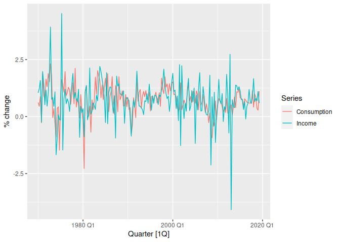
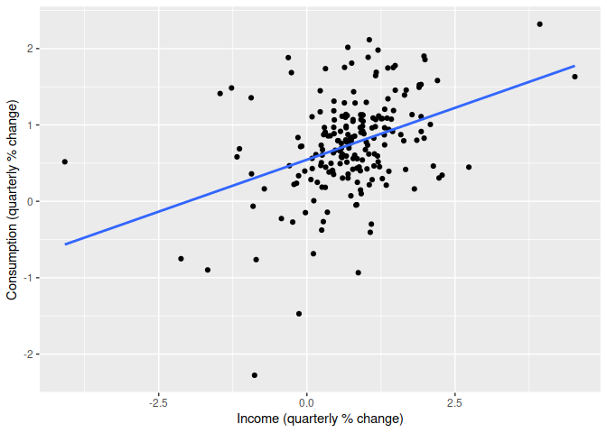
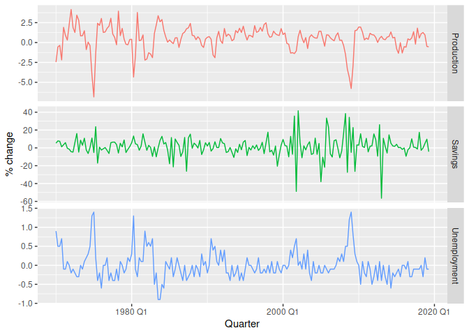
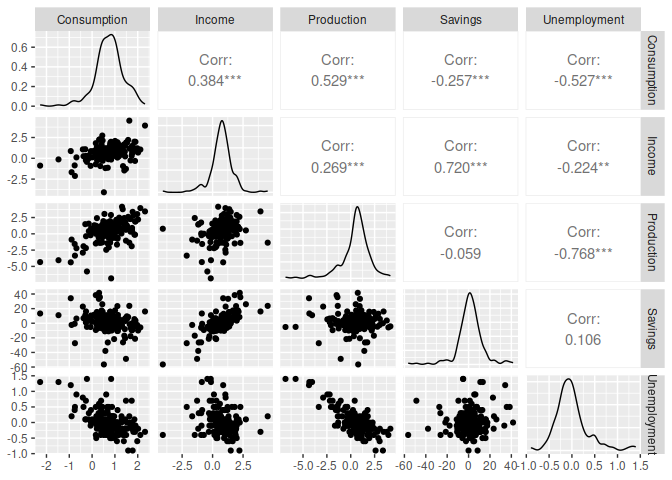

Chapter 7 Time series regression
================

- <a href="#71-the-linear-model" id="toc-71-the-linear-model">7.1 The
  linear model</a>
  - <a href="#simple-linear-regression"
    id="toc-simple-linear-regression">Simple linear regression</a>
  - <a href="#example-us-consumption-of-expenditure"
    id="toc-example-us-consumption-of-expenditure">Example: US consumption
    of expenditure</a>
  - <a href="#multiple-linear-regression"
    id="toc-multiple-linear-regression">Multiple linear regression</a>
  - <a href="#example-us-consumption-expenditure"
    id="toc-example-us-consumption-expenditure">Example: US consumption
    expenditure</a>
  - <a href="#assumptions" id="toc-assumptions">Assumptions</a>

In this chapter we discuss regression models. The basic concept is that
we forecast the time series of interest $y$ assuming that it has a
linear relationship with other time series $x$.

**Forecast variable $y$**: aka regressand, dependent or explained
variable.

**Predictor variables $x$** aka regressors, independent or explanatory
variables.

``` r
library(fpp3)
```

    ## ── Attaching packages ────────────────────────────────────────────── fpp3 0.5 ──

    ## ✔ tibble      3.1.8     ✔ tsibble     1.1.3
    ## ✔ dplyr       1.1.0     ✔ tsibbledata 0.4.1
    ## ✔ tidyr       1.3.0     ✔ feasts      0.3.0
    ## ✔ lubridate   1.9.2     ✔ fable       0.3.2
    ## ✔ ggplot2     3.4.1     ✔ fabletools  0.3.2

    ## ── Conflicts ───────────────────────────────────────────────── fpp3_conflicts ──
    ## ✖ lubridate::date()    masks base::date()
    ## ✖ dplyr::filter()      masks stats::filter()
    ## ✖ tsibble::intersect() masks base::intersect()
    ## ✖ tsibble::interval()  masks lubridate::interval()
    ## ✖ dplyr::lag()         masks stats::lag()
    ## ✖ tsibble::setdiff()   masks base::setdiff()
    ## ✖ tsibble::union()     masks base::union()

``` r
library(feasts)
```

# 7.1 The linear model

## Simple linear regression

$$y_t = \beta_0 + \beta_1 x_t + \varepsilon_t$$

$\beta_0$: $y$-intercept, represents the predicted value of $y$ when
$x=0$

$\beta_1$: slope, represents the average predicted change in $y$
resulting from a one unit increase in $x$.


We can think of each observation $y_t$ as consisting of the systematic
or explained part of the model, $\beta_0+\beta_1x_t$ and the random
“error” $\epsilon_t$. The “error” term does not imply a mistake, but a
deviation from the underlying straight line model. **$\epsilon_t$
captures anything that may affect $y_t$ other than $x_t$.**

## Example: US consumption of expenditure

``` r
us_change
```

    ## # A tsibble: 198 x 6 [1Q]
    ##    Quarter Consumption Income Production Savings Unemployment
    ##      <qtr>       <dbl>  <dbl>      <dbl>   <dbl>        <dbl>
    ##  1 1970 Q1       0.619  1.04      -2.45    5.30         0.9  
    ##  2 1970 Q2       0.452  1.23      -0.551   7.79         0.5  
    ##  3 1970 Q3       0.873  1.59      -0.359   7.40         0.5  
    ##  4 1970 Q4      -0.272 -0.240     -2.19    1.17         0.700
    ##  5 1971 Q1       1.90   1.98       1.91    3.54        -0.100
    ##  6 1971 Q2       0.915  1.45       0.902   5.87        -0.100
    ##  7 1971 Q3       0.794  0.521      0.308  -0.406        0.100
    ##  8 1971 Q4       1.65   1.16       2.29   -1.49         0    
    ##  9 1972 Q1       1.31   0.457      4.15   -4.29        -0.200
    ## 10 1972 Q2       1.89   1.03       1.89   -4.69        -0.100
    ## # … with 188 more rows

``` r
us_change |>
  pivot_longer(c(Consumption, Income), names_to = "Series") |>
  autoplot(value) +
  labs(y = "% change")
```

<!-- --> This shows
time series of quarterly percentage changes (growth rates) of real
personal consumption expenditure, $y$, and real personal disposable
income, $x$, for the US from 1970 Q1 to 2019 Q2.

``` r
us_change |>
  ggplot(aes(x = Income, y = Consumption)) +
  labs(y = "Consumption (quarterly % change)",
       x = "Income (quarterly % change)") +
  geom_point() +
  geom_smooth(method = "lm", se = FALSE)
```

    ## `geom_smooth()` using formula = 'y ~ x'

<!-- -->

This is a scatter plot of consumption changes against income changes
along with the estimated regression line

$$\hat{y}_t=0.54 + 0.27x_t.$$

$\hat{y}$: value of $y$ predicted by the model.

The equation is estimated using the `TSLM()` function and shown with
**`report()`**

``` r
us_change |>
  model(TSLM(Consumption ~ Income)) |>
  report()
```

    ## Series: Consumption 
    ## Model: TSLM 
    ## 
    ## Residuals:
    ##      Min       1Q   Median       3Q      Max 
    ## -2.58236 -0.27777  0.01862  0.32330  1.42229 
    ## 
    ## Coefficients:
    ##             Estimate Std. Error t value Pr(>|t|)    
    ## (Intercept)  0.54454    0.05403  10.079  < 2e-16 ***
    ## Income       0.27183    0.04673   5.817  2.4e-08 ***
    ## ---
    ## Signif. codes:  0 '***' 0.001 '**' 0.01 '*' 0.05 '.' 0.1 ' ' 1
    ## 
    ## Residual standard error: 0.5905 on 196 degrees of freedom
    ## Multiple R-squared: 0.1472,  Adjusted R-squared: 0.1429
    ## F-statistic: 33.84 on 1 and 196 DF, p-value: 2.4022e-08

The fitted line has a positive slope, reflecting the positive
relationship between income and consumption. The slope coefficient shows
that a one unit increase in $x$ (a 1% increase in personal disposable
income) results on average in 0.27 units increase in $y$ (an average
increase of 0.27% in personal consumption expenditure). Alternatively
the estimated equation shows that a value of 1 for $x$ (the percentage
increase in personal disposable income) will result in a forecast value
of $0.54+0.27×1=0.82$ for $y$ (the percentage increase in personal
consumption expenditure).

**The interpretation of the intercept requires that a value of $x=0$
makes sense.** In this case when $x=0$ (i.e., when there is no change in
personal disposable income since the last quarter) the predicted value
of $y$ is 0.54 (i.e., an average increase in personal consumption
expenditure of 0.54%). Even when $x=0$ does not make sense, the
intercept is an important part of the model. Without it, the slope
coefficient can be distorted unnecessarily. The intercept should always
be included unless the requirement is to force the regression line
“through the origin”. In what follows we assume that an intercept is
always included in the model.

## Multiple linear regression

$$
\begin{equation}
  y_t = \beta_{0} + \beta_{1} x_{1,t} + \beta_{2} x_{2,t} + \cdots + \beta_{k} x_{k,t} + \varepsilon_t,
  \tag{7.1}
\end{equation}
$$

where $y$ is the variable to be forecast and $x_1,\dots,x_k$ are the $k$
predictor variables. Each of the predictor variables must be numerical.
The coefficients $\beta_1, \dots, \beta_k$ measure the effect of each
predictor after taking into account the effects of all the other
predictors in the model. Thus, **the coefficients measure the marginal
effects of the predictor variables**.

## Example: US consumption expenditure

``` r
us_change |>
  select(-Consumption, -Income) |>
  pivot_longer(-Quarter) |>
  ggplot(aes(Quarter, value, colour = name)) +
  geom_line() +
  facet_grid(name ~ ., scales = "free_y") +
  guides(colour = "none") +
  labs(y="% change")
```

<!-- -->

These are quarterly percentage changes in industrial production and
personal savings, and quarterly changes in the unemployment rate (as
this is already a percentage). Building a multiple linear regression
model can potentially generate more accurate forecasts as we expect
consumption expenditure to not only depend on personal income but on
other predictors as well.

``` r
us_change |>
  GGally::ggpairs(columns = 2:6)
```

<!-- -->

This is a scatterplot matrix of five variables. The first column shows
the relationships between the forecast variable (consumption) and each
of the predictors. The scatterplots show positive relationships with
income and industrial production, and negative relationships with
savings and unemployment. The strength of these relationships are shown
by the correlation coefficients across the first row. The remaining
scatterplots and correlation coefficients show the relationships between
the predictors.

## Assumptions

1.  The model is a reasonable approximation to reality; that is, the
    relationship between the forecast variable and the predictor
    variables satisfies this linear equation.

2.  We make the following assumptions about the errors
    ${\epsilon_1,\dots,\epsilon_T}$

- they have mean zero; otherwise the forecasts will be systematically
  biased.
- they are not autocorrelated; otherwise the forecasts will be
  inefficient, as there is more information in the data that can be
  exploited.
- they are unrelated to the predictor variables; otherwise there would
  be more information that should be included in the systematic part of
  the model.

It is also useful to have the errors being normally distributed with a
constant variance $\sigma^2$ in order to easily produce prediction
intervals.

Another important assumption in the linear regression model is that each
predictor $x$ is not a random variable. If we were performing a
controlled experiment in a laboratory, we could control the values of
each $x$ (so they would not be random) and observe the resulting values
of $y$. With observational data (including most data in business and
economics), it is not possible to control the value of $x$, we simply
observe it. Hence we make this an assumption.
