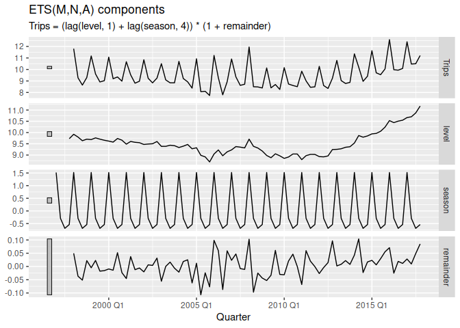
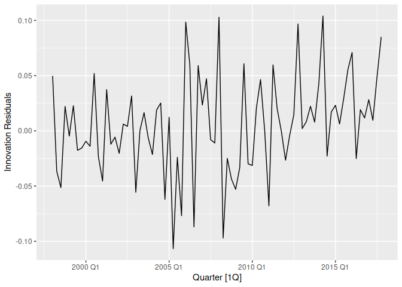
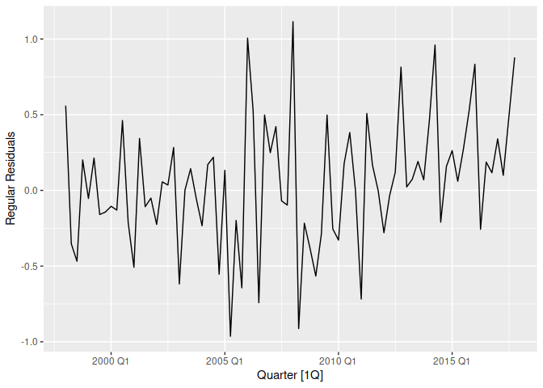

Chapter 8.2 Exponential smoothing (8.5-8.7)
================

- <a href="#85-innovations-state-space-models-for-exponential-smoothing"
  id="toc-85-innovations-state-space-models-for-exponential-smoothing">8.5
  Innovations state space models for exponential smoothing</a>
  - <a href="#etsann-simple-exponential-smoothing-with-additive-errors"
    id="toc-etsann-simple-exponential-smoothing-with-additive-errors">ETS(A,N,N):
    simple exponential smoothing with additive errors</a>
  - <a
    href="#etsmnn-simple-exponential-smoothing-with-multiplicative-errors"
    id="toc-etsmnn-simple-exponential-smoothing-with-multiplicative-errors">ETS(M,N,N):
    simple exponential smoothing with multiplicative errors</a>
  - <a href="#etsaan-holts-linear-method-with-additive-errors"
    id="toc-etsaan-holts-linear-method-with-additive-errors">ETS(A,A,N):
    Holt’s linear method with additive errors</a>
  - <a href="#etsman-holts-linear-method-with-multiplicative-errors"
    id="toc-etsman-holts-linear-method-with-multiplicative-errors">ETS(M,A,N):
    Holt’s linear method with multiplicative errors</a>
  - <a href="#other-ets-models" id="toc-other-ets-models">Other ETS
    models</a>
- <a href="#86-estimation-and-model-selection"
  id="toc-86-estimation-and-model-selection">8.6 Estimation and model
  selection</a>
  - <a href="#estimating-ets-models"
    id="toc-estimating-ets-models">Estimating ETS models</a>
  - <a href="#model-selection" id="toc-model-selection">Model selection</a>
  - <a href="#example-domestic-holiday-tourist-visitor-nights-in-australia"
    id="toc-example-domestic-holiday-tourist-visitor-nights-in-australia">Example:
    Domestic holiday tourist visitor nights in Australia</a>

``` r
library(fpp3)
```

    ## ── Attaching packages ────────────────────────────────────────────── fpp3 0.5 ──

    ## ✔ tibble      3.1.8     ✔ tsibble     1.1.3
    ## ✔ dplyr       1.1.0     ✔ tsibbledata 0.4.1
    ## ✔ tidyr       1.3.0     ✔ feasts      0.3.0
    ## ✔ lubridate   1.9.2     ✔ fable       0.3.2
    ## ✔ ggplot2     3.4.1     ✔ fabletools  0.3.2

    ## ── Conflicts ───────────────────────────────────────────────── fpp3_conflicts ──
    ## ✖ lubridate::date()    masks base::date()
    ## ✖ dplyr::filter()      masks stats::filter()
    ## ✖ tsibble::intersect() masks base::intersect()
    ## ✖ tsibble::interval()  masks lubridate::interval()
    ## ✖ dplyr::lag()         masks stats::lag()
    ## ✖ tsibble::setdiff()   masks base::setdiff()
    ## ✖ tsibble::union()     masks base::union()

# 8.5 Innovations state space models for exponential smoothing

In the rest of this chapter, we study the statistical models that
underlie the exponential smoothing methods we have considered so far.
The exponential smoothing methods presented in Table 8.6 are algorithms
which generate point forecasts. The statistical models in this section
generate the same point forecasts, but can also generate prediction (or
forecast) intervals. <span style="background-color:#ffffb3;">A
statistical model is a stochastic (or random) data generating process
that can produce an entire forecast distribution.</span> We will also
describe how to use the model selection criteria introduced in Chapter 7
to choose the model in an objective manner.

<span style="background-color:#ffffb3;">Each model consists of</span> a
measurement equation that describes <span
style="background-color:#ffffb3;">the observed data, and some state
equations that describe how the unobserved components or states (level,
trend, seasonal) change over time.</span> Hence, these are referred to
as **state space models**.

For each method there exist two models: one with additive errors and one
with multiplicative errors. The point forecasts produced by the models
are identical if they use the same smoothing parameter values. They
will, however, generate different prediction intervals.

To distinguish between a model with additive errors and one with
multiplicative errors (and also to distinguish the models from the
methods), we add a third letter to the classification of Table 8.5. We
label each state space model as $ETS(\cdot,\cdot,\cdot)$ for (Error,
Trend, Seasonal). This label can also be thought of as **ExponenTial
Smoothing**. Using the same notation as in Table 8.5, the possibilities
for each component (or state) are: Error$=\{A,M\}$, Trend$=\{N,A,A_d\}$
and Seasonal$=\{N,A,M\}$.

## ETS(A,N,N): simple exponential smoothing with additive errors

$$
\begin{align*}
  \text{Forecast equation}  && \hat{y}_{t+1|t} & = \ell_{t}\\
  \text{Smoothing equation} && \ell_{t}        & = \alpha y_{t} + (1 - \alpha)\ell_{t-1}.
\end{align*}
$$

If we re-arrange the smoothing equation for the level, we get the “error
correction” form,

$$
\begin{align*}
\ell_t &= \ell_{t-1}+\alpha( y_{t}-\ell_{t-1})\\
         &= \ell_{t-1}+\alpha e_{t},
\end{align*}
$$

where $e_t=y_t−\ell_{t−1}=y_t−\hat{y}_{t\lvert t−1}$ is the residual at
time $t$.

<span style="background-color:#ffffb3;">The training data errors lead to
the adjustment of the estimated level throughout the smoothing process
for $t=1,\dots,T$.</span> For example, if the error at time $t$ is
negative, then $y_t\lt\hat{y}_{t\lvert t−1}$ and so the level at time
$t−1$ has been over-estimated. The new level $\ell_t$ is then the
previous level $\ell_{t-1}$ adjusted downwards. <span
style="background-color:#ffffb3;">The closer $\alpha$ is to one, the
“rougher” the estimate of the level (large adjustments take place). The
smaller the $\alpha$, the “smoother” the level (small adjustments take
place).</span>

We can also write $y_t=\ell_{t−1}+e_t$, so that each observation can be
represented by the previous level plus an error. To make this into an
innovations state space model, all we need to do is specify the
probability distribution for $e_t$. For a model with additive errors, we
assume that residuals (the one-step training errors) $e_t$ are normally
distributed white noise with mean 0 and variance $\sigma^2$. A
short-hand notation for this is
$e_t=\epsilon_t\sim \text{NID}(0,\sigma^2)$; <span
style="background-color:#ffffb3;">NID stands for “normally and
independently distributed”.</span>

Then the equations of the model can be written as

$$
\begin{align}
  y_t &= \ell_{t-1} + \varepsilon_t \tag{8.3}\\
  \ell_t&=\ell_{t-1}+\alpha \varepsilon_t. \tag{8.4}
\end{align}
$$

<span style="background-color:#ffffb3;">We refer to (8.3) as the
measurement (or observation) equation and (8.4) as the state (or
transition) equation.</span> These two equations, together with the
statistical distribution of the errors, form a fully specified
statistical model. Specifically, these constitute an innovations state
space model underlying simple exponential smoothing.

<span style="background-color:#ffffb3;">The term “innovations” comes
from the fact that all equations use the same random error
process</span>, $\epsilon_t$. For the same reason, this formulation is
also referred to as a **“single source of error” model**. There are
alternative multiple source of error formulations which we do not
present here.

The measurement equation shows the relationship between the observations
and the unobserved states. In this case, observation $y_t$ is a linear
function of the level $\ell_{t-1}$, the predictable part of $y_t$, and
the error $\epsilon_t$, the unpredictable part of $y_t$. For other
innovations state space models, this relationship may be nonlinear.

The state equation shows the evolution of the state through time. The
influence of the smoothing parameter $\alpha$ is the same as for the
methods discussed earlier. For example, $\alpha$ governs the amount of
change in successive levels: high values of $\alpha$ allow rapid changes
in the level; low values of $\alpha$ lead to smooth changes. If
$\alpha=0$, the level of the series does not change over time; if
$\alpha=1$, the model reduces to a random walk model,
$y_t=y_{t−1}+\epsilon_t$. (See Section 9.1 for a discussion of this
model.)

## ETS(M,N,N): simple exponential smoothing with multiplicative errors

In a similar fashion, we can specify models with multiplicative errors
by writing the one-step-ahead training errors as relative errors

$$
\varepsilon_t = \frac{y_t-\hat{y}_{t|t-1}}{\hat{y}_{t|t-1}}
$$

where $\epsilon_t\sim\text{NID}(0,\sigma^2)$. Substituting
$\hat{y}_{t\vert t-1}=\ell_{t-1}$ gives
$y_t=\ell_{t-1}+\ell_{t-1}\varepsilon_t$ and
$e_t = y_t - \hat{y}_{t|t-1} = \ell_{t-1}\varepsilon_t$.

Then we can write the multiplicative form of the state space model as

$$
\begin{align*}
  y_t&=\ell_{t-1}(1+\varepsilon_t)\\
  \ell_t&=\ell_{t-1}(1+\alpha \varepsilon_t).
\end{align*}
$$

## ETS(A,A,N): Holt’s linear method with additive errors

For this model, we assume that the one-step-ahead training errors are
given by
$\varepsilon_t=y_t-\ell_{t-1}-b_{t-1} \sim \text{NID}(0,\sigma^2)$.
Substituting this into the error correction equations for Holt’s linear
method we obtain

$$
\begin{align*}
y_t&=\ell_{t-1}+b_{t-1}+\varepsilon_t\\
\ell_t&=\ell_{t-1}+b_{t-1}+\alpha \varepsilon_t\\
b_t&=b_{t-1}+\beta \varepsilon_t,
\end{align*}
$$ where for simplicity we have set $\beta=\alpha\beta^*$.

## ETS(M,A,N): Holt’s linear method with multiplicative errors

Specifying one-step-ahead training errors as relative errors such that

$$
\varepsilon_t=\frac{y_t-(\ell_{t-1}+b_{t-1})}{(\ell_{t-1}+b_{t-1})}
$$

and following an approach similar to that used above, the innovations
state space model underlying Holt’s linear method with multiplicative
errors is specified as

$$
\begin{align*}
y_t&=(\ell_{t-1}+b_{t-1})(1+\varepsilon_t)\\
\ell_t&=(\ell_{t-1}+b_{t-1})(1+\alpha \varepsilon_t)\\
b_t&=b_{t-1}+\beta(\ell_{t-1}+b_{t-1}) \varepsilon_t,
\end{align*}
$$

where again $\beta=\alpha\beta^*$ and
$\varepsilon_t \sim \text{NID}(0,\sigma^2)$.

## Other ETS models

In a similar fashion, we can write an innovations state space model for
each of the exponential smoothing methods of Table 8.6. Table 8.7
presents the equations for all of the models in the ETS framework.


# 8.6 Estimation and model selection

## Estimating ETS models

<span style="background-color:#ffffb3;">An alternative to estimating the
parameters by minimising the sum of squared errors is to maximise the
“likelihood”.</span> The likelihood is the probability of the data
arising from the specified model. Thus, a large likelihood is associated
with a good model. For an additive error model, maximising the
likelihood (assuming normally distributed errors) gives the same results
as minimising the sum of squared errors. However, <span
style="background-color:#ffffb3;">different results will be obtained for
multiplicative error models</span>. In this section, we will estimate
the smoothing parameters $\alpha, \beta, \gamma, \text{ and } \phi$ ,
and the initial states $\ell_0,b_0,s_0,s_1,\dots,s_{-m+1}$, by <span
style="background-color:#ffffb3;">maximising the likelihood</span>.

The possible values that the smoothing parameters can take are
restricted. Traditionally, the parameters have been constrained to lie
between 0 and 1 so that the equations can be interpreted as weighted
averages. That is, $0< \alpha,\beta^*,\gamma^*,\phi<1$. For the state
space models, we have set $\beta=\alpha\beta^*$ and
$\gamma=(1-\alpha)\gamma^*$. Therefore, the traditional restrictions
translate to $0\lt\alpha\lt1$, $0\lt\beta\lt\alpha$ and
$0\lt y\lt1-\alpha$. In practice, the damping parameter $\phi$ is
usually constrained further to prevent numerical difficulties in
estimating the model. In the `fable` package, it is restricted so that
$0.8\lt\phi\lt0.98$.

Another way to view the parameters is through a consideration of the
mathematical properties of the state space models. The parameters are
constrained in order to prevent observations in the distant past having
a continuing effect on current forecasts. This leads to some
*admissibility* constraints on the parameters, which are usually (but
not always) less restrictive than the traditional constraints region
(Hyndman et al., 2008, pp. 149–161). For example, for the ETS(A,N,N)
model, the traditional parameter region is $0\lt\alpha\lt1$ but the
admissible region is $0\lt\alpha\lt2$ . For the ETS(A,A,N) model, the
traditional parameter region is $0\lt\alpha\lt1$ and
$0\lt\beta\lt\alpha$ but the admissible region is $0\lt\alpha\lt2$ and
$0\lt\beta\lt4-2\alpha$.

[Article on **admissibility** and the $A^*$
algorithm](http://www.cs.trincoll.edu/~ram/cpsc352/notes/astar.html)

## Model selection

A great advantage of the ETS statistical framework is that information
criteria can be used for model selection. The AIC, AIC$_c$ and BIC,
introduced in Section 7.5, can be used here to determine which of the
ETS models is most appropriate for a given time series.

For ETS models, Akaike’s Information Criterion (AIC) is defined as

$$\text{AIC} = -2\log(L) + 2k,$$

where $L$ is the likelihood of the model and $k$ is the total number of
parameters and initial states that have been estimated (including the
residual variance).

The AIC corrected for small sample bias (AIC$_c$) is defined as

$$
\text{AIC}_{\text{c}} = \text{AIC} + \frac{2k(k+1)}{T-k-1},
$$

and the Bayesian Information Criterion (BIC) is

$$\text{BIC} = \text{AIC} + k[\log(T)-2].$$

<span style="background-color:#ffffb3;">Three of the combinations of
(Error, Trend, Seasonal) can lead to numerical difficulties.
Specifically, the models that can cause such instabilities are
ETS(A,N,M), ETS(A,A,M), and ETS(A,A$_d$,M), due to division by values
potentially close to zero in the state equations. We normally do not
consider these particular combinations when selecting a model.</span>

Models with multiplicative errors are useful when the data are strictly
positive, but are not numerically stable when the data contain zeros or
negative values. Therefore, <span
style="background-color:#ffffb3;">multiplicative error models will not
be considered if the time series is not strictly positive.</span> In
that case, only the six fully additive models will be applied.

## Example: Domestic holiday tourist visitor nights in Australia

We now employ the ETS statistical framework to forecast Australian
holiday tourism over the period 2016–2019. We let the `ETS()` function
select the model by minimising the $AIC_c$.

``` r
aus_holidays <- tourism |>
  filter(Purpose == "Holiday") |>
  summarise(Trips = sum(Trips)/1e3)
fit <- aus_holidays |>
  model(ETS(Trips))
report(fit)
```

    ## Series: Trips 
    ## Model: ETS(M,N,A) 
    ##   Smoothing parameters:
    ##     alpha = 0.3484054 
    ##     gamma = 0.0001000018 
    ## 
    ##   Initial states:
    ##      l[0]       s[0]      s[-1]      s[-2]    s[-3]
    ##  9.727072 -0.5376106 -0.6884343 -0.2933663 1.519411
    ## 
    ##   sigma^2:  0.0022
    ## 
    ##      AIC     AICc      BIC 
    ## 226.2289 227.7845 242.9031

The model selected is ETS(M,N,A)

$$
\begin{align*}
y_{t} &= (\ell_{t-1}+s_{t-m})(1 + \varepsilon_t)\\
\ell_t &= \ell_{t-1} + \alpha(\ell_{t-1}+s_{t-m})\varepsilon_t\\
s_t &=  s_{t-m} + \gamma(\ell_{t-1}+s_{t-m}) \varepsilon_t.
\end{align*}
$$

The parameter estimates are $\hat{\alpha}=0.3484$ and $\hat{y}=0.0001$.
The output also returns the estimates for the initial states $\ell_0$,
$s_0$, $s_{−1}$, $s_{−2}$ and $s_{−3}$. Compare these with the values
obtained for the Holt-Winters method with additive seasonality presented
in Table 8.3.

Figure 8.10 shows the states over time, while Figure 8.12 shows point
forecasts and prediction intervals generated from the model. <span
style="background-color:#ffffb3;">The small values of $\gamma$ indicate
that the seasonal states change very little over time.</span>

``` r
components(fit) |>
  autoplot() +
  labs(title = "ETS(M,N,A) components")
```

    ## Warning: Removed 4 rows containing missing values (`geom_line()`).

<!-- -->

Because this model has multiplicative errors, the innovation residuals
are not equivalent to the regular residuals (i.e., the one-step training
errors). The innovation residuals are given by $\hat{\epsilon}_t$, while
the regular residuals are defined as $y_t−\hat{y}_{t\vert t-1}$. We can
obtain both using the augment() function. They are plotted in Figure
8.11.

``` r
augment(fit) |>
  autoplot(.innov) +
  labs(y = "Innovation Residuals")
```

<!-- -->

``` r
augment(fit) |>
  autoplot(.resid) +
  labs(y = "Regular Residuals")
```

<!-- -->
