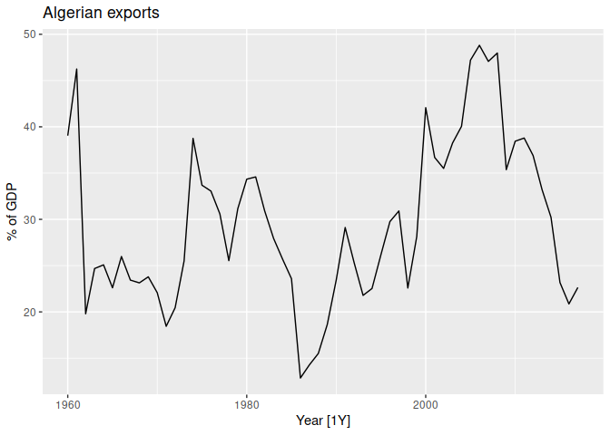
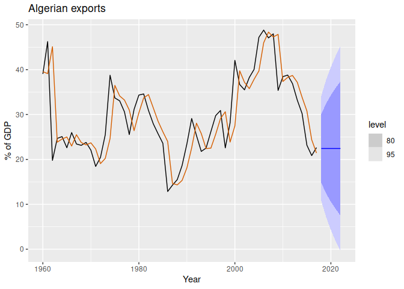

Chapter 8 Exponential smoothing
================

- <a href="#81-simple-exponential-smoothing"
  id="toc-81-simple-exponential-smoothing">8.1 Simple exponential
  smoothing</a>
  - <a href="#weighted-average-form" id="toc-weighted-average-form">Weighted
    average form</a>
  - <a href="#component-form" id="toc-component-form">Component form</a>
  - <a href="#flat-forecasts" id="toc-flat-forecasts">Flat forecasts</a>
  - <a href="#optimisation" id="toc-optimisation">Optimisation</a>
  - <a href="#example-algerian-exports"
    id="toc-example-algerian-exports">Example: Algerian exports</a>

``` r
library(fpp3)
```

    ## ── Attaching packages ────────────────────────────────────────────── fpp3 0.5 ──

    ## ✔ tibble      3.1.8     ✔ tsibble     1.1.3
    ## ✔ dplyr       1.1.0     ✔ tsibbledata 0.4.1
    ## ✔ tidyr       1.3.0     ✔ feasts      0.3.0
    ## ✔ lubridate   1.9.2     ✔ fable       0.3.2
    ## ✔ ggplot2     3.4.1     ✔ fabletools  0.3.2

    ## ── Conflicts ───────────────────────────────────────────────── fpp3_conflicts ──
    ## ✖ lubridate::date()    masks base::date()
    ## ✖ dplyr::filter()      masks stats::filter()
    ## ✖ tsibble::intersect() masks base::intersect()
    ## ✖ tsibble::interval()  masks lubridate::interval()
    ## ✖ dplyr::lag()         masks stats::lag()
    ## ✖ tsibble::setdiff()   masks base::setdiff()
    ## ✖ tsibble::union()     masks base::union()

**Exponential smoothing** was proposed in the late 1950s (Brown, 1959;
Holt, 1957; Winters, 1960), and has motivated some of the most
successful forecasting methods. <span
style="background-color:#ffffb3;">Forecasts produced using exponential
smoothing methods are **weighted averages of past observations**, with
the weights **decaying exponentially** as the observations get
older.</span> In other words, the more recent the observation the higher
the associated weight. <span style="background-color:#ffffb3;">This
framework generates reliable forecasts quickly and for a wide range of
time series</span>, which is a great advantage and of major importance
to applications in industry.

This chapter is divided into two parts. In the first part (Sections
8.1–8.4) we present the mechanics of the most important exponential
smoothing methods, and their application in forecasting time series with
various characteristics. This helps us develop an intuition to how these
methods work. In this setting, selecting and using a forecasting method
may appear to be somewhat ad hoc. <span
style="background-color:#ffffb3;">The selection of the method is
generally based on recognising key components of the time series (trend
and seasonal) and the way in which these enter the smoothing method
(e.g., in an additive, damped or multiplicative manner).</span>

In the second part of the chapter (Sections 8.5–8.7) we present the
statistical models that underlie exponential smoothing methods. These
models generate identical point forecasts to the methods discussed in
the first part of the chapter, but also generate prediction intervals.
Furthermore, this statistical framework allows for genuine model
selection between competing models.

# 8.1 Simple exponential smoothing

The simplest of the exponential smoothing methods is naturally called
**simple exponential smoothing (SES)**. <span
style="background-color:#ffffb3;">This method is suitable for
forecasting data with no clear trend or seasonal pattern.</span> For
example, the data in Figure 8.1 do not display any clear trending
behaviour or any seasonality. (There is a decline in the last few years,
which might suggest a trend. We will consider whether a trended method
would be better for this series later in this chapter.) We have already
considered the naïve and the average as possible methods for forecasting
such data (Section 5.2).

``` r
algeria_economy <- global_economy |>
  filter(Country == "Algeria")
algeria_economy |>
  autoplot(Exports) +
  labs(y = "% of GDP", title = "Algerian exports")
```

<!-- -->

Using the naïve method, all forecasts for the future are equal to the
last observed value of the series,

$$\hat{y}_{T+h|T} = y_{T},$$

for $h=1,2,\dots$. Hence, the naïve method assumes that the most recent
observation is the only important one, and all previous observations
provide no information for the future. This can be thought of as a
weighted average where all of the weight is given to the last
observation.

Using the average method, all future forecasts are equal to a simple
average of the observed data,

$$\hat{y}_{T+h|T} = \frac1T \sum_{t=1}^T y_t,$$

We often want something between these two extremes. For example, it may
be sensible to attach larger weights to more recent observations than to
observations from the distant past. This is exactly the concept behind
simple exponential smoothing. Forecasts are calculated using weighted
averages, where the weights decrease exponentially as observations come
from further in the past — the smallest weights are associated with the
oldest observations:

$$
\begin{equation}
  \hat{y}_{T+1|T} = \alpha y_T + \alpha(1-\alpha) y_{T-1} + \alpha(1-\alpha)^2 y_{T-2}+ \cdots,   \tag{8.1}
\end{equation}
$$

where $0\le\alpha\le1$ is the smoothing parameter. The one-step-ahead
forecast for time $T+1$ is a weighted average of all of the observations
in the series $y_1,\dots,y_T$. The rate at which the weights decrease is
controlled by the parameter $\alpha$.

The table below shows the weights attached to observations for four
different values of $\alpha$ when forecasting using simple exponential
smoothing. Note that the sum of the weights even for a small value of
$\alpha$ will be approximately one for any reasonable sample size.

|           | $\alpha=0.2$ | $\alpha=0.4$ | $\alpha=0.6$ | $\alpha=0.8$ |
|:----------|-------------:|-------------:|-------------:|-------------:|
| $y_T$     |       0.2000 |       0.4000 |       0.6000 |       0.8000 |
| $y_{T-1}$ |       0.1600 |       0.2400 |       0.2400 |       0.1600 |
| $y_{T-2}$ |       0.1280 |       0.1440 |       0.0960 |       0.0320 |
| $y_{T-3}$ |       0.1024 |       0.0864 |       0.0384 |       0.0064 |
| $y_{T-4}$ |       0.0819 |       0.5018 |       0.0154 |       0.0013 |
| $y_{T-5}$ |       0.0655 |       0.0311 |       0.0061 |       0.0003 |

For any $\alpha$ between 0 and 1, the weights attached to the
observations decrease exponentially as we go back in time, hence the
name “exponential smoothing”. <span style="background-color:#ffffb3;">If
$\alpha$ is small (i.e., close to 0), more weight is given to
observations from the more distant past. If $\alpha$ is large (i.e.,
close to 1), more weight is given to the more recent
observations.</span> For the extreme case where $\alpha=1$,
$\hat{y}_{T+1|T}=y_T$, and the forecasts are equal to the naïve
forecasts.

We present two equivalent forms of simple exponential smoothing, each of
which leads to the forecast Equation (8.1).

## Weighted average form

The forecast at time $T+1$ is equal to a weighted average between the
most recent observation $y_T$ and the previous forecast
$\hat{y}_{T|T−1}$

$$\hat{y}_{T+1|T} = \alpha y_T + (1-\alpha) \hat{y}_{T|T-1},$$ where
<span style="background-color:#ffffb3;">$0\le\textbf{$$}\le1$ is the
**smoothing parameter**.</span> Similarly, we can write the fitted
values as

$$
\hat{y}_{t+1|t} = \alpha y_t + (1-\alpha) \hat{y}_{t|t-1},
$$

for $t=1,\dots,T$. (Recall that fitted values are simply one-step
forecasts of the training data.)

The process has to start somewhere, so we let the first fitted value at
time 1 be denoted by $\ell_0$ (which we will have to estimate). Then

$$
\begin{align*}
  \hat{y}_{2|1} &= \alpha y_1 + (1-\alpha) \ell_0\\
  \hat{y}_{3|2} &= \alpha y_2 + (1-\alpha) \hat{y}_{2|1}\\
  \hat{y}_{4|3} &= \alpha y_3 + (1-\alpha) \hat{y}_{3|2}\\
  \vdots\\
  \hat{y}_{T|T-1} &= \alpha y_{T-1} + (1-\alpha) \hat{y}_{T-1|T-2}\\
  \hat{y}_{T+1|T} &= \alpha y_T + (1-\alpha) \hat{y}_{T|T-1}.
\end{align*}
$$

Substituting each equation into the following equation, we obtain

$$
\begin{align*}
  \hat{y}_{3|2}   & = \alpha y_2 + (1-\alpha) \left[\alpha y_1 + (1-\alpha) \ell_0\right]              \\
                 & = \alpha y_2 + \alpha(1-\alpha) y_1 + (1-\alpha)^2 \ell_0                          \\
  \hat{y}_{4|3}   & = \alpha y_3 + (1-\alpha) [\alpha y_2 + \alpha(1-\alpha) y_1 + (1-\alpha)^2 \ell_0]\\
                 & = \alpha y_3 + \alpha(1-\alpha) y_2 + \alpha(1-\alpha)^2 y_1 + (1-\alpha)^3 \ell_0 \\
                 & ~~\vdots                                                                           \\
  \hat{y}_{T+1|T} & =  \sum_{j=0}^{T-1} \alpha(1-\alpha)^j y_{T-j} + (1-\alpha)^T \ell_{0}.
\end{align*}
$$

The last term becomes tiny for large $T$. So, the weighted average form
leads to the same forecast Equation (8.1).

## Component form

An alternative representation is the component form. <span
style="background-color:#ffffb3;">For simple exponential smoothing, the
only component included is the level, $\ell_t$</span>. (Other methods
which are considered later in this chapter may also include a trend
$b_t$ and a seasonal component $s_t$.) Component form representations of
exponential smoothing methods comprise a forecast equation and a
smoothing equation for each of the components included in the method.
The component form of simple exponential smoothing is given by:

$$
\begin{align*}
  \text{Forecast equation}  && \hat{y}_{t+h|t} & = \ell_{t}\\
  \text{Smoothing equation} && \ell_{t}        & = \alpha y_{t} + (1 - \alpha)\ell_{t-1},
\end{align*}
$$

where $\ell_t$ is the level (or the smoothed value) of the series at
time $t$ . Setting $h=1$ gives the fitted values, while setting $t=T$
gives the true forecasts beyond the training data.

<span style="background-color:#ffffb3;">The forecast equation shows that
the forecast value at time $t+1$ is the estimated level at time
$t$</span>. The smoothing equation for the level (usually referred to as
the **level equation**) gives the estimated level of the series at each
period $t$.

If we replace $\ell_t$ with $\hat{y}_{t+1|t}$ and $\ell_{t-1}$ with
$\hat{y}_{t|t−1}$ in the smoothing equation, we will recover the
weighted average form of simple exponential smoothing.

The component form of simple exponential smoothing is not particularly
useful on its own, but it will be the easiest form to use when we start
adding other components.

## Flat forecasts

Simple exponential smoothing has a “flat” forecast function:

$$\hat{y}_{T+h|T} = \hat{y}_{T+1|T}=\ell_T, \qquad h=2,3,\dots.$$

That is, all forecasts take the same value, equal to the last level
component. Remember that these forecasts will only be suitable if the
time series has no trend or seasonal component.

## Optimisation

The application of every exponential smoothing method requires the
smoothing parameters and the initial values to be chosen. In particular,
for simple exponential smoothing, we need to select the values of
$\alpha$ and $\ell_0$. All forecasts can be computed from the data once
we know those values. For the methods that follow there is usually more
than one smoothing parameter and more than one initial component to be
chosen.

In some cases, the smoothing parameters may be chosen in a subjective
manner — the forecaster specifies the value of the smoothing parameters
based on previous experience. However, a more reliable and objective way
to obtain values for the unknown parameters is to estimate them from the
observed data.

In Section 7.2, we estimated the coefficients of a regression model by
minimising the sum of the squared residuals (usually known as SSE or
“sum of squared errors”). Similarly, <span
style="background-color:#ffffb3;">the unknown parameters and the initial
values for any exponential smoothing method can be estimated by
minimising the SSE</span>. The residuals are specified as
$e_t=y_t−\hat{y}_{t|t−1}$ for $t=1,\dots,T$ . Hence, we find the values
of the unknown parameters and the initial values that minimise

$$
\begin{equation}
\text{SSE}=\sum_{t=1}^T(y_t - \hat{y}_{t|t-1})^2=\sum_{t=1}^Te_t^2. \tag{8.2}
\end{equation}
$$

<span style="background-color:#ffffb3;">Unlike the regression case
(where we have formulas which return the values of the regression
coefficients that minimise the SSE), this involves a non-linear
minimisation problem, and we need to use an optimisation tool to solve
it.</span>

## Example: Algerian exports

In this example, simple exponential smoothing is applied to forecast
exports of goods and services from Algeria.

``` r
fit <- algeria_economy |>
  model(ETS(Exports ~ error("A") + trend("N") + season("N")))
fc <- fit |>
  forecast(h = 5)
fc
```

    ## # A fable: 5 x 5 [1Y]
    ## # Key:     Country, .model [1]
    ##   Country .model                                           Year    Exports .mean
    ##   <fct>   <chr>                                           <dbl>     <dist> <dbl>
    ## 1 Algeria "ETS(Exports ~ error(\"A\") + trend(\"N\") + s…  2018  N(22, 36)  22.4
    ## 2 Algeria "ETS(Exports ~ error(\"A\") + trend(\"N\") + s…  2019  N(22, 61)  22.4
    ## 3 Algeria "ETS(Exports ~ error(\"A\") + trend(\"N\") + s…  2020  N(22, 86)  22.4
    ## 4 Algeria "ETS(Exports ~ error(\"A\") + trend(\"N\") + s…  2021 N(22, 111)  22.4
    ## 5 Algeria "ETS(Exports ~ error(\"A\") + trend(\"N\") + s…  2022 N(22, 136)  22.4

This gives parameter estimates $\hat{\alpha}=0.84$ and
$\hat{\ell}_0=39.5$, obtained by minimising SSE over periods
$t=1,2,\dots,58$, subject to the restriction that $0\le\alpha\le1$.

In Table 8.1 we demonstrate the calculation using these parameters. The
second last column shows the estimated level for times $t=0$ to $t=58$;
the last few rows of the last column show the forecasts for \$h=\$1 to
5-steps ahead.

| Year     | Time $t$ | Observation $y_t$ | Level $\ell_t$ | Forecast $\hat{y}_{t|t-1}$ |     |
|:---------|:---------|:------------------|:---------------|:---------------------------|:----|
| 1959     | 0        |                   | 39.54          |                            |     |
| 1960     | 1        | 39.04             | 39.12          | 39.54                      |     |
| 1961     | 2        | 46.24             | 45.10          | 39.12                      |     |
| 1962     | 3        | 19.79             | 23.84          | 45.10                      |     |
| 1963     | 4        | 24.68             | 24.55          | 23.84                      |     |
| 1964     | 5        | 25.08             | 25.00          | 24.55                      |     |
| 1965     | 6        | 22.60             | 22.99          | 25.00                      |     |
| 1966     | 7        | 25.99             | 25.51          | 22.99                      |     |
| 1967     | 8        | 23.43             | 23.77          | 25.51                      |     |
| $\vdots$ | $\vdots$ | $\vdots$          | $\vdots$       | $\vdots$                   |     |
| 2014     | 55       | 30.22             | 30.80          | 33.85                      |     |
| 2015     | 56       | 23.17             | 24.39          | 30.80                      |     |
| 2016     | 57       | 20.86             | 21.43          | 24.39                      |     |
| 2017     | 58       | 22.64             | 22.44          | 21.43                      |     |
|          | $h$      |                   |                | $\hat{y}_{T+h|T}$          |     |
| 2018     | 1        |                   |                | 22.44                      |     |
| 2019     | 2        |                   |                | 22.44                      |     |
| 2020     | 3        |                   |                | 22.44                      |     |
| 2021     | 4        |                   |                | 22.44                      |     |
| 2022     | 5        |                   |                | 22.44                      |     |

The black line in Figure 8.2 shows the data, which has a changing level
over time.

``` r
fc |>
  autoplot(algeria_economy) +
  geom_line(aes(y = .fitted),
            col = "#D55E00",
            data = augment(fit)) +
  labs(y = "% of GDP", title = "Algerian exports") +
  guides(colour = "none")
```

<!-- -->

The forecasts for the period 2018–2022 are plotted in Figure 8.2. Also
plotted are one-step-ahead fitted values alongside the data over the
period 1960–2017. <span style="background-color:#ffffb3;">The large
value of $\alpha$ in this example is reflected in the large adjustment
that takes place in the estimated level $\ell_t$ at each time. A smaller
value of $\alpha$ would lead to smaller changes over time, and so the
series of fitted values would be smoother.\<\>

The prediction intervals shown here are calculated using the methods
described in Section 8.7. The prediction intervals show that there is
considerable uncertainty in the future exports over the five-year
forecast period. <span style="background-color:#ffffb3;">So interpreting
the point forecasts without accounting for the large uncertainty can be
very misleading.\<\>
