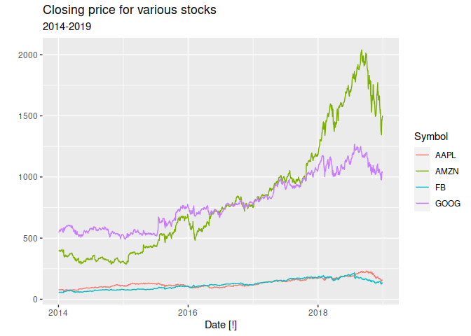
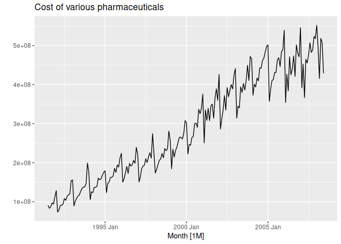
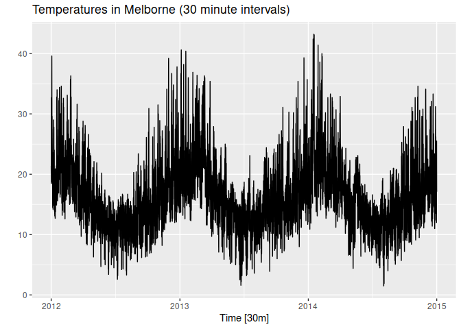
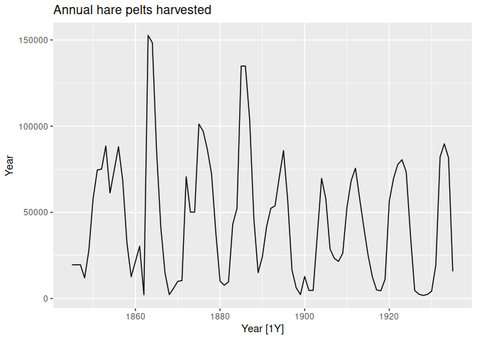
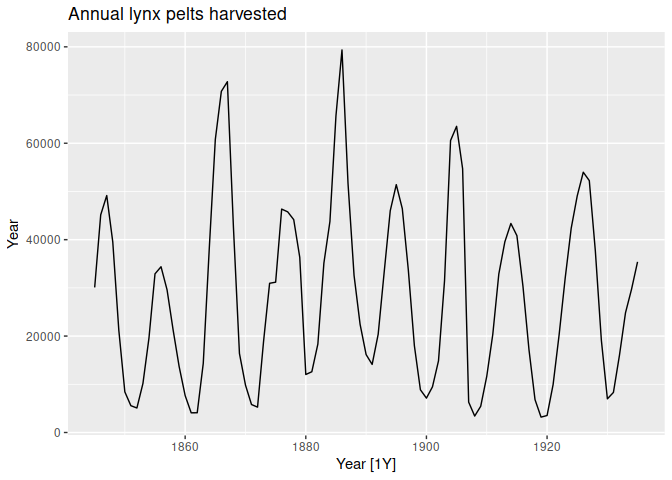

Chapter 2 exercises
================

- <a href="#ex-1" id="toc-ex-1">Ex 1</a>
- <a href="#ex-2" id="toc-ex-2">Ex 2</a>

``` r
library(fpp3)
```

    ## ── Attaching packages ────────────────────────────────────────────── fpp3 0.5 ──

    ## ✔ tibble      3.1.8     ✔ tsibble     1.1.3
    ## ✔ dplyr       1.1.0     ✔ tsibbledata 0.4.1
    ## ✔ tidyr       1.3.0     ✔ feasts      0.3.0
    ## ✔ lubridate   1.9.2     ✔ fable       0.3.2
    ## ✔ ggplot2     3.4.1     ✔ fabletools  0.3.2

    ## ── Conflicts ───────────────────────────────────────────────── fpp3_conflicts ──
    ## ✖ lubridate::date()    masks base::date()
    ## ✖ dplyr::filter()      masks stats::filter()
    ## ✖ tsibble::intersect() masks base::intersect()
    ## ✖ tsibble::interval()  masks lubridate::interval()
    ## ✖ dplyr::lag()         masks stats::lag()
    ## ✖ tsibble::setdiff()   masks base::setdiff()
    ## ✖ tsibble::union()     masks base::union()

# Ex 1

1.  Use the help function to explore what the series gafa_stock, PBS,
    vic_elec and pelt represent.

    - Use autoplot() to plot some of the series in these data sets.

    - What is the time interval of each series?

    - gafa_stock is Business Daily

    - PBS is monthly

    - vic_elec is hourly (every other hour)

    - pelt is yearly

``` r
gafa_stock
```

    ## # A tsibble: 5,032 x 8 [!]
    ## # Key:       Symbol [4]
    ##    Symbol Date        Open  High   Low Close Adj_Close    Volume
    ##    <chr>  <date>     <dbl> <dbl> <dbl> <dbl>     <dbl>     <dbl>
    ##  1 AAPL   2014-01-02  79.4  79.6  78.9  79.0      67.0  58671200
    ##  2 AAPL   2014-01-03  79.0  79.1  77.2  77.3      65.5  98116900
    ##  3 AAPL   2014-01-06  76.8  78.1  76.2  77.7      65.9 103152700
    ##  4 AAPL   2014-01-07  77.8  78.0  76.8  77.1      65.4  79302300
    ##  5 AAPL   2014-01-08  77.0  77.9  77.0  77.6      65.8  64632400
    ##  6 AAPL   2014-01-09  78.1  78.1  76.5  76.6      65.0  69787200
    ##  7 AAPL   2014-01-10  77.1  77.3  75.9  76.1      64.5  76244000
    ##  8 AAPL   2014-01-13  75.7  77.5  75.7  76.5      64.9  94623200
    ##  9 AAPL   2014-01-14  76.9  78.1  76.8  78.1      66.1  83140400
    ## 10 AAPL   2014-01-15  79.1  80.0  78.8  79.6      67.5  97909700
    ## # … with 5,022 more rows

``` r
gafa_stock |>
  autoplot(Close) +
  labs(title = "Closing price for various stocks",
       subtitle = "2014-2019",
       y = "")
```

<!-- -->

``` r
PBS
```

    ## # A tsibble: 67,596 x 9 [1M]
    ## # Key:       Concession, Type, ATC1, ATC2 [336]
    ##       Month Concession   Type        ATC1  ATC1_desc ATC2  ATC2_…¹ Scripts  Cost
    ##       <mth> <chr>        <chr>       <chr> <chr>     <chr> <chr>     <dbl> <dbl>
    ##  1 1991 Jul Concessional Co-payments A     Alimenta… A01   STOMAT…   18228 67877
    ##  2 1991 Aug Concessional Co-payments A     Alimenta… A01   STOMAT…   15327 57011
    ##  3 1991 Sep Concessional Co-payments A     Alimenta… A01   STOMAT…   14775 55020
    ##  4 1991 Oct Concessional Co-payments A     Alimenta… A01   STOMAT…   15380 57222
    ##  5 1991 Nov Concessional Co-payments A     Alimenta… A01   STOMAT…   14371 52120
    ##  6 1991 Dec Concessional Co-payments A     Alimenta… A01   STOMAT…   15028 54299
    ##  7 1992 Jan Concessional Co-payments A     Alimenta… A01   STOMAT…   11040 39753
    ##  8 1992 Feb Concessional Co-payments A     Alimenta… A01   STOMAT…   15165 54405
    ##  9 1992 Mar Concessional Co-payments A     Alimenta… A01   STOMAT…   16898 61108
    ## 10 1992 Apr Concessional Co-payments A     Alimenta… A01   STOMAT…   18141 65356
    ## # … with 67,586 more rows, and abbreviated variable name ¹​ATC2_desc

``` r
PBS |> 
  select(Month, Cost) |>
  summarise(TotalCost = sum(Cost)) |>
  autoplot(TotalCost) +
    labs(title = "Cost of various pharmaceuticals",
       y = "")
```

<!-- -->

``` r
vic_elec
```

    ## # A tsibble: 52,608 x 5 [30m] <Australia/Melbourne>
    ##    Time                Demand Temperature Date       Holiday
    ##    <dttm>               <dbl>       <dbl> <date>     <lgl>  
    ##  1 2012-01-01 00:00:00  4383.        21.4 2012-01-01 TRUE   
    ##  2 2012-01-01 00:30:00  4263.        21.0 2012-01-01 TRUE   
    ##  3 2012-01-01 01:00:00  4049.        20.7 2012-01-01 TRUE   
    ##  4 2012-01-01 01:30:00  3878.        20.6 2012-01-01 TRUE   
    ##  5 2012-01-01 02:00:00  4036.        20.4 2012-01-01 TRUE   
    ##  6 2012-01-01 02:30:00  3866.        20.2 2012-01-01 TRUE   
    ##  7 2012-01-01 03:00:00  3694.        20.1 2012-01-01 TRUE   
    ##  8 2012-01-01 03:30:00  3562.        19.6 2012-01-01 TRUE   
    ##  9 2012-01-01 04:00:00  3433.        19.1 2012-01-01 TRUE   
    ## 10 2012-01-01 04:30:00  3359.        19.0 2012-01-01 TRUE   
    ## # … with 52,598 more rows

``` r
vic_elec |>
  autoplot(Temperature) +
  labs(title = "Temperatures in Melborne (30 minute intervals)", y="")
```

<!-- -->

``` r
pelt
```

    ## # A tsibble: 91 x 3 [1Y]
    ##     Year  Hare  Lynx
    ##    <dbl> <dbl> <dbl>
    ##  1  1845 19580 30090
    ##  2  1846 19600 45150
    ##  3  1847 19610 49150
    ##  4  1848 11990 39520
    ##  5  1849 28040 21230
    ##  6  1850 58000  8420
    ##  7  1851 74600  5560
    ##  8  1852 75090  5080
    ##  9  1853 88480 10170
    ## 10  1854 61280 19600
    ## # … with 81 more rows

``` r
pelt |>
  autoplot(Hare) +
  labs(title = "Annual hare pelts harvested",
       y = "Year")
```

<!-- -->

``` r
pelt |>
  autoplot(Lynx) +
  labs(title = "Annual lynx pelts harvested",
       y = "Year")
```

<!-- -->

# Ex 2

2.  Use filter() to find what days corresponded to the peak closing
    price for each of the four stocks in gafa_stock.

- Google: 1268.33 on 7/26/18
- Facebook: 217.50 on 7/25/18
- Amazon: 2039.51 on 9/4/18
- Apple: 232.07 on 10/3/18

``` r
aapl_stock <- filter(gafa_stock, Symbol == "AAPL")
summary(aapl_stock[,"Close"])
```

    ##      Close      
    ##  Min.   : 71.4  
    ##  1st Qu.:103.0  
    ##  Median :119.2  
    ##  Mean   :131.2  
    ##  3rd Qu.:157.8  
    ##  Max.   :232.1

``` r
aapl_stock_max <- max(aapl_stock[,"Close"])
aapl_stock_max
```

    ## [1] 232.07

``` r
aapl_stock |>
  filter(Close == aapl_stock_max)
```

    ## # A tsibble: 1 x 8 [!]
    ## # Key:       Symbol [1]
    ##   Symbol Date        Open  High   Low Close Adj_Close   Volume
    ##   <chr>  <date>     <dbl> <dbl> <dbl> <dbl>     <dbl>    <dbl>
    ## 1 AAPL   2018-10-03  230.  233.  230.  232.      230. 28654800

``` r
amzn_stock <- filter(gafa_stock, Symbol == "AMZN")
max(amzn_stock[,"Close"]) -> amzn_stock_max
amzn_stock |>
  filter(Close == amzn_stock_max)
```

    ## # A tsibble: 1 x 8 [!]
    ## # Key:       Symbol [1]
    ##   Symbol Date        Open  High   Low Close Adj_Close  Volume
    ##   <chr>  <date>     <dbl> <dbl> <dbl> <dbl>     <dbl>   <dbl>
    ## 1 AMZN   2018-09-04 2026. 2050.  2013 2040.     2040. 5721100

``` r
fb_stock <- filter(gafa_stock, Symbol == "FB")
max(fb_stock[,"Close"]) -> fb_stock_max
fb_stock |>
  filter(Close == fb_stock_max)
```

    ## # A tsibble: 1 x 8 [!]
    ## # Key:       Symbol [1]
    ##   Symbol Date        Open  High   Low Close Adj_Close   Volume
    ##   <chr>  <date>     <dbl> <dbl> <dbl> <dbl>     <dbl>    <dbl>
    ## 1 FB     2018-07-25  216.  219.  214.  218.      218. 58954200

``` r
goog_stock <- filter(gafa_stock, Symbol == "GOOG")
max(goog_stock[,"Close"]) -> goog_stock_max
goog_stock |>
  filter(Close == goog_stock_max)
```

    ## # A tsibble: 1 x 8 [!]
    ## # Key:       Symbol [1]
    ##   Symbol Date        Open  High   Low Close Adj_Close  Volume
    ##   <chr>  <date>     <dbl> <dbl> <dbl> <dbl>     <dbl>   <dbl>
    ## 1 GOOG   2018-07-26  1251 1270. 1249. 1268.     1268. 2405600
